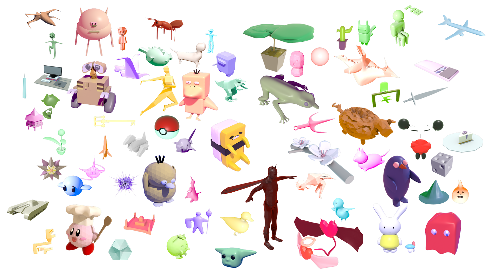

# Scotty3D

  

Welcome to Scotty3D! This 3D graphics software package includes components for interactive mesh
editing, realistic path tracing, and dynamic animation. Implementing functionality in each of these areas
constitutes the majority of the coursework for 15-462/662 (Computer Graphics) at Carnegie Mellon University

Please visit the [documentation website](https://cmu-graphics.github.io/Scotty3D/).

## Sampled Student Work (Fall 2020)

Showcase [video](https://www.youtube.com/watch?v=yJ5eY3EIImA&t=2s)!

### MeshEdit

### PathTracer

