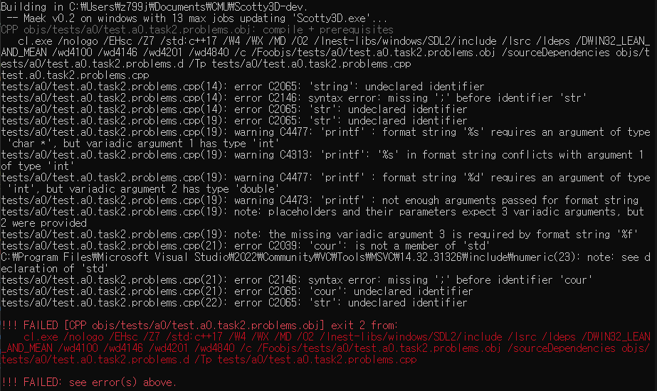

# Assignment 0: Scotty3D

Welcome to Scotty3D. This assignment is constructed in three parts to help you get used to our custom graphics package and learn basic tips on how to debug in CLI and GUI.

## Scoring

Total [50pts]:
- A0T1 [10pts]
- A0T2 [20pts]
- A0T3 [20pts]

## Hand-in Instructions

To turn in your work, make sure you have all the files in the proper place, and then **sign in to your GitHub account on the Gradescope submission** page.

Details:
- `writeup-A0.html` is described below.
- Please make sure you do not have any extra print statements enabled.

### Write-up
You will submit a short document showing completion of each task in a template called `writeup-A0.html`. 
For each task, do either of the following:
- If you believe that you have correctly completed the required tasks, replace the reference images when applicable, answer any questions, and write the approximate time taken to complete the task.
- If you did not fully complete the required tasks, write a short explanation of what works and what does not work, and (optionally) briefly explain your strategy and how you got stuck. If your explanation indicates a significant understanding of the problem, we may award partial credit even though the task is incomplete.
- If we receive submissions in this or any future assignments where the write-up still contains reference images or "Not attempted" texts, we WILL assume you did not complete those tasks and grade accordingly. Make sure your write-up documents correspond with your actual work!
- Add any immediate feedback you have for the assignment in the **Feedback** section.

## A0T1: Build Your Scotty3D

The first part of this assignment is to correctly set up your Scotty3D clone repository and ensure you can compile and run the application. If you already completed this step, task 1 will be very quick for you. You may refer to the sample images stored under `/assignments/A0-writeup/reference/` when taking your own screenshots, but you should make sure to store your own pictures under `/assignments/A0-writeup/student/` and update the image links in `writeup-A0.html`.

1. Clone

Follow the instructions at [Github Setup](https://github.com/CMU-Graphics/Scotty3D#github-setup). Take a screenshot of either (1) the command prompt showing completion of this stage or (2) your MyScotty3D repository on GitHub. Store your screenshot and replace the relevant image in your writeup.

2. General Setup

Follow the instructions at [General Setup](https://github.com/CMU-Graphics/Scotty3D#general-setup). Note that step 3 is already completed from your previous task. Take a screenshot of (1) Visual Studio 2022 installed with the "Desktop development with C++" component under modifications, (2) node working on your command prompt, and (3) `nest-libs` placed correctly at the root of your repository folder. Store your screenshots and replace the relevant images in your writeup.

3. Build and Run

Follow the instructions at [Building and Running](https://github.com/CMU-Graphics/Scotty3D#building-and-running). Build the application and run Scotty3D in both (1) GUI and (2) test case modes. Take screenshots of each run successfully working, store them, and replace the relevant images in your writeup.

The reference image for test cases may not be the same as your own. Do not worry about this, as there are some cases that are hidden / in development by staff members.

4. Read Scotty3D-docs

Visit our [Scotty3D-docs](https://cmu-graphics.github.io/Scotty3D-docs/) page. This page details our project philosophy and how to interact with our application. [User Guide](https://cmu-graphics.github.io/Scotty3D-docs/guide/) page contains detailed instructions on what each button means and how to use them. Since you have just started this course, many of the features will not be functioning. But later, when you do implement more features, make sure to refer back to these pages for detailed instructions.
You need not submit anything for this step.

### Tips
- Our default expectation for IDE to be used for Scotty3D is [vscode](https://code.visualstudio.com/). Although you are not required to use vscode, we strongly recommend you do so as our staff members are most used to features of and debugging with vscode.  
- Note that we have a `.vscode` folder included at the root of our workplace directory. Included in this folder are json files to help you use vscode's debugging tools. If you wish to make use of these files on Windows, you must launch the Scotty3D project folder from "x64 Native Tools Command Prompt for VS 2022" by navigating to the correct directory and typing in the command `code .`. If configured properly, you should see the `Run` and `Tests` options at the "Run and Debug" tab in vscode. Learn how to modify the arguments in these json files and options in `Maekfile.js` for the greatest debugging efficiency. 
- Learn features of your IDE. Shortcuts, breakpoints, and optimization options are all crucial in reducing your time spent debugging. What's the command to search file by name? What's the command to run currently set debug mode? How do you set breakpoints and observe variables? How do you prevent some variables from being optimized away? If you can't answer these questions, it may be beneficial to take some time and learn these features!

## A0T2: Debugging in CLI

There are three types of test case outputs, showcased by `test.a0.task2.example.cpp`. You will probably never use `Test::ignored()`. One point to note is that a test case passes if it does not throw errors, so keep this in mind when constructing test cases.

Open `test.a0.task2.problems.cpp`. Fix all the test functions **without changing the general approach** of each function so that all of them pass when run. You may not receive credit if you deviate too much from the original versions. These problems are created based on common problems past students encountered, so make sure you learn from them! The problems may also intentionally switch between different styles of achieving the same goal for the sake of your exposure to C++ features.

Once you have fixed the bugs, answer the questions for task 2 found in `writeup-A0.html`.

Let us walk through the first part of problem 1 together. When you uncomment and run the test function `test_a0_task2_problems_print`, you may encounter a wall of errors similar to the example image below. \
[](A0/A0T2-compiler-error.png)

The best way to debug with C++ is to work from top to bottom, as it is usually the case that many errors and warnings result from one initial error. This means that fixing the topmost error can potentially make many of the following errors disappear.

To parse a line of error, we simply chop the error message into a number of components. Here we have an example error line copied over.

```
tests/a0/test.a0.task2.problems.cpp(14): error C2065: 'string': undeclared identifier
```

We first see the location of the problem identified as the `14`th line of file `tests/a0/test.a0.task2.problems.cpp`. Then we see the error code associated with the problem encountered, `error C2065`, which we can search online for more details if the error description does not provide enough information to guide your debugging. Lastly, we see the exact problem of this line of code: `'string': undeclared identifier`.

The reason we see this error is because of the Namespace feature in C++. Namespaces define the scope of a variable, function, or object, which helps prevent name collisions. Basic data types such as `char`, `int`, `long`, `float`, etc are defined internally to the compiler in C++ so you do not need to specify the namespaces for them. However, the declaration of class `string` is in the namespace `std`. Therefore, you need to either access this declaration via `std::string` or some equivalent alternatives.

- Note that another fix you may find for this problem is to insert `using namespace std;` at the top of the file. Although this saves us from typing `std::` in front of any declarations included in the standard library, this **severely pollutes** our namespace and may cause ambiguous behaviors when there are name collisions. We do not include this line anywhere in our codebase, and so shouldn't you!

Now go ahead and apply this fix. Observe how a lot of the error messages are indeed gone. Fix the rest of the compiler errors and proceed on to the rest of the problems.

## A0T3: Debugging in GUI

Test cases are useful when the potential problems are predictable and easy to formulate. However, a lot of bugs you will encounter in computer graphics are first discovered when you actually try running your code in GUI.

Let us compile and run the Scotty3D executable. First, launch it from the command line.
Select "Create Object", then "Mesh Instance". With the created mesh instance, you should see the object properties tab at the bottom left of the GUI.
Select the "Mesh" tab, then "Pentagon" from the second drop-down.
Click on "Replace".

Oh no! Our Scotty3D crashed! Thankfully, our executable informed us of assertion failure before it terminated.

```
Halfedge_Mesh from_indexed_faces failed validation: Vertex with id 5 references past-the-end halfedge.
halfedge-utility.cpp:846 [ASSERT] 0
```

At this point, you may be inclined to look into `halfedge-utility.cpp:846` and relevant functions to identify the issue. Although this is generally a good idea, this problem can benefit from a more efficient debugging strategy.

This time, run the Scotty3D executable through the **vscode debugger** and repeat the above process. If run properly, you should run into a breakpoint at the point of assertion failure. A great benefit of using IDE debuggers is it gives access to the call stack on breakpoints. With this, we can now observe exactly how and through what sequence of function calls and operations lead to this problem.

Remember that the action that caused this problem is converting our mesh to a *pentagon*, so you need to identify the problem and fix it.

- Note that this is a very specific example that may not exactly resemble other GUI debugging issues you may encounter throughout the course. However, the point of this task is to learn to get used to your IDE's functionalities and to remember to utilize these techniques in future situations.
