# Assignment 1: Rasterizer

Modern GPUs implement an abstraction called the Rasterization Pipeline.
This abstraction breaks the process of converting 3D triangles into 2D pixels into several highly-parallel stages, allowing for a variety of efficient hardware implementations.
In this assignment, you will be implementing parts of a simplified rasterization pipeline *in software*.
Though simplified, your pipeline will be sufficient to allow Scotty3D to create preview renders without a GPU!

Different graphics APIs may present this pipeline in different ways, but the core steps remains consistent: a GPU draws things by running code (in parallel) on a list of vertices to produce homogeneous screen positions (+ extra varying data), building triangles from that list of vertices, clipping the triangles to remove parts not visible on the screen, performing a division to compute screen positions, computing a list of "fragments" covered by those triangles, running code on each fragment, and composing the results into a framebuffer.

_**Important:**_ Before you start, read through [`src/rasterizer/pipeline.h`](../src/rasterizer/pipeline.h) to understand how our code implements this pipeline. Familiarize yourself with the terms that will be frequently referred to in this assignment, such as pixels, fragments, attributes, and samples. You will be filling in functions in [`src/rasterizer/pipeline.cpp`](../src/rasterizer/pipeline.cpp) (as well as several other files) to complete this implementation.

## Scoring

Total [100pts]: (capped at [110pts], even with extra credit)
- Checkpoint A1.0 [40pts]:
	- A1T1 transforms [5pts]
	- A1T2 lines [15pts]
	- A1T3 flat triangles [15pts]
	- A1T4 depth + blending [3pts]
	- writeup-A1.html [2pts]
- Checkpoint A1.5 [60pts]:
	- A1T5 interpolation [22pts]
		- screen-space [6pts]
		- perspective-correct [6pts]
		- derivatives [10pts]
	- A1T6 mip-mapping [18pts]
		- sampling [8pts]
		- generation [8pts]
		- lod [2pts]
	- A1T7 supersampling [12pts]
		- storage [2pts]
		- for (samples) [4pts]
		- resolve [4pts]
		- sample pattern [2pts]
	- writeup-A1.html [3pts]
	- render.png + render.js3d [5pts]
- Extra Credit [?pts]

## Hand-in Instructions

To turn in your work, make sure you have all the files in the proper place and login to your GitHub account on the Gradescope submission page (for the checkpoint, you can exclude the `render.js3d` and `render.png` files). Gradescope will extract submissions from your Scotty3D GitHub repository by automatically pulling your most recent commit, so it's really important to remember to push all new changes before you submit.

Details:
- We encourage you to develop your own test cases. Please include these in the `tests/` folder.
- If you do any of the extra credit, please note in your write-up what you implemented and where to find them.
- `render.png` and `render.js3d` are a cool render of your own devising. These should be placed in `assignments/A1-writeup`.
- `assignments/writeup-A1.html` is described below.
- Please make sure you do not have any print statements enabled. You will lose points if there are an excessive amount of prints when we run your code.

### Write-up
You will submit a short document explaining how you believe your implementation performs on each of the tasks. The project directory contains a template in `assignments/writeup-A1.html`. 

For each task, do either of the following:
* If you believe that you have correctly implemented the required functions, then simply replace any reference images with images from your implentation and answer any questions listed in the writeup. 
* If your implementation does not fully function, write an additional short explanation of what your code can and cannot do, and (optionally) briefly explain your strategy and how you got stuck. If your explanation indicates significant understanding of the problem, we may award partial credit even though the code does not work.

If there are any reference images attached, make sure to replace them with a closely related image that demonstrates the task before turning in your assignment.

### Render Something You Like!
At the end of the assignment, we want you to bask in the glory of successfully implementing a software rasterizer by generating a rendered image to your liking, using what you just wrote. You may choose to use one of the provided scenes, or to import your own objects, but we ask that you make an effort to make it distinct from the default scenes. Whether this is by changing the scene layout, the textures/colors of the models, or anything else you can think of, it is up to you. Name this file `render.png` and add it to `assignments/A1-writeup` and make sure it is displayed in your writeup.

## How To Test What You've Made

Writing robust graphics code is hard. You'll need to spend some time testing your code to make sure that it works. You have three ways of doing that.

### via Test Cases

Writing automated test cases can help you isolate and test individual functions in your code.

For the tasks below, we provide a basic set of functionality tests in the corresponding `tests/a1/test.a1.*.cpp` file(s). You can run these tests with `./Scotty3D --run-tests a1.`.

**Be Warned**, however, that we provide *only* basic functionality tests; when we grade your assignment, we will also (a) read your code and (b) use an expanded set of test cases.

You may add test cases by creating new `.cpp` files in the `tests/a1/` folder. You may refer to the existing tests for examples of how to create test cases, but in general, you should include the `test.h` header and throw errors if the actual output of the function is inconsistent with the expected value. We encourage you to develop and share test cases on Piazza. (Reminder: Test cases are the *only* source code you should *ever* post on our class Piazza.)

### via GUI
Building and rendering scenes is a great way to catch subtle bugs in your code (and it can, sometimes, be fun!).

You can run the code interactively from the GUI:
- Load a scene.
- Click the "Render" tab at the top of the screen.
- Click the "Open Render Window" button in the left panel.
- Select "Software Rasterize" from the "Method" drop-down in the "Render Image" window.
- Select a "Camera Instance" in the "Render Image" window.
- Click the "Start Render" button in the "Render Image" window.

### via CLI

If you find yourself re-rendering scenes repeatedly, you can use the command line interface to Scotty3D instead of the GUI (The new lines and tabs are there to make it more readable, don't add them when running the command):
```
./Scotty3D 
--rasterize 
--scene 	<insert path to scene> 
--camera 	<insert camera name> 
--output 	<insert name of output image>
```

For more information about CLI parameters, run `./Scotty3D --help`.

## A1T1: Scene Functions

- Where: 
  - `// A1T1: local_to_world` (in `src/scene/transform.cpp`)
  - `// A1T1: world_to_local` (in `src/scene/transform.cpp`)
- Test with: `./Scotty3D --run-tests a1.task1.` or by adding transformations to objects in a scene
- Tests provided: `tests/a1/test.a1.task1.cpp`

Before A1T1 is complete (everything is at the origin): \
[<p align="center">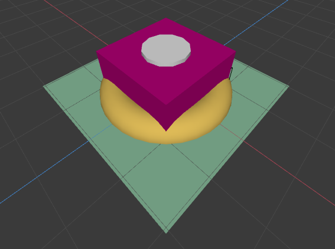</p>](A1/A1T1-before.png)

After A1T1 is complete (transforms are applied): \
[<p align="center">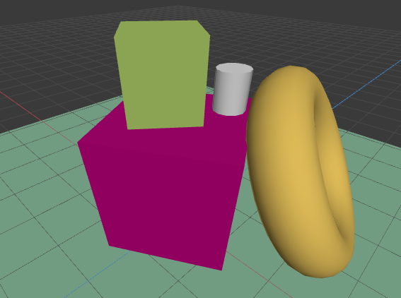</p>](A1/A1T1-after.png)

Your first task is to complete the scene graph implementation in Scotty3D by filling in two functions in the `Transform` class (used to represent object positions).

As discussed in our lecture on 3D transformations, Scotty3D represents the positions of objects in a scene with a scene graph.

Our scene graph (`src/scene/scene.h`) represents the transformations between object space and world space using `Transform` objects (`src/scene/transform.h`) that record the scaling, rotation, and translation (in that order!) that must be applied to move from object-local positions to positions relative to each object's parent.

Indeed, `Transform::local_to_parent` conveniently returns these transformations as a 4x4 matrix (`Mat4`).

Your job is to fill in `Transform::local_to_world` and `Transform::world_to_local` -- functions that return `Mat4`'s representing the transformation from object space all the way to / from world space.

Note that `Transform::parent` is a [`std::weak_ptr< Transform >`](https://en.cppreference.com/w/cpp/memory/weak_ptr), so you'll need to call `parent->lock()` to retrieve a [`std::shared_ptr< Transform >`](https://en.cppreference.com/w/cpp/memory/shared_ptr) from which to access the parent's member functions. A good way to do this is to use an [`if` statement containing an `init-statement`](https://en.cppreference.com/w/cpp/language/if).
Thus, your code will probably look something like this:

```cpp
Mat4 Transform::local_to_world() const {
	// A1T1: local_to_world
	//...
	if (std::shared_ptr< Transform > parent_ = parent.lock()) {
		//case where transform has a parent
		//...
	} else {
		//case where transform doesn't have a parent
		//...
	}
	//...
}
```

## A1T2: Lines

- Search for: 
  - `// A1T2: rasterize_line` (in `src/rasterizer/pipeline.cpp`)
- Test with: `./Scotty3D --run-tests a1.task2.` or by rendering models with wireframe enabled
- Tests provided: `tests/a1/test.a1.task2.cpp`

`A1-cubes.js3d` Before A1T2 is complete: \
[<p align="center">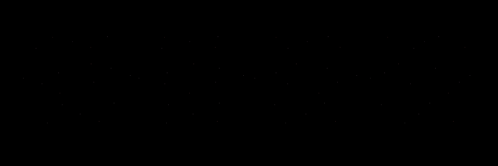</p>](A1/A1T2-cubes-before.png)

`A1-cubes.js3d` After A1T2 is complete: \
[<p align="center">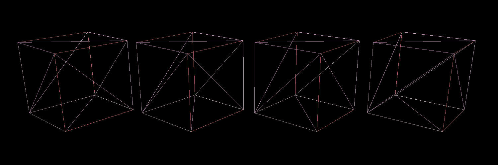</p>](A1/A1T2-cubes-after.png)

Drawing a scene in *wireframe* (that is: drawing just the edges of triangles) is both a fast preview method and an interesting stylistic choice (e.g., the "Outrun" art style).

As a rasterization warm-up, fill in the `Pipeline::rasterize_line( ... )` function.
This function is used by the pipeline when drawing any mesh whose "wireframe" flag is set.

We will be following the [diamond-exit rule with OpenGL's general statement](https://registry.khronos.org/OpenGL/specs/gl/glspec33.core.pdf#page=126&zoom=100,168,674). You may choose to use any [line algorithm](https://en.wikipedia.org/wiki/Line_drawing_algorithm) as long as it satsifies the above specification and runs in $O(1+\text{number of output fragments})$ time. We encourage you to start with an implementation of [Bresenham's Algorithm](https://www.cs.helsinki.fi/group/goa/mallinnus/lines/bresenh.html) and then, if you wish, continue on with implementations that improve quality or optimize drawing performance. **Do note that the Bresenham Algorithm does not fully confide to the diamond-exit rule - you will need to explicitly check on the endpoints**.

More details of the function's specification are included in a block comment above the function in the source code.
*Read this specification carefully, as it contains some useful simplifications.*

## A1T3: Flat Triangles

- Search for: 
  - `// A1T3 (extra credit): clip_triangle` (in `src/rasterizer/pipeline.cpp`)
  - `// A1T3: flat triangles` (in `src/rasterizer/pipeline.cpp`)
- Test with: `./Scotty3D --run-tests a1.task3.` or by rendering a scene with flat triangles enabled
- Tests provided: `tests/a1/test.a1.task3.cpp`


`A1-cubes.js3d` After A1T3 is complete: \
[<p align="center">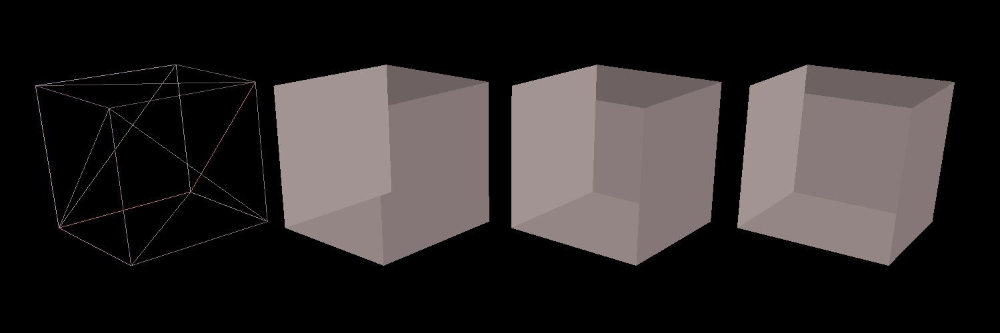</p>](A1/A1T3-cubes-after.png)

A step above wireframe is to draw triangles with *flat shading* -- that is, with all of their attributes copied from the first vertex.

Fill in the `rasterize_triangle` function for the case where the pipeline is using "flat" interpolation, i.e. every fragment gets the same attributes. Think about what this implies about the derivatives of the fragment.

Your implementation should use an algorithm that is more work efficient than simply testing all samples on screen. To receive full credit it should at least constrain coverage tests to samples that lie within a screen-space bounding box of the triangle. However, we encourage exploration of even more efficient implementations, such as ones that employ "early out" optimizations discussed in lecture.

More details of the functions' specifications are included in a block comment above the function in the source code.
*Read this specification carefully, as it contains some useful simplifications.*

Take care that if two triangles share an edge, and a sample point lies on that edge, exactly one of the triangles should emit a fragment for that sample.
One way to handle this is the ["top-left" rule](https://docs.microsoft.com/en-us/windows/win32/direct3d11/d3d10-graphics-programming-guide-rasterizer-stage-rules) used in Direct3D. 

As we don't explictly require the vertices to be given in clockwise or counterclockwise order, you'll first need to determine the winding order of the triangle given. From there, you'll be able to determine the following (we provide only the CW case, but think about how to adapt this for **CCW**):
- Top Edge (**CW**): This is a horizontal edge where both $y$-coordinates are the same between consecutive vertices and are greater than the third vertex's $y$-coordinate.
- Left Edge (**CW**): This is an edge that goes "up" between consecutive vertices (think about why!).

For **5 pts** of extra credit, you may wish to implement `clip_triangle`. This function takes in three vertices that we wish to clip to screen space. Note that if you choose to not implement this, then scenes with triangles that go beyond the screen may behave incorrectly and will render more slowly. You can assume that when grading, we will only use scenes where the correctness does not depend on `clip_triangle`. More information of this will be at the extra credits section.

## A1T4: Depth Testing and Blending

- Search for: 
  - `// A1T4: Depth_Less` (in `src/rasterizer/pipeline.cpp`)
  - `// A1T4: Blend_Add` (in `src/rasterizer/pipeline.cpp`)
  - `// A1T4: Blend_Over` (in `src/rasterizer/pipeline.cpp`)
- Test with: `./Scotty3D --run-tests a1.task4.` or by placing objects in front of each other and rendering (depth testing)
- Tests provided: `tests/a1/test.a1.task4.cpp`

`A1-cubes.js3d` After A1T4 is complete: \
[<p align="center">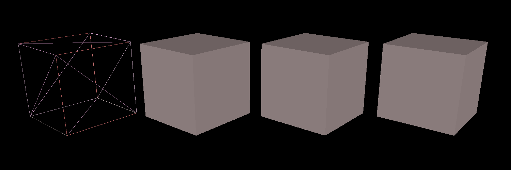</p>](A1/A1T4-cubes-after.png)

Now that we have generated the fragments by rasterization, we know which pixels are covered by some primitive and therefore have a color. These colors are written to a framebuffer to produce the output render you see on screen. But as you might have noticed, your render for the previous task does not give the correct color for every pixel, because occlusion is not properly handled. In this task, you will make this work by filling in a few small equations for depth testing and blending in the fragment loop right after rasterization:

```cpp
for (auto const &f : fragments) {

	// Step 1. Depth Test (modes: Always, Never, Less)
	// 	If passed, proceed to the next steps which process the fragment's attributes
	//	Otherwise, discard this fragment

	// Step 2. Shading
	//	Output the fragment's color and opacity based on its attributes

	// Step 3. Blending (modes: Replace, Add, Over)
	//	Blend the fragment's color (and possibly opacity) with the current value in the framebuffer at the fragment's location

}
```

Note that the way colors are written to the framebuffer is controlled by the depth testing and blending mode of the pipeline. You will specifically be implementing the Less (`Pipeline_Depth_Less`) mode for depth test, and the Add (`Pipeline_Blend_Add`) and Over (`Pipeline_Blend_Over`) modes for blending. The other modes are implemented for you to give an idea of how your code should look like. More specification can be found in the code.

You may also find information about [depth testing](https://registry.khronos.org/OpenGL/specs/gl/glspec33.core.pdf#page=214&zoom=100,168,674) and [blending](https://registry.khronos.org/OpenGL/specs/gl/glspec33.core.pdf#page=216&zoom=100,168,674) in the OpenGL specification to be helpful.

We have also added the feature of being able to change which objects should use which type of blending and depth testing - this can be found by creating a mesh instance and then under the `object` tab on the left panel, you'll see three options to change the draw style, blend style and depth style of the object.

Comparisons between different blend and depth modes from `A1T4-blend-depth.js3d`: 

This is using depth always, from left to right, we have blend replace, blend add and blend over. \
[<p align="center">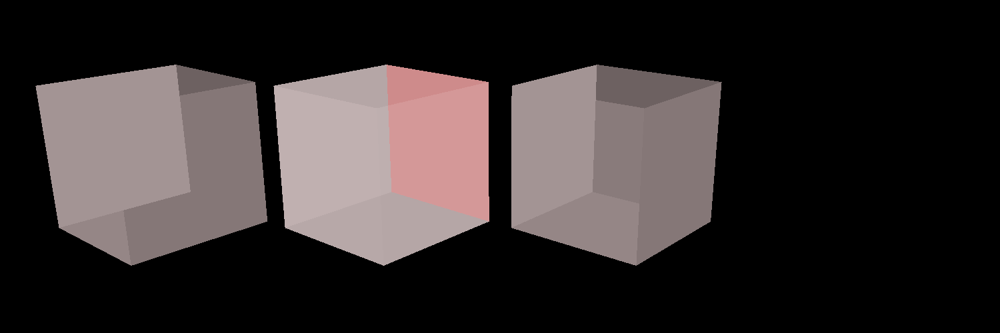</p>](A1/A1T4-depth-always-blends.png) 
This is using depth less, from left to right, we have blend replace, blend add and blend over. \
[<p align="center">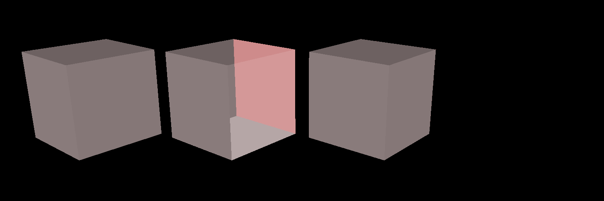</p>](A1/A1T4-depth-less-blends.png) 
This is using depth never, from left to right, we have blend replace, blend add and blend over. \
[<p align="center"></p>](A1/A1T4-depth-never-blends.png) 

Note that blend replace and blend over look identical - this is because when opacity is equal to 1, blend over always takes the replacing fragment color. For depth never, we never take the fragment so we never rasterize anything.
## A1T5: Triangles with Interpolation

- Search for: 
  - `// A1T5: screen-space smooth triangles` (in `src/rasterizer/pipeline.cpp`)
  - `// A1T5: perspective-correct triangles` (in `src/rasterizer/pipeline.cpp`)
- Test with: `./Scotty3D --run-tests a1.task5.`
- Tests provided: `tests/a1/test.a1.task5.cpp`

`A1-cubes.js3d` After A1T5 is complete: \
[<p align="center">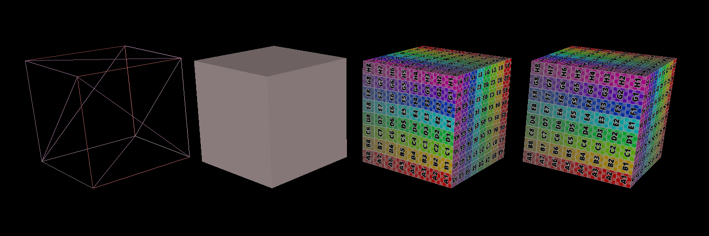</p>](A1/A1T5-cubes-after.png)

So far we have only been considering flat-shaded triangles, that is, all fragments in a triangle share a constant color. What if we want to apply textures to our models? How do we make sure that the pixels inside a triangle all take the correct texture coordinates, when we are only given those of the 3 vertices? The answer is that we interpolate them using barycentric coordinates, a very important coordinate system in computer graphics.

In lecture, we have seen how naive screen-space interpolation leads to issues and discussed the intuition and basic recipe of [perspective-correct interpolation](http://15462.courses.cs.cmu.edu/spring2022/lecture/persp/slide_034). In this step you will complete the implementation of `rasterize_triangle` by completing screen-space and perspective-correct attribute interpolation.

First, let's take a step back and think about what attributes and derivatives really mean. In Scotty3D,

* Vertex attributes include vertex positions, normals, and texture (uv) coordinates. Once the vertices are shaded and ready to be passed to the fragment program, they only have uv coordinates and normals as attributes. We then process these and assign attributes to the fragments during rasterization. Refer to the `enum`s in `programs.h` and definitions in `pipeline.h` for more information.
* Derivatives are a fragment field computed as the differences in _interpolated vertex attributes_. We need derivatives because they are useful for mip-mapping, a texture-mapping technique that you will implement in Task 6. For this assignment, we only care about uv coordinates and do not further process the normals, so you can assume that our derivative calculation is only for the uv coordinates. However, do make sure you understand how uv coordinates are represented in `f.attributes` and `f.derivatives`.

Now let's think about how this connects to our 3 interpolation modes. In `Interp_Flat`, since we want constant colors, we simply copy the vertex attributes to every fragment, and the derivatives are trivial. Now to support texturing, intuitively it makes sense that every fragment should get different attribute values (specifically, different uv coordinates). To do this, both `f.attributes` and `f.derivatives` will require interpolation with repect to the triangle vertices. And for derivatives, you will want to consider a $2\times 2$ block of pixels and compute the [forward/backward difference](https://registry.khronos.org/OpenGL/specs/gl/GLSLangSpec.4.00.pdf#page=137) in attribute values. But how does the computation differ in `Interp_Smooth` and `Interp_Correct`?

* `Interp_Smooth`: naive attribute interpolation without considering perspective 
* `Interp_Correct`: interpolates $\frac{1}{w}$ and $\frac{\Phi}{w}$, where $\Phi$ is the vertex attribute and $w$ is the 4th component of the vertex position in homogeneous clip space (useful for perspective projection). The final fragment attribute is then

$$\frac{\verb|interpolate|(\frac{\Phi}{w})}{\verb|interpolate|(\frac{1}{w})}$$

Note that the code uses `inv_w` (see `ClippedVertex` definition) to represent $\frac{1}{w}$, so you do not need to directly compute $w$ at the vertices.

## A1T6: Mip-Mapping

- Search for: 
  - `// A1T6: lod` (in `src/rasterizer/programs.h`), 
  - `// A1T6: generate` (in `src/scene/texture.cpp`)
  - `// A1T6: sample` (in `src/scene/texture.cpp`)
- Test with: `./Scotty3D --run-tests a1.task6`
- Tests provided: `tests/a1/test.a1.task6.cpp`

In lecture, we have discussed how mip-mapping can be used for texture anti-aliasing. In our pipeline, mip-mapping happens within the `shade_fragment` process which gives a fragment its color (based on the attributes and derivatives you have just computed!). In the context of texturing, this means that for each fragment $f$ in our _raster image_, we want to query the corresponding texel in the _texture image_. This texel's color will then be assigned to $f$. In order to find the texel, we need `lod`, the level of detail, that determines which resolution of the texture should be used. From lecture, we know that `lod` can be computed as

$$\log_2(L)$$

where

$$L=\sqrt{\max\left(\left(\frac{du}{dx}\right)^2+\left(\frac{dv}{dx}\right)^2, \left(\frac{du}{dy}\right)^2+\left(\frac{dv}{dy}\right)^2\right)} = \max\left(\sqrt{\left(\frac{du}{dx}\right)^2+\left(\frac{dv}{dx}\right)^2}, \sqrt{\left(\frac{du}{dy}\right)^2+\left(\frac{dv}{dy}\right)^2}\right)$$

Remember what these derivatives mean? Let's take $\frac{du}{dx}$ for example. Essentially, it means "for each increment (decrement) of $1$ along the $x$ direction in our raster image, how much we need to increment (decrement) along the $u$ direction in the texture image". Our code uses `fdx_texcoord` and `fdy_texcoord` to represent the changes in _texture space_ (recall that uv coordinates are in $[0, 1]^2$). Think about how you would want to use `wh` to get the actual amount of change in the _texture image_.

When implementing trilinear sampling, note that our levels are ordered from high-res to low-res in this way: [`base`, 0, 1, ..., `levels.size()-1`]. Be careful about handling `lod`s that are close to the boundaries (e.g. $\log_2(L)$ can be negative) when implementing trilinear sampling.

Comparisons between the different sampling methods from `A1T6-samplers.js3d`: 

This is a top down view to compare nearest, bilinear and trilinear sampling. \
[<p align="center">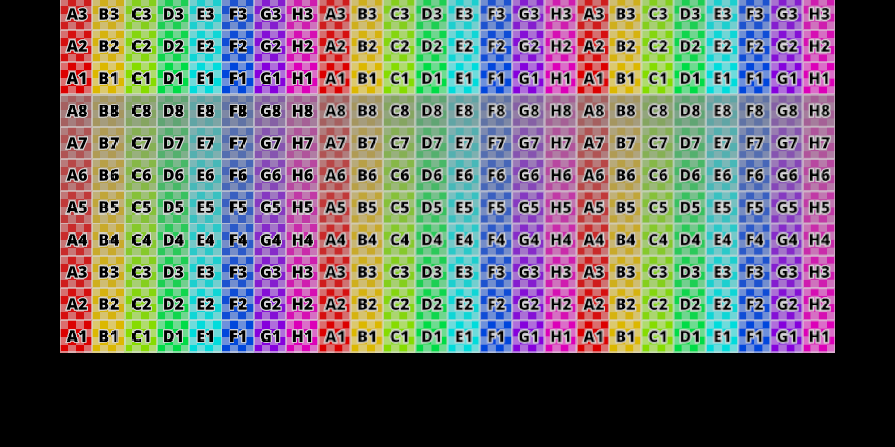</p>](A1/A1T6-above.png) \
This is a tilted view to show the benefits of trilinear sampling. \
[<p align="center">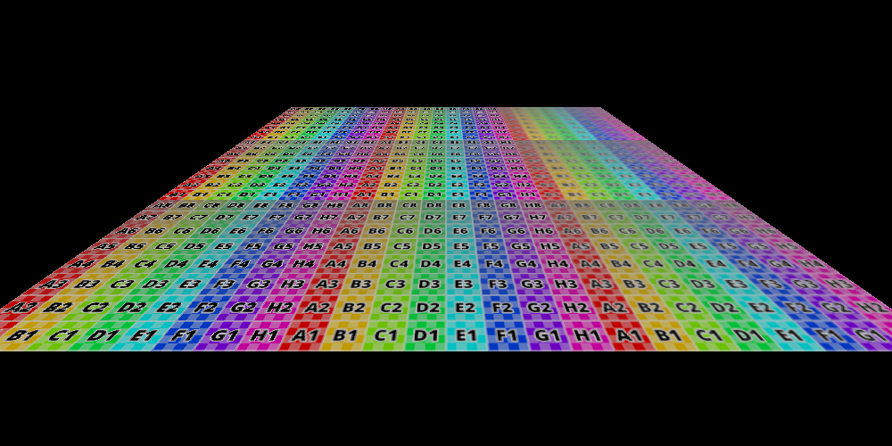</p>](A1/A1T6-tilted.png)

## A1T7: Supersampling

- Search for:
  - `// A1T7: index` in `src/rasterizer/framebuffer.h`
  - `// A1T7: resolve_colors` in `src/rasterizer/framebuffer.cpp`
  - `// A1T7: sample loop` in `src/rasterizer/pipeline.cpp`
  - `// A1T7: sample pattern` in `src/rasterizer/sample_pattern.cpp`
- Test with: `./Scotty3D --run-tests a1.task7.`
- Tests provided: `tests/a1/test.a1.task7.cpp`
- Command line tests: `./Scotty3D --rasterize --scene <path to scene> --camera <camera name> --film-sample-pattern <name of sample pattern> --output <output name> `

When scenes contain high-frequency detail, point samples don't do a great job of reconstructing them, resulting in "jaggies" or "aliasing" artifacts. One way to smooth away these artifacts is to check coverage and color at more than one point within each pixel and to make the final pixel color a weighted average of these points.

In this part of the assignment, you will integrate such a "super-sampling" approach into our pipeline, by updating the code to:
- pick where to store samples (in `Framebuffer::index()`)
- generate new fragments for these new samples (in `Pipeline::run()`)
- combine the samples into an image (in `Framebuffer::resolve()`)
- create a sample pattern to use (in `SamplePattern::all_patterns()`)

Before you start, think about how the inclusion of super-sampling changes the pipeline you have implemented so far -- Previously, we only took 1 sample in each pixel, so during rasterization, we roughly treat samples and pixels as the same thing and just emit a fragment per covered sample (pixel). This is no longer the case when we take multiple samples in each pixel, since if more than one sample is covered, then more than one fragment should be emitted. But where, and how?

Take a look at `src/rasterizer/sample_pattern.h`. The vector `centers_and_weights` specifies the positions and weights of the samples in each pixel (all the pixels in the framebuffer follow this sample pattern). Think about how you can retrieve the number of samples in each pixel. Below is an illustration of a possible `SamplePattern` to provide intuition about the `Vec3` representation of samples in a pixel:

<p align="center">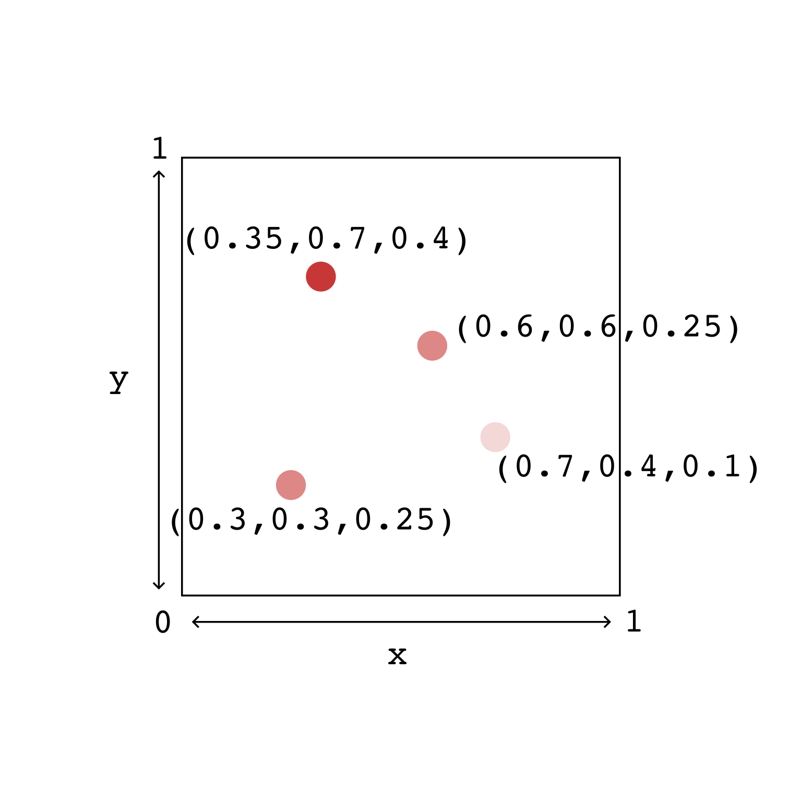</p>

Note that you should NOT need to modify your rasterize functions. Instead, you will want to _add a sample loop that wraps the part of the pipeline that needs to be repeated_, and support super-sampling by _shifting the positions of the `ClippedVertex`s passed into your rasterize functions_. For example, if you have a `ClippedVertex` at the center of the pixel in the above illustration, in the iteration for the top-left sample, how much would you need to shift to get to that sample's location?

After you figure out the loop structure, recall that our ultimate goal is to fill in the colors and depths of our framebuffer. Our code stores these for each sample in the `colors` and `depths` vectors (see `src/rasterizer/framebuffer.h`), and calls `color_at(x,y,s)` and `depth_at(x,y,s)` in the pipeline to query the values. To support the queries, your task in `index(x,y,s)` is to design a consistent way of indexing into the vectors (each of size $w\cdot h\cdot \text{number of samples per pixel}$). Once this is completed, by the end of the pipeline, our framebuffer will store the final color and depth values for every sample. Then, `resolve_colors()` can use these values along with the sample weights to compute the final output image. Once you select a `SamplePattern` to use in the GUI (Render -> Open Render Window -> Sample Pattern) and rasterize the scene, this will be exactly the image you see in the UI!

Comparisons between the different sample patterns from `A1T7-supersampling.js3d`: 

This is rasterizing a triangle with only sampling from the center of the pixel. \
[<p align="center">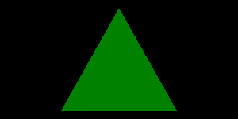</p>](A1/A1T7-center.png) \
This is rasterizing a triangle by sampling 64 equally spaced points in the pixel - note the smoothness in the edges compared to the center rasterized image. \
[<p align="center"></p>](A1/A1T7-grid-8x8.png)

Now that you're done with all of these tasks, congratulations on successfully creating your own software rasterizer! :)
## Extra Credit:

You can receive extra credit on this assignment for going beyond the assignment parameters. Extra credits require you to do independent thinking and may require code restructuring. Extra credits will be graded based on both the quality of the results and the clarity of the code changes and write-up.

Do your extra credit work in a separate branch so that it does not interfere with our grading of T1-T7 -- you may turn this branch in as a separate `extra/` directory.

### Make it Fast

Perform optimizations to make your rasterizer faster without sacrificing correctness.

You might try:
- Update your perspective-correct rasterization to avoid divisions (with, e.g., the Midpoint Algorithm).
- Use a smaller vertex and fragment buffer, draining them after they fill, to improve cache locality.
- Develop a tile-based rasterizer to improve framebuffer access locality.
- Use SIMD operations.
- Use fixed-point math.
- Implement a hierarchical z-buffer.
- Rasterize quad-frags.

In all of these cases, you should develop a testing methodology to compare your revised rasterizer to your baseline rasterizer and provide a clear description of why you believe your optimizations work.

### Add Clipping

Implement `clip_triangle` under `pipeline.cpp` to speed up your rasterizer.

You may have found suspicious functions named `clip_line` and `clip_triangle` under `pipeline.cpp` that we did not require you to write for the main assignment. It is often the case that there are many primitives lying outside the view frustum from the camera in a scene. Rasterizing triangles outside of the visible portion of the scene is both wasteful in memory and speed.

In order to take this into account, what we can do is to "clip" primitives (triangles, for our purposes) to fit within our volume of interest. Recall that we use homogenous coordinates for vertex transformations to allow translation and perspective transformation to be represented by 4x4 transformation matrices. Clipping's job is, given a primitive, to return only the part of the primitive which will map to the $[-1,1]^{3}$ "normalized device coordinates" cube after division by $w$, plus removing anything with a negative $w$ coordinate as a consequence.

Each of the clipping equations ( $-w < x$, $x < w$, $-w < y$, $y < w$, $-w < z$, $z < w$ ) corresponds to removing a half-space in 4D coordinates. As a result, you should return a triangulation of the subset of the triangle (considered as the 2D convex set in 4D space, which contains all of the vertices) in which the inequalities are true.

Keep in mind that $w$ will not be the same across all vertices almost always, and winding order (clockwise or counterclockwise order of vertices around the inside) must be preserved.
Also note that although `clip_line` may give you some insight into how to implement clipping equations, applying this to triangles may fundamentally differ in code structure. If you wish to use it as a baseline, proceed with caution.

### Investigate Multisampling

Multisampling remains an interesting area of work. Many multisampling strategies go beyond the basic sample distributions and averaging strategies in our codebase. You can recieve extra credit on this assignment for trying some different multisampling strategies.

You might try:
- Characterize a number of popular sampling patterns.
- Update the code to support sampling patterns that do sample-sharing between pixels.
- Update the code to support sampling patterns that use different coverage and color samples.

In each of these cases, you should provide a clear write-up describing how you implemented the ideas and provide comparisons showing how (/if) they improved image quality and/or rasterization efficiency. Please also include examples (images or models) showcasing when the implemented idea would do well and when it would do poorly.

### Write Some Really Good Test Cases

Course staff, at their discretion, may provide a small amount of extra credit to students who author particularly useful test cases and share them on the test case thread on Piazza.
