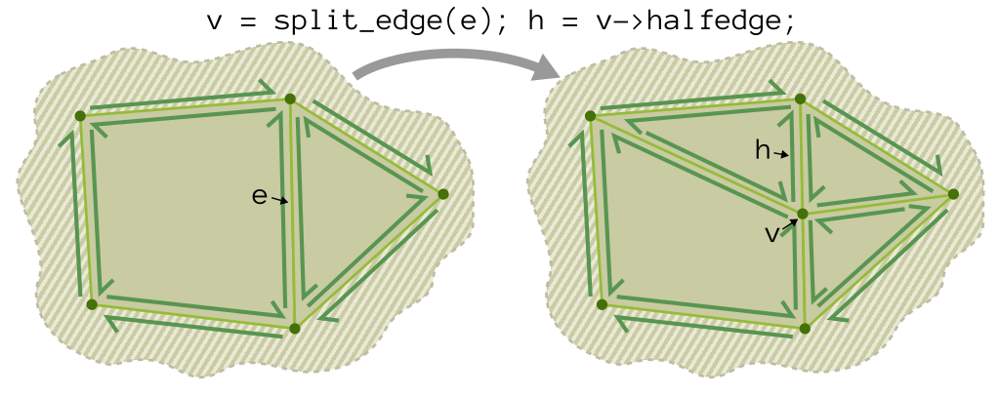
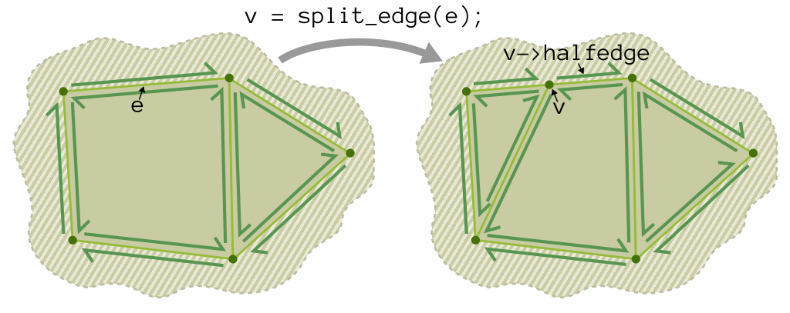
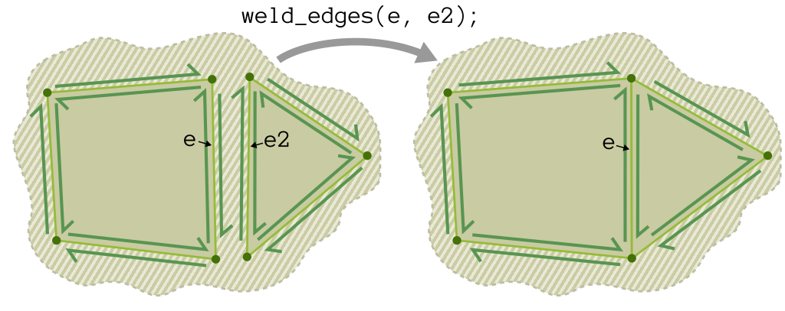
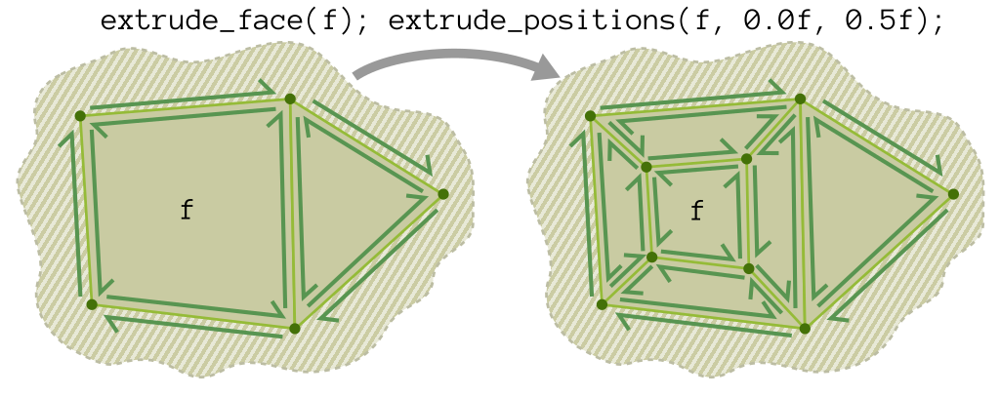
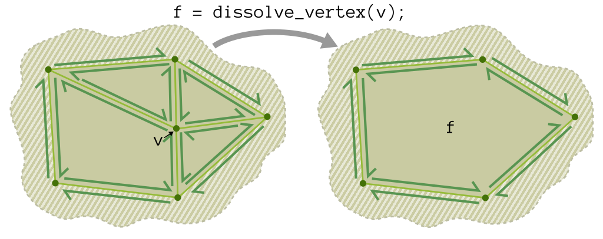
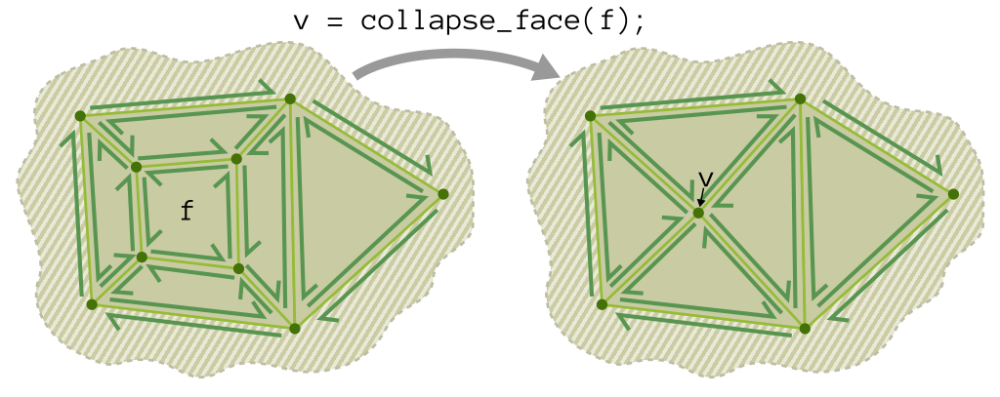
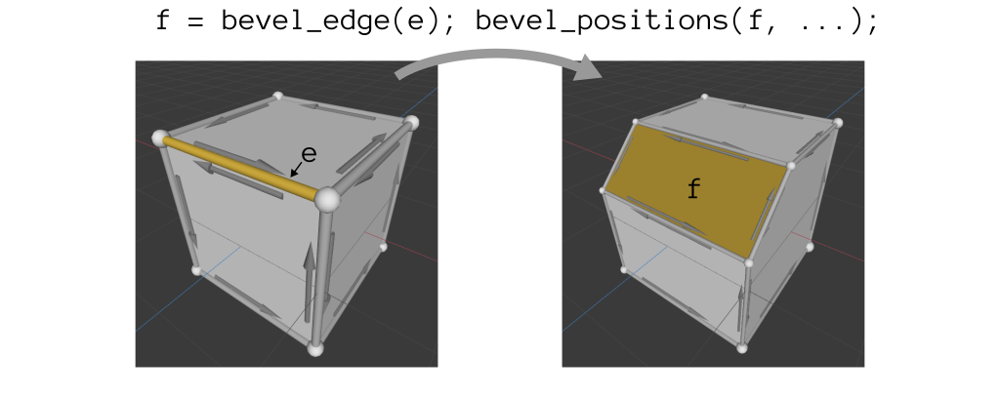
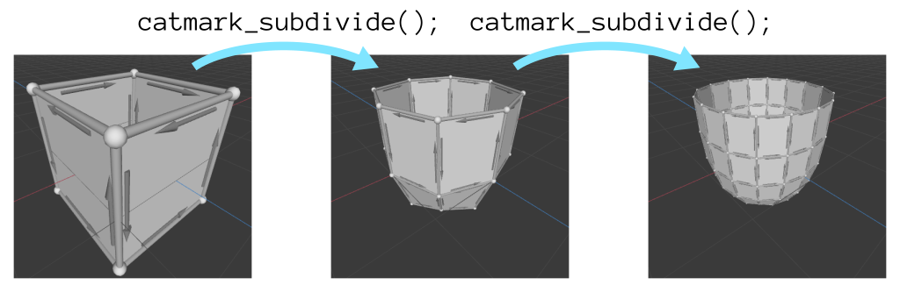
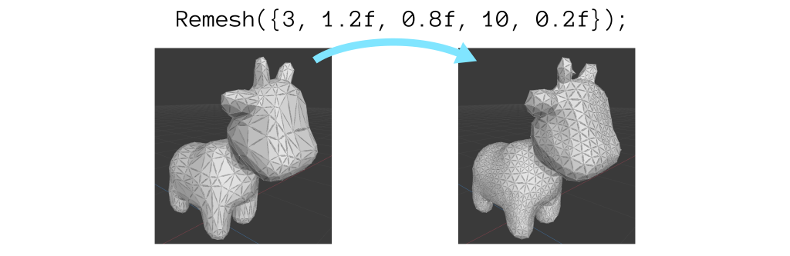
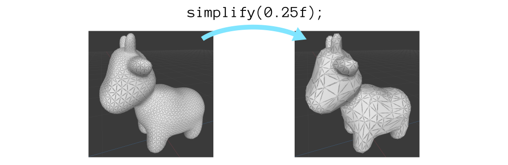

The authoritative version of this file is the one [in the Scotty3D repository](https://github.com/CMU-Graphics/Scotty3D/blob/main/assignments/A2.md).

# A2: Mesh Editing

In Assignment 2 you will write code to support the interactive editing of meshes in Scotty3D. Scotty3D stores and manipulates meshes using a halfedge mesh structure -- a local connectivity description which allows for fast local topology changes and has clear storage locations for data associated with vertices, edges, faces, and face-corners (/edge-sides).

You will find Scotty3D's implementation of halfedge meshes in the `Halfedge_Mesh` class, declared in `src/geometry/halfedge.h` and defined in `src/geometry/halfedge-*.cpp`. You will be filling in many of the editing operations for the mesh over the course of the assignment.

Read through the header and skim through the cpp files before you dive into the assignment. There's a lot of good inspiration in there for how to use and manipulate the structure effectively.

## Scoring

Total [100pts]: (capped at [110pts], even with extra credit)
- Checkpoint A2.0: [40pts]
	- `A2L1` flip edge [6pts]
	- `A2L2` split edge [8pts]
	- `A2L3` collapse edge [8pts]
	- `A2L4` weld edges [8pts]
	- `A2L5`, `A2L5h` extrude face [8pts]
	- optionally, for extra credit: [+2pts each]
		- `A2Lx1` dissolve vertex
		- `A2Lx2` dissolve edge
		- `A2Lx3` collapse face
		- `A2Lx4` inset vertex
		- `A2Lx5`, `A2Lx5h` bevel vertex
		- `A2Lx6`, `A2Lx6h` bevel edge
		- `A2Lx7` make boundary
	- writeup-A2.txt [2pts]
- Checkpoint A2.5: [60pts]
	- `A2G1` triangulation [15pts]
	- `A2G2` linear subdivision positions [10pts]
	- `A2G3` Catmull-Clark subdivision positions [10pts]
	- at least one of: [20pts] -- extras worth [+4pts each]
		- `A2Go1` Loop subdivision
		- `A2Go2` isotropic remeshing
		- `A2Go3` simplification
	- writeup-A2.txt [3pts]
	- model.s3d + model.png [2pts]

## Hand-in Instructions

To turn in your work, make sure you have all the files in the proper place and then run the following command in your root directory:
```
$ tar cvzf handin.tgz src/ tests/a2/ writeup-A2.txt model.s3d model.png
```

Details:
- We encourage you to develop your own test cases. Please include these in the `tests/` folder.
- If you do any of the extra credit, submit your code and write-up for the extra credit in a separate `extra/` folder.
- `model.s3d` and `model.png` are a cool model you've made with Scotty3D and a screenshot (or render) of that model
- `writeup-A2.txt` is described below.

### Write-up
You will submit a short document explaining how you believe your implementation performs on each of the tasks. The project directory contains a template in `writeup-A2.txt`.
*Given the choose-your-own-adventure nature of this assignment, the write-up is especially important.*
* Clearly indicate in your write-up which extra local operations you wish us to grade for extra credit.
* Clearly indicate in your write-up which optional global operation we should grade for regular credit (and which extra global operations, if any, we should grade for extra credit).

For each task, do either of the following:
* If you believe that you have correctly implemented the required functions, simply leave the text "Fully implemented." 
* If your implementation does not fully function, write a short explanation of what your code can and cannot do, and (optionally) briefly explain your strategy and how you got stuck. If your explanation indicates significant understanding of the problem, we may award partial credit even though the code does not work.

### Model Something With Your Code!
It's hard to wrangle mesh connectivity in code, but it sure makes it easier to build cool meshes in the GUI! So build yourself a fancy model using your very own code, save it as an s3d, and submit it (and a render or screen capture) along with your assignment.
The most [Baroque](https://en.wikipedia.org/wiki/Baroque)-styled model, as selected by the course staff, will be awarded a small prize.


## How to Test What You've Made

Some basic (incomplete!) test cases have been provided for you. You should add and share your own test cases in the appropriate Piazza thread.

```
#run all of the A2 test cases:
$ ./Scotty3D --run-tests a2.
```

You can also edit meshes in the GUI, which provides functions to call your operators. If you find yourself performing the same edits over and over in the GUI, we suggest writing a test case instead.

Unfortunately, we don't provide a simple way to run mesh edits from the CLI.

## All About `Halfedge_Mesh`

In our code, a halfedge mesh -- represented by the `Halfedge_Mesh` structure -- is a pointer-based repository for manifold mesh connectivity and data.
More information about the halfedge mesh is given in [the halfedge supplement](A2/halfedge.md).
Consider it a supplement to a thorough reading of `src/geometry/halfedge.h`.

Pay *extra attention* to the **Validity** section of the supplement (and header file).

## What To Do

**Beware:** this assignment has a lot of optional tasks. Don't mistakenly do more than you need to (though, hey, it would net you some extra credit).

Each task name is prefixed by a tag which you can use to locate and test the code.
E.g., for "`A2L1` Flip Edge" you can:
 - find where to fill in the code, by searching in `src/geometry/halfedge-local.cpp` for `A2L1`. (Note: `A2G*` tags appear in `halfedge-global.cpp`.)
 - find the test cases in `tests/a2/test.a2.l1.cpp`
 - run the test cases with `./Scotty3d --run-tests a2.l1.`

**Note:** meshes are structures that hold *connectivity* information (various pointers to other elements) along with *data* (information like positions, texture coordinates, and normals). Make sure to correctly update both kinds of information.

### Local Operations (Checkpoint A2.0)

For the first checkpoint, you need to fill the following five local operations.
Specifications for each function are available in a comment over the declaration. As usual, read carefully!

*Complexity Note:* these operations should be work-efficient. This means that their time should generally be linear in the number of mesh elements in a small topological neighborhood of the input. If you find yourself writing code for a local operation that iterates through, e.g., the entire `halfedges` list of the mesh, you are probably doing something wrong.

*Robustness Note:* For many local operations there are easy cases (often illustrated below) and hard cases (discuss amongst yourselves!). If your code handles the easy cases correctly and fails gracefully (by not modifying the mesh and returning `std::nullopt`) on the hard cases, you will get 80% of the points for an operation. If your code handles all cases correctly, you will receive full points.

### `A2L1` Flip Edge
Given a non-boundary edge, rotate it to the vertices one step counterclockwise from its current endpoints.


### `A2L2` Split Edge
Given an edge, add a vertex in the middle and subdivide adjacent non-boundary faces along the edge from the newly-added vertex to the next-in-ccw-order-from-the-edge vertex in the face.



Split edge does not subdivide boundary faces.



### `A2L3` Collapse Edge
Merge the two endpoints of an edge at the midpoint of the edge.


### `A2L4` Weld Edges
Merge two boundary edges into one non-boundary edge.



### `A2L5`, `A2L5h` Extrude Face
Extrude face surrounds a face with a ring of quads, so that the face can be moved and/or shrunk by the "extrude positions" helper function.



Face extrusion is an *incredibly handy* modeling primitive.

## Extra Local Operations

You may also implement any of these *optional* local operations for extra credit. You may find that some of them are useful for the global operations below.

You will receive extra credit regardless of whether you turn in the operations with A2.0 or A2.5 . Please indicate in your write-up which extra local operations you wish us to grade.

### `A2Lx1` Dissolve Vertex
Dissolve vertex removes a vertex by merging all of the adjacent non-boundary faces into one face.



Dissolving a vertex on the boundary does not merge with the boundary face.


### `A2Lx2` Dissolve Edge
Dissolve edge removes an edge by merging the two adjacent faces into one face.


If applied to a boundary edge, the merged face is a boundary.


### `A2Lx3` Collapse Face
Collapse face removes a face by shrinking it to a vertex at its center.



### `A2Lx4` Inset Vertex
Inset vertex creates a vertex in the middle of a face, and divides the face into triangles around the new vertex.


### `A2Lx5`, `A2Lx5h` Bevel Vertex
Bevel vertex replaces a vertex with an (zero-area) face with a vertex for every outgoing edge, ready to be expanded via the bevel positions helper function.


Notice that the `bevel_positions` helper function (`A2Lx5h`/`A2Lx6h`) is shared with bevel edge, below. So it might make sense to also do the Bevel Edge task.

### `A2Lx6`, `A2Lx6h` Bevel Edge
Bevel edge replaces an edge with an (zero-area) face with a vertex for every outgoing edge, ready to be expanded via the bevel positions helper function.



Notice that the `bevel_positions` helper function (`A2Lx5h`/`A2Lx6h`) is shared with bevel vertex, above. So it might make sense to also do the Bevel Vertex task.

### `A2Lx7` Make Boundary
Make boundary punches a hole in a mesh by setting a non-boundary face as boundary and cleaning up the consequences (e.g., merging adjacent boundary faces).


## Global Operations (Checkpoint A2.5)

For the second checkpoint, you need to fill in following three global operations as well as (at least one) of the optional global operations below.
Specifications for each function are available in a comment over the declaration. As usual, read carefully!


### `A2G1` Triangulation
Triangulate the mesh. Note that your code need not take special care for non-convex faces (and can, e.g., produce inverted triangles).

If you decide to go to the trouble of triangulating non-convex faces in a particularly nice way, call it out in your write-up for potential extra credit.


### `A2G2` Linear Subdivision Positions
Figure out the correct positions for newly added vertices when doing a Catmull-Clark-style subdivision (without the associated smoothing), so that the mesh remains in the same place. Be careful when handling boundaries.


Notice that you are only responsible for computing positions. A helper function exists which actually does the subdivision.

### `A2G3` Catmull-Clark Subdivision Positions
Figure out the correct positions for newly added vertices when doing a Catmull-Clark subdivision. Be careful when handling boundaries.



Notice that you are only responsible for computing positions. A helper function exists which actually does the subdivision.

## Optional Global Operations (pick one!)

To receive full credit on the assignment, you must implement one of the following three operations. Make sure to tell us which one to grade in your write-up. (Others will be graded for extra credit.)

### `A2Go1` Loop Subdivision
Subdivide a triangle mesh (a mesh where all non-boundary faces are triangles) using the Loop subdivision rules.


### `A2Go2` Isotropic Remeshing
Produce a mesh with a nicer edge length and angle distribution by repeatedly splitting edges that are too long, collapsing edges that are too short, and applying smoothing (tangent to the surface normal) to vertex positions.



### `A2Go3` Simplification
Produce a mesh with shorter edges by using a quadric error metric to optimally place new vertices.



## Tips

Some suggestions which will make your A2 process easier.

### Draw Pictures

Meshes are spatial objects. It's hard to reason about them without some sort of visual/spatial representation. When you are trying to figure out how to implement a given operation or debug a problematic case, drawing a picture should be one of your first steps.

### Mesh Validity

Given that all of your operations must produce valid meshes as output when run on valid meshes, it's worth understanding what it means for a mesh to be valid. Read the comment above `validate()` in `halfedge.h` and think through the cases that are allowed/disallowed by this specification.

The codebase is set up to call `validate()` after every operation. You should not do this in your operation code unless you are debugging, because `validate()` takes time proportional to the size of the mesh, so it breaks the complexity requirements for the local operations.
