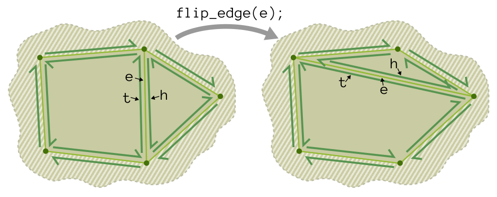
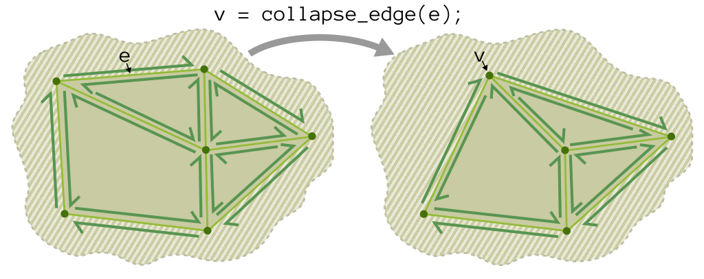
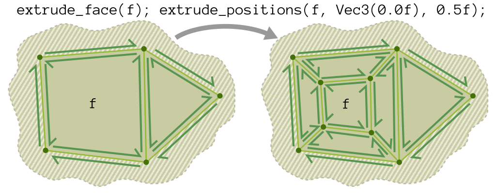
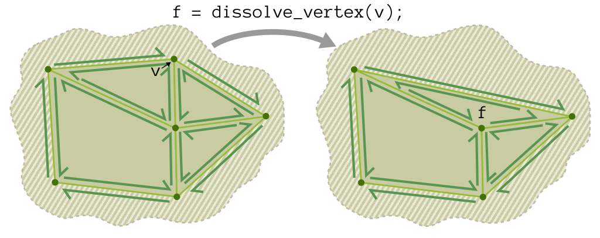
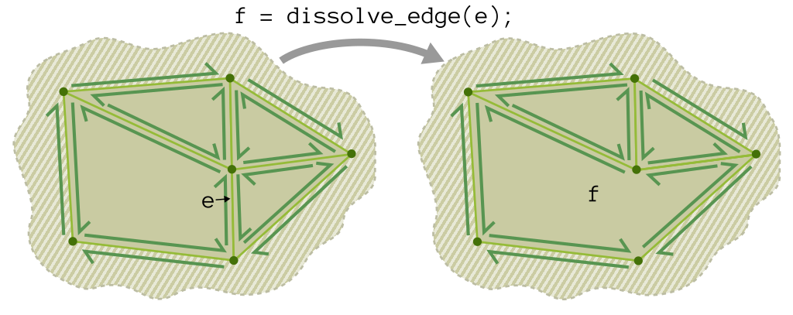
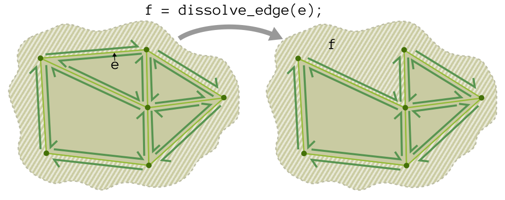
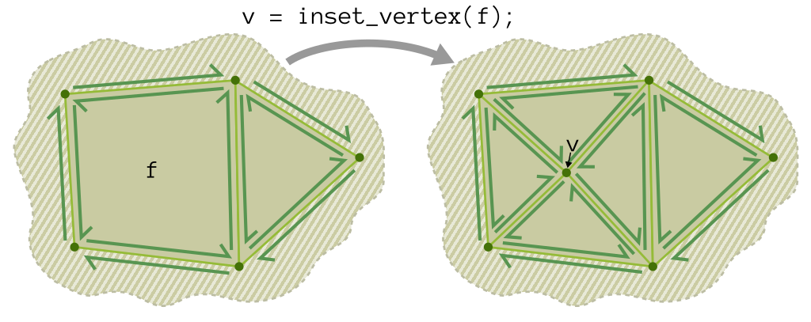
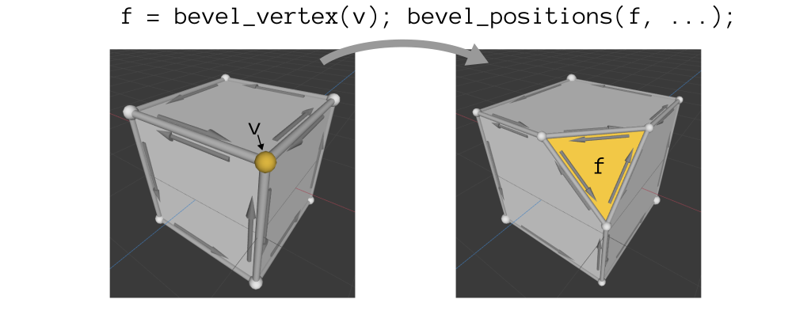
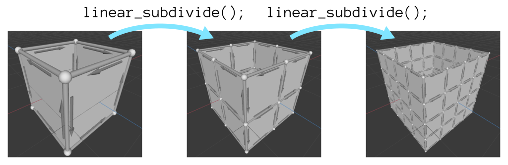
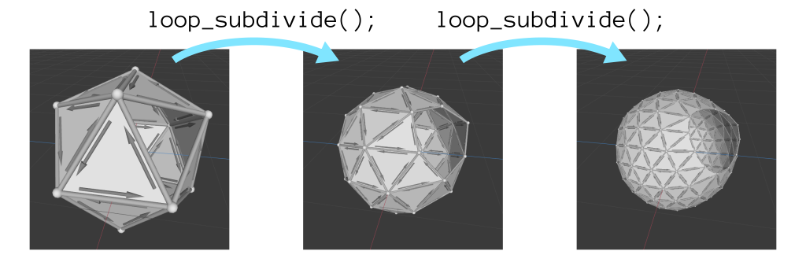

The authoritative version of this file is the one [in the Scotty3D repository](https://github.com/CMU-Graphics/Scotty3D/blob/main/assignments/A2.md).

# A2: Mesh Editing

In Assignment 2 you will write code to support the interactive editing of meshes in Scotty3D. Scotty3D stores and manipulates meshes using a halfedge mesh structure -- a local connectivity description which allows for fast local topology changes and has clear storage locations for data associated with vertices, edges, faces, and face-corners (/edge-sides).

You will find Scotty3D's implementation of halfedge meshes in the `Halfedge_Mesh` class, declared in `src/geometry/halfedge.h` and defined in `src/geometry/halfedge-*.cpp`. You will be filling in many of the editing operations for the mesh over the course of the assignment.

Read through the header and skim through the cpp files before you dive into the assignment. There's a lot of good inspiration in there for how to use and manipulate the structure effectively.

## Scoring

Total [100pts]: (capped at [110pts], even with extra credit)
- Checkpoint A2.0: [40pts]
	- `A2L1` flip edge [6pts]
	- `A2L2` split edge [6pts]
	- `A2L3` collapse edge [14pts]
	- `A2L4`, `A2L4h` extrude face [12pts]
	- optionally, for extra credit: [+2pts each]
		- `A2Lx1` dissolve vertex
		- `A2Lx2` dissolve edge
		- `A2Lx3` collapse face
		- `A2Lx4` inset vertex
		- `A2Lx5`, `A2Lx5h` bevel vertex
		- `A2Lx6`, `A2Lx6h` bevel edge
		- `A2Lx7` make boundary
    	- `A2Lx8` weld edges
	- writeup-A2.html [2pts]
- Checkpoint A2.5: [60pts]
	- `A2G1` triangulation [12pts]
	- `A2G2` linear subdivision positions [10pts]
	- `A2G3` Catmull-Clark subdivision positions [10pts]
	- at least one of: [20pts] -- extras worth [+4pts each]
		- `A2Go1` Loop subdivision
		- `A2Go2` isotropic remeshing
		- `A2Go3` simplification
	- writeup-A2.html [3pts]
	- model.js3d + model.png [5pts]

## Hand-in Instructions

To turn in your work, make sure you have all the files in the proper place and login to your GitHub account on the Gradescope submission page (for the checkpoint, you can exclude the `render.js3d` and `render.png` files). Gradescope will extract submissions from your Scotty3D GitHub repository by automatically pulling your most recent commit, so it's **really important to remember to push all new changes before you submit**.

Details:
- We encourage you to develop your own test cases. Please include these in the `tests/` folder.
- If you do any of the extra credit, please note in your write-up on which extra credit operations you attempted.
- `model.js3d` and `model.png` are a cool model you've made with Scotty3D and a screenshot (or render) of that model. These should be placed in `assignments/A2-writeup`.
- `assignments/writeup-A2.html` is described below.
- Please make sure you do not have any print statements enabled. You will lose points if there are an excessive amount of prints when we run your code.

### Write-up
You will submit a short document explaining how you believe your implementation performs on each of the tasks. The project directory contains a template in `assignments/writeup-A2.html`.
*Given the choose-your-own-adventure nature of this assignment, the write-up is especially important.*
* Clearly indicate in your write-up which extra local operations, if any, you wish us to grade for extra credit.
* Clearly indicate in your write-up which optional global operation we should grade for regular credit (and which extra global operations, if any, we should grade for extra credit).

For each task, do either of the following:
* If you believe that you have correctly implemented the required functions, then simply replace any reference images with images from your implentation and answer any questions listed in the writeup. 
* If your implementation does not fully function, write an additional short explanation of what your code can and cannot do, and (optionally) briefly explain your strategy and how you got stuck. You may include pictures or anything that may help you explain what you have done. If your explanation indicates significant understanding of the problem, we may award partial credit even though the code does not work.

If there are any reference images attached, make sure to replace them with a closely related image that demonstrates the task before turning in your assignment.

In addition, you will need to write a brief artists' statement for your `model.js3d`/`model.png`.

### Model Something With Your Code!
It's hard to wrangle mesh connectivity in code, but it sure makes it easier to build cool meshes in the GUI! So build yourself a fancy model using your very own code, save it as an js3d, and submit it (and a render or screen capture) along with your assignment. Name this file `model.js3d` and `model.png`, add it to `assignments/A2-writeup` and make sure it is displayed in your writeup.

## How to Test What You've Made

### via Test Cases

Some basic (incomplete!) test cases have been provided for you. You should add and share your own test cases in the appropriate Piazza thread.

```
#run all of the A2 test cases:
$ ./Scotty3D --run-tests a2.
```

Most of these test cases are constructed from using `Halfedge_Mesh::from_indexed_faces({Positions of vertices}, {Indices of face})`. An example of how to read `test_a2_l1_flip_edge_simple` is that we have an initial `mesh`, the `edge` we want to flip, and the expected `after` mesh that should result from this operation. There is a comparison function that compares the exected `after` mesh to the mesh resulting from performing the flip operation on `edge` of the initial `mesh` and checks to see if there are any differences. See the comments above each test case for an idea of what the mesh looks like before and after the operation.

### via Utility Functions

You will find many of the functions in `geometry/halfedge-utility.cpp` helpful in debugging. You will find `Halfedge_Mesh::describe()` and `Halfedge_Mesh::validate()` particularly useful. `describe()` prints out a description of the mesh, including the internal ids of its elements, and `validate()` checks that mesh corresponds to a valid manifold halfedge mesh. More info on `validate()` is described at the end of this file.

**Note : make sure you remove any calls to `describe()` and `validate()` before you submit the assignment.**


### via GUI

You can also edit meshes in the GUI, which provides functions to call your operators. You can do so with the following steps:
- Load a scene.
- Click the "Model" tab at the top of the screen.
- Select a mesh under the meshes tab in the left panel.
- Depending on the operation, select either nothing, a vertex, an edge, a face or a halfedge by clicking on the respective item.
- On the left panel, select the operation you wish to test.

If you find yourself performing the same edits over and over in the GUI, we suggest writing a test case instead.

Unfortunately, we don't provide a simple way to run mesh edits from the CLI.

## All About `Halfedge_Mesh`

In our code, a halfedge mesh -- represented by the `Halfedge_Mesh` structure -- is a pointer-based repository for manifold mesh connectivity and data.
More information about the halfedge mesh is given in [the halfedge supplement](A2/halfedge.md).
Consider it a supplement to a thorough reading of `src/geometry/halfedge.h`.

Pay *extra attention* to the **Validity** section of the supplement (and header file).

## What To Do

**Beware:** this assignment has a lot of optional tasks. Don't mistakenly do more than you need to (though, hey, it would net you some extra credit).

Each task name is prefixed by a tag which you can use to locate and test the code.
E.g., for "`A2L1` Flip Edge" you can:
 - find where to fill in the code, by searching in `src/geometry/halfedge-local.cpp` for `A2L1`. (Note: `A2G*` tags appear in `halfedge-global.cpp`.)
 - find the test cases in `tests/a2/test.a2.l1.cpp`
 - run the test cases with `./Scotty3d --run-tests a2.l1.`

**Note:** Meshes are structures that hold *connectivity* information (various pointers to other elements) along with *data* (information like positions, texture coordinates, and normals). Make sure to correctly update both kinds of information.

**Note:** For this semester, you will not need to correctly update any of the data information. However, when creating halfedges, you will need to set the normals to something different from the zero vector to avoid getting messed up models. A safe choice would be the face normal of the face the halfedge lies on. If you choose to try to correctly update the information, you may receive some extra credit. Please note what you chose to do and the reasoning behind it in your writeup.

### Local Operations (Checkpoint A2.0)

For the first checkpoint, you need to fill the following four local operations.
Specifications for each function are available in a comment over the declaration. As usual, read carefully!

*Complexity Note:* these operations should be work-efficient. This means that their time should generally be linear in the number of mesh elements in a small topological neighborhood of the input. If you find yourself writing code for a local operation that iterates through, e.g., the entire `halfedges` list of the mesh, you are probably doing something wrong.

*Robustness Note:* For many local operations there are easy cases (often illustrated below) and hard cases (discuss amongst yourselves!). If your code handles the easy cases correctly and fails gracefully (by not modifying the mesh and returning `std::nullopt`) on the hard cases, you will get 80% of the points for an operation. If your code handles common edge cases "correctly" as well (you can make a sound argument for what the expected output should be), you will receive full points. If you choose to go above and beyond and handle very niche edge cases, we may award extra credit. Please note in your writeup what edge cases you handled.

You should aim to implement an operation that performs as you would expect it to - there are countless edge cases for many of these operations that sometimes makes it infeasible to take care of in a timely manner. The goal of this assignment is not to get everything to be "correct," but to implement something that is usable in most scenarios (which will eventually lead to your building of your own model).

We've provided an example with `bisect_edge` in the code that can help give an idea on how to proceed with implementing these local operations.

### `A2L1` Flip Edge
Given a **non-boundary** edge, rotate it to the vertices one step counterclockwise from its current endpoints.



**Note: There is one edge case you should consider accounting for.**

### `A2L2` Split Edge
Given an edge, add a vertex in the middle and subdivide adjacent non-boundary faces along the edge from the newly-added vertex to the next-in-ccw-order-from-the-edge vertex in the face.


Split edge does not subdivide boundary faces.


### `A2L3` Collapse Edge
Merge the two endpoints of an edge at the midpoint of the edge. This will combine all the edges to both endpoints into a new vertex (be careful to not have two edges overlapping).



If collapsing the edge would result in an invalid mesh, you should instead do nothing and return `std::nullopt`. Otherwise returns the newly collapsed vertex. It is difficult to restore a mesh after making changes such as deleting data, so you will need to come up with a way to detect these edge cases prior to applying changes to the mesh.

**Note: Example of a hard edge case and a simple edge case:**
```
.---.---.    . \   / .
|   |   |    |  \ /  |
|   |   | -> |   .   | (figure 8, and any generalizations of this)
|   |   |    |  / \  |
.---.---.    . /   \ .
```
```
   .    
  / \   What would a triangle collapse into?
 /   \   
.-----. 
```


### `A2L4`, `A2L4h` Extrude Face
Extrude face surrounds a face with a ring of quads, so that the face can be moved and/or shrunk by the "extrude positions" helper function. Implementing these two functions will enable the `bevel face` (move a face in the direction of the normal and allow it to expand/shrink) and `extrude face` (move a face in the direction of the normal).



Face extrusion is an *incredibly handy* modeling primitive.

## Extra Local Operations

You may also implement any of these *optional* local operations for extra credit. You may find that some of them are useful for the global operations below.

You will receive extra credit regardless of whether you turn in the operations with A2.0 or A2.5 . Please indicate in your write-up which extra local operations you wish us to grade.

### `A2Lx1` Dissolve Vertex
Dissolve vertex removes a vertex by merging all of the adjacent non-boundary faces into one face.


Dissolving a vertex on the boundary does not merge with the boundary face.



### `A2Lx2` Dissolve Edge
Dissolve edge removes an edge by merging the two adjacent faces into one face.



If applied to a boundary edge, the merged face is a boundary.



### `A2Lx3` Collapse Face
Collapse face removes a face by shrinking it to a vertex at its center.


### `A2Lx4` Inset Vertex
Inset vertex creates a vertex in the middle of a face, and divides the face into triangles around the new vertex.



### `A2Lx5`, `A2Lx5h` Bevel Vertex
Bevel vertex replaces a vertex with an (zero-area) face with a vertex for every outgoing edge, ready to be expanded via the bevel positions helper function.



Notice that the `bevel_positions` helper function (`A2Lx5h`/`A2Lx6h`) is shared with bevel edge, below. So it might make sense to also do the Bevel Edge task.

### `A2Lx6`, `A2Lx6h` Bevel Edge
Bevel edge replaces an edge with an (zero-area) face with a vertex for every outgoing edge, ready to be expanded via the bevel positions helper function.


Notice that the `bevel_positions` helper function (`A2Lx5h`/`A2Lx6h`) is shared with bevel vertex, above. So it might make sense to also do the Bevel Vertex task.

### `A2Lx7` Make Boundary
Make boundary punches a hole in a mesh by setting a non-boundary face as boundary and cleaning up the consequences (e.g., merging adjacent boundary faces).


### `A2Lx8` Weld Edges
Merge two boundary edges into one non-boundary edge.


## Global Operations (Checkpoint A2.5)

For the second checkpoint, you need to fill in the following three global operations as well as (at least one) of the optional global operations below.

Specifications for each function are available in a comment over the declaration. As usual, read carefully! We've also provided the writeups that were used in previous iterations of the class - do note that things might be slightly different (for instance, you'll need to handle boundaries for subdivision operations).

### `A2G1` Triangulation
Triangulate the mesh. Note that your code need not take special care for non-convex faces (and can, e.g., produce inverted triangles).

If you decide to go to the trouble of triangulating non-convex faces in a particularly nice way, call it out in your write-up for potential extra credit.

See [Triangulate](A2/triangulate.md) for more information from a previous iteration.


### `A2G2` Linear Subdivision Positions
Figure out the correct positions for newly added vertices when doing a Catmull-Clark-style subdivision (without the associated smoothing), so that the mesh remains in the same place.

See [Linear Subdivision](A2/linear.md) for more information from a previous iteration.



Notice that you are only responsible for computing positions. A helper function exists which actually does the subdivision.

### `A2G3` Catmull-Clark Subdivision Positions
Figure out the correct positions for newly added vertices when doing a Catmull-Clark subdivision. Be careful when handling [boundaries](http://15462.courses.cs.cmu.edu/fall2022/lecture/geometryprocessing/slide_023).

See [Catmull-Clark Subdivision](A2/catmull.md)  for more information from a previous iteration.


Notice that you are only responsible for computing positions. A helper function exists which actually does the subdivision.

## Optional Global Operations (pick one!)

To receive full credit on the assignment, you must implement one of the following three operations. Make sure to tell us which one to grade in your write-up. (Others will be graded for extra credit.)

### `A2Go1` Loop Subdivision
Subdivide a triangle mesh (a mesh where all non-boundary faces are triangles) using the Loop subdivision rules. Be careful when handling [boundaries](http://15462.courses.cs.cmu.edu/fall2022/lecture/geometryprocessing/slide_023) (see the Catmull-Clark markdown for a little more clarification).

See [Loop Subdivision](A2/loop.md) for more information from a previous iteration.



### `A2Go2` Isotropic Remeshing
Produce a mesh with a nicer edge length and angle distribution by repeatedly splitting edges that are too long, collapsing edges that are too short, and applying smoothing (tangent to the surface normal) to vertex positions.

See [Isotropic Remeshing](A2/remesh.md)  for more information from a previous iteration.


**Note: The test cases provided for this task are very basic test cases as the slightly more complicated ones aren't working at the moment. We will grade this operation based off of the GUI and looking at the student's code.**

### `A2Go3` Simplification
Produce a mesh with shorter edges by using a quadric error metric to optimally place new vertices.

See [Simplification](A2/simplify.md)  for more information from a previous iteration.


## Tips

Some suggestions which will make your A2 process easier.

### Draw Pictures

Meshes are spatial objects. It's hard to reason about them without some sort of visual/spatial representation. When you are trying to figure out how to implement a given operation or debug a problematic case, drawing a picture should be one of your first steps.

### Mesh Validity

Given that all of your operations must produce valid meshes as output when run on valid meshes, it's worth understanding what it means for a mesh to be valid. Read the comment above `validate()` in `halfedge.h` and think through the cases that are allowed/disallowed by this specification.

The codebase is set up to call `validate()` after every operation. You should not do this in your operation code unless you are debugging, because `validate()` takes time proportional to the size of the mesh, so it breaks the complexity requirements for the local operations.
