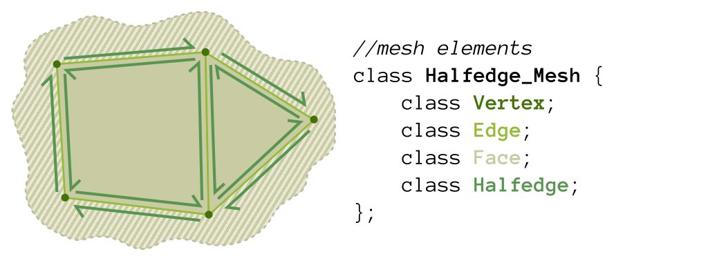
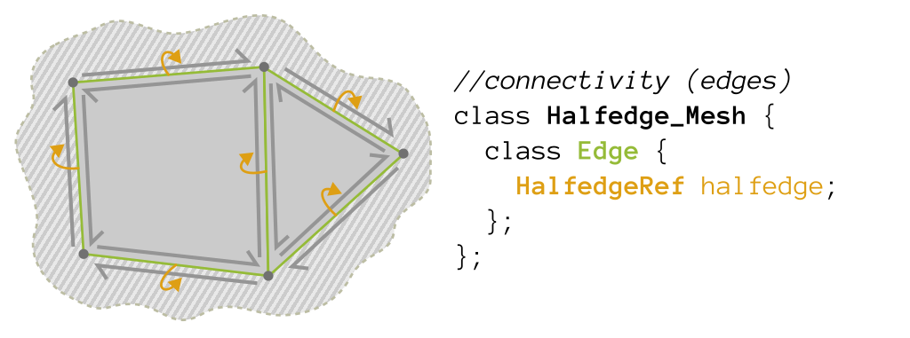

# All About `Halfedge_Mesh`

In our code, a halfedge mesh -- represented by the `Halfedge_Mesh` structure -- is a pointer-based repository for manifold mesh connectivity and data.
This section provides an overview of some key ideas about halfedge meshes and the `Halfedge_Mesh` structure in particular. Consider it a supplement to a thorough reading of `src/geometry/halfedge.h`.

## Mesh Elements and Memory Management

A `Halfedge_Mesh` wrangles four mesh element types: `Vertices`, `Edges`, `Faces`, and `Halfedges`:



As a pointer-based structure, `Halfedge_Mesh` operations will often require the allocation and deallocation of new elements. Rather than using the C++ `new` and `delete` operators directly, `Halfedge_Mesh` instead provides `emplace_*` and `erase_*` functions to allocate and free (respectively) mesh elements. This allows the mesh to track all of the elements that belong to it in `std::list`s (called `vertices`, `edges`, `faces`, and `halfedges`).

The functions also maintain a unique-within-the-mesh `id` value for mesh elements, which can be useful for debugging (printing `v->id` for debug messages is a lot more readable than `&*v`). As an additional feature, the high-order bit of the `id` is set by the `erase_*` functions. So if you start seeing very very large id values, you probably have a use-after-free bug.

## Mesh Connectivity

In our halfedge mesh structure, elements store both connectivity information as references (really, `std::list< >` iterators) to other elements.

Vertices store a reference to one of the halfedges directed away from them in `Vertex::halfedge`:


Edges store a reference to one of the halfedges that make them up in `Edge::halfedge`:



Faces store a reference to one of the halfedges that circulate around them in `Face::halfedge`:


Halfedges store the bulk of the connectivity information. They store a reference to the halfedge on the other side of their edge in `Halfedge::twin`, a reference to the halfedge that follows them in their current face in `Halfedge::next`, a reference to the vertex they leave in `Halfedge::vertex`, a reference to the edge they border in `Halfedge::edge`, and a reference to the face they circulate in `Halfedge::face`:


## Mesh Data

In addition to the mesh connectivity, the mesh stores data on each of the mesh features.


Vertices store their location in `position`, and information about skinning (A4!) in `bone_weights`.

Edges store a `sharp` flag which is used in shading normal computation. If this flag is true, then we treat this edge as a break in the surface when computing shading normals, and if it's false, then we treat this edge as connected when computing shading normals.

Faces store a `boundary` flag which tells you if the face is a solid face or a face that exists to book-keep holes in the model:


Halfedges store `corner_uv` and `corner_normal` values, which are used to set texture coordinates and shading normals for the corner of the face associated with the halfedge.


### Splitting and Merging Data

Since it is often the case that you are adding or removing features from the mesh, we include an overloaded `interpolate_data` helper function to help in interpolating/merging `Vertex::bone_weights` and `Halfedge::corner_*` data. (Handling of `Edge::sharp` is probably either obvious [as in splits] or arbitrary [as in merges with different flags]. Handling of `Face::boundary` is generally specified by the operation.)

Check the comments near `interpolate_data` in `halfedge.h` for some usage examples.

## Iterating over the Data

Down below are some examples of how to iterate using a `Halfedge_Mesh`. Suppose we have a face $f$ and want to print out the positions of all its vertices. We would write a routine like this:

```
void printVertexPositions(FaceRef f) {
  HalfedgeRef h = f->halfedge; // get the first halfedge of the face
  do {
    VertexRef v = h->vertex;   // get the vertex of the current halfedge
    std::cout << v->position << std::endl;      // print the vertex position
    h = h->next;               // move to the next halfedge around the face
  } while (h != f->halfedge);  // keep going until we're back at the beginning
}
```

Notice that we refer to a face as a FaceRef rather than just a Face. You can think of a Ref as a kind of pointer. Note that members of an iterator are accessed with an arrow -> rather than a dot ., just as with pointers. (A more in-depth explanation of some of these details can be found in the inline documentation.) Similarly, to print out the positions of all the neighbors of a given vertex we could write a routine like this:

```
void printNeighborPositions(VertexRef v) {
  HalfedgeRef h = v->halfedge;    // get one of the outgoing halfedges of the vertex
  do {
    HalfedgeRef h_twin = h->twin;   // get the vertex of the current halfedge
    VertexRef vN = h_twin->vertex;  // vertex is 'source' of the half edge.
                                      // so h->vertex is v,
                                      // whereas h_twin->vertex is the neighbor vertex.
    std::cout << vN->position << std::endl;          // print the vertex position
    h = h_twin->next;               // move to the next outgoing halfedge of the vertex.
  } while(h != v->halfedge);        // keep going until we're back at the beginning
}
```

To iterate over all the vertices in a halfedge mesh, we could write a loop like this:

```
for(VertexRef v = vertices_begin(); v != vertices_end(); v++) {
  printNeighborPositions(v); // do something interesting here
}
```

## Temporary Storage

Sometimes it is useful to associate temporary storage with the various mesh elements. E.g., to store a position or flag on a mesh element during an algorithm. You can use the fact that mesh elements have stable addresses (and we provide a `std::hash` specialization that hashes their addresses) to do this:
```cpp
std::unordered_map< VertexRef, Vec3 > next_position; //store data per-element
std::unordered_set< VertexRef > was_special; //store a set of VertexRefs

for (VertexRef v = vertices.begin(); v != vertices.end(); ++v) {
	next_position[v] = Vec3(0.0f, 0.0f, 0.0f);
	if (check_something(v)) {
		was_special.emplace(v);
	}
}

//... later ...

for (VertexRef v = vertices.begin(); v != vertices.end(); ++v) {
	v->position = next_position.at(v);
	if (was_special.count(v)) {
		//...
	}
}
```

Keep in mind that neither addresses or the order of iteration of hashed containers (`unordered_*`) will be stable between OS's, standard library versions, or even (if using address-space layout randomization) runs of the same program. This probably won't matter for you, but I'm mentioning it now just in case.

## Validity

A `Halfedge_Mesh` structure is a sea of pointers. It is surprisingly easy to tangle these pointers into a mess that fails to represent a manifold mesh (or, really, a consistent mesh at all). In order to provide guidance on what constitutes a reasonable setting for a mesh, we define a *valid* mesh as one for which the following properties hold:
1. The mesh is self-contained. All pointers are to elements in the vertices, edges, faces, or halfedges lists.
2. Edges correspond to twinned halfedges. That is, for every edge `e`, `e->halfedge(->twin)^n` is a cycle of exactly two halfedges, and these are exactly the halfedges with `h->edge` equal to `e`.
3. Faces correspond to cycles of halfedges. That is, for every face `f`, `f->halfedge(->next)^n` is a cycle of at least three halfedges, and these are exactly the halfedges with `h->face` equal to `f`.
4. Vertices correspond to stars of halfedges. That is, for every vertex `v`, `v->halfedge(->twin->next)^n` is a cycle of at least two halfedges, and these are exactly the halfedges with `h->vertex` equal to `v`.
5. Vertices are not orphaned, nor is the surface adjacent to them hourglass-shaped. That is, vertices are adjacent to at least one non-boundary face and at most one boundary face.
6. Edges not orphaned. That is, edges are adjacent to at least one non-boundary face.
7. Faces are simple. That is, faces touch each vertex and edge at most once.

These properties are checked by the `Halfedge_Mesh::validate()` function, which returns `nullopt` if the mesh is valid or an element reference and an explanatory message if something is wrong with the mesh.
