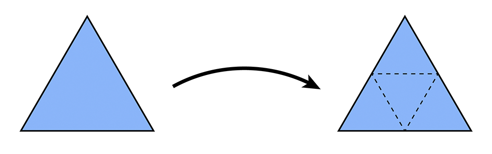

# `A2Go1` Loop Subdivision

For an in-practice example, see the [User Guide](https://cmu-graphics.github.io/Scotty3D-docs/guide/model_mode/).

Loop subdivision (named after [Charles Loop](http://charlesloop.com/)) is a standard approximating subdivision scheme for triangle meshes. At a high level, it consists of two basic steps:

1. Split each triangle into four by connecting edge midpoints (sometimes called "$4-1$ subdivision").
2. Update vertex positions as a particular weighted average of neighboring positions.

The $4-1$ subdivision looks like this:

<p align="center"></p>

And the following picture illustrates the weighted average:

<p align="center"></p>

Note that the above image has **two separate formulas**.

On the right side, the new position of an **old vertex** is the following:

$$
 v_{new} = (1 - nu) \cdot v_{old} + u \cdot \sum v_{neighbor}
$$

On the left side, the new position of a **newly created vertex v** that splits the old Edge $AB$ and is flanked by old opposite vertices $C$ and $D$ across the two faces connected to $AB$ in the original mesh is the following:

$$
 v_{new} = \frac{3}{8} \cdot (A + B) + \frac{1}{8} \cdot (C + D)
$$

If we repeatedly apply these two steps, we will converge to a fairly smooth approximation of our original mesh.

We will implement Loop subdivision as the `Halfedge_Mesh::loop_subdivide()` method. In contrast to linear and Catmull-Clark subdivision, Loop subdivision **must** be implemented using the local mesh operations described above (simply because it provides an alternative perspective on subdivision implementation, which can be useful in different scenarios). In particular, $4-1$ subdivision can be achieved by applying the following strategy:

1. Split every edge of the mesh *in any order whatsoever*.
2. Flip any new edge that touches a new vertex and an old vertex.

The following pictures (courtesy Denis Zorin) illustrate this idea:

<p align="center"></p>

Notice that only blue (and not black) edges are flipped in this procedure; as described above, edges in the split mesh should be flipped if and only if they touch both an original vertex *and* a new vertex (i.e., a midpoint of an original edge).

When working with dynamic mesh data structures (like a halfedge mesh), one must think **very carefully** about the order in which mesh elements are processed---it is quite easy to delete an element at one point in the code, then try to access it later (typically resulting in a crash!). For instance, suppose we write a loop like this:

```cpp
// iterate over all edges in the mesh
for (EdgeRef e = edges_begin(); e != edges_end(); e++) {
  if (some condition is met) {
    split_edge(e);
  }
}
```

Although this routine looks straightforward, it can very easily crash! The reason is fairly subtle: we are iterating over edges in the mesh by incrementing the iterator `e` (via the expression `e++`). But since `split_edge()` is allowed to create and delete mesh elements, it might deallocate the edge pointed to by `e` before we increment it! To be safe, one should instead write a loop like this:

```cpp
// iterate over all edges in the mesh
int n = n_edges();
EdgeRef e = edges_begin();
for (int i = 0; i < n; i++) {

  // get the next edge NOW!
  EdgeRef nextEdge = e;
  nextEdge++;

  // now, even if splitting the edge deletes it...
  if (some condition is met) {
    split_edge(e);
  }

  // ...we still have a valid reference to the next edge.
  e = nextEdge;
}
```

Note that this loop is just a representative example, the implementer must consider which elements might be affected by a local mesh operation when writing such loops. We recommend ensuring that your atomic edge operations provide certain guarantees. For instance, if the implementation of `Halfedge_Mesh::flip_edge()` guarantees that no edges will be created or destroyed (as it should), then you can safely do edge flips inside a loop without worrying about these kinds of side effects.

For Loop subdivision, there are some additional data members that will make it easy to keep track of the data needed to update the connectivity and vertex positions. In particular:

- `vertex_new_pos` can be used as temporary storage for the new position (computed via the weighted average above). Note that one should *not* change the value of `Vertex::pos` until *all* the new vertex positions have been computed -- otherwise, subsequent computation will take averages of values that have already been averaged!
- Likewise, `edge_new_pos` can be used to store the position of the vertices that will ultimately be inserted at edge midpoints. Again, these values should be computed from the original values (before subdivision), and applied to the new vertices only at the very end. Each `edge_new_pos` value will be used for the position of the vertex that will appear along the old edge after the edge is split. We precompute the position of the new vertex before splitting the edges and allocating the new vertices because it is easier to traverse the simpler original mesh to find the positions for the weighted average that determines the positions of the new vertices.

Given this setup, we strongly suggest that it will be easiest to implement subdivision according to the following "recipe" (though the implementer is of course welcome to try doing things a different way!). The basic strategy is to *first* compute the new vertex positions (storing the results in the `new_pos` maps for both vertices and edges), and only *then* update the connectivity. Doing it this way will be much easier, since traversal of the original (coarse) connectivity is much simpler than traversing the new (fine) connectivity. In more detail:

1. Mark all vertices as belonging to the original mesh by setting `Vertex::is_new` to `false` for all vertices in the mesh.
2. Compute updated positions for all vertices in the original mesh using the vertex subdivision rule, and store them in `Vertex::new_pos`.
3. Compute new positions associated with the vertices that will be inserted at edge midpoints, and store them in `Edge::new_pos`.
4. Split every edge in the mesh, being careful about how the loop is written. In particular, you should make sure to iterate only over edges of the original mesh. Otherwise, the loop will keep splitting edges that you just created!
5. Flip any new edge that connects an old and new vertex.
6. Finally, copy the new vertex positions (`Vertex::new_pos`) into the usual vertex positions (`Vertex::pos`).

It may be useful to ensure `Halfedge_Mesh::split_edge()` will now return an iterator to the newly inserted vertex, and particularly that the halfedge of this vertex will point along the edge of the original mesh. This iterator is useful because it can be used to 
1. Flag the vertex returned by the split operation as a new vertex, and 
2. Flag each outgoing edge as either being new or part of the original mesh. 

(In other words, Step $4$ is a great time to set the members `is_new` for vertices and edges created by the split. It is also a good time to copy the `new_pos` field from the edge being split into the `new_pos` field of the newly inserted vertex.)

We recommend implementing this algorithm in stages, e.g., *first* see if you can correctly update the connectivity, *then* worry about getting the vertex positions right. Some examples below illustrate the correct behavior of the algorithm (coming soon).

This subdivision rule **is not** required to support meshes with boundary, unless the implementer wishes to go above and beyond.