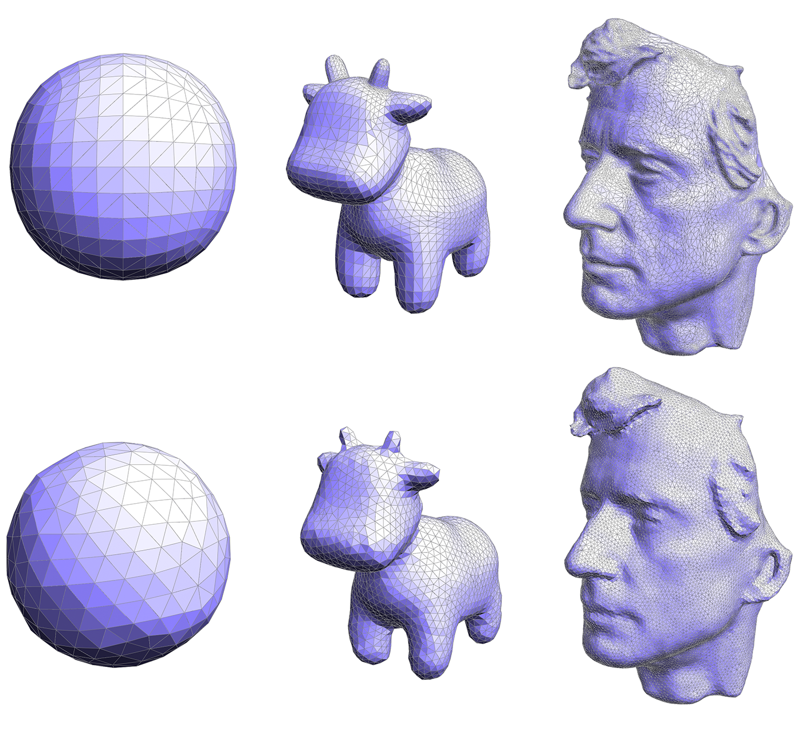

# `A2Go2` Isotropic Remeshing

For an in-practice example, see the [User Guide](https://cmu-graphics.github.io/Scotty3D-docs/guide/model_mode/).

Scotty3D also supports remeshing, an operation that keeps the number of samples roughly the same while improving the shape of individual triangles. The isotropic remeshing algorithm tries to make the mesh as "uniform" as possible, i.e., triangles as close as possible to equilateral triangles of equal size, and vertex degrees as close as possible to $6$ (note: this algorithm is for **triangle meshes only**). The algorithm to be implemented is based on the paper [Botsch and Kobbelt, "A Remeshing Approach to Multiresolution Modeling"](https://www.graphics.rwth-aachen.de/media/papers/remeshing1.pdf)(Section $4$), and can be summarized in just a few simple steps:

1. If an edge is too long, split it.
2. If an edge is too short, collapse it.
3. If flipping an edge improves the degree of neighboring vertices, flip it.
4. Move vertices toward the average of their neighbors.

Repeating this simple process several times typically produces a mesh with fairly uniform triangle areas, angles, and vertex degrees. However, each of the steps deserves slightly more explanation.

### **Edge Splitting / Collapsing**

Ultimately we want all of our triangles to be about the same size, which means we want edges to all have roughly the same length. As suggested in the paper by Botsch and Kobbelt, we will aim to keep our edges no longer than $\frac{4}{3}$ of the **mean** edge length $L$ in the input mesh, and no shorter than $\frac{4}{5}$ of $L$. In other words, if an edge is longer than $\frac{4L}{3}$, split it; if it is shorter than $\frac{4L}{5}$, collapse it. These parameters are stored in `Halfedge_Mesh::Isotropic_Remesh_Parameters` and you should access them from there. We recommend performing all of the splits first, then doing all of the collapses (though as usual, you should be careful to think about when and how mesh elements are being allocated/deallocated).

### Edge Flipping

We want to flip an edge any time it reduces the total deviation from regular degree (degree $6$). In particular, let $a_1$, $a_2$ be the degrees of an edge that we're thinking about flipping, and let $b_1$, $b_2$ be the degrees of the two vertices across from this edge. The total deviation in the initial configuration is `|a1-6| + |a2-6| + |b1-6| + |b2-6|`. You should be able to easily compute the deviation after the edge flip **without actually performing the edge flip**; if this number decreases, then the edge flip should be performed. We recommend flipping all edges in a single pass, after the edge collapse step.

### Vertex Averaging

Finally, we also want to optimize the geometry of the vertices. A very simple heuristic is that a mesh will have reasonably well-shaped elements if each vertex is located at the center of its neighbors. To keep your code clean and simple, we recommend using the method `Vertex::neighborhood_center()`, which computes the average position of the vertex's neighbors. Note that you should not use this to immediately replace the current position: we don't want to be taking averages of vertices that have already been averaged. Doing so can yield some bizarre behavior that depends on the order in which vertices are traversed (if you're interested in learning more about this issue, Google around for the terms "Jacobi iterations" and "Gauss-Seidel). So, the code should 

1. First compute the new positions for all vertices using their neighborhood centroids, and 
2. *Then* update the vertices with new positions (copy the new positions into `position`).

How exactly should the positions be updated? One idea is to simply replace each vertex position with its centroid. We can make the algorithm slightly more stable by moving *gently* toward the centroid, rather than immediately snapping the vertex to the center. For instance, if $p$ is the original vertex position and $c$ is the centroid, we might compute the new vertex position as $q = p + w(c - p)$ where $w$ is some weighting factor between $0$ and $1$ (we use $\frac{1}{5}$ in the examples below). In other words, we start out at $p$ and move a little bit in the update direction $v = c - p$.

Another important issue arises if the update direction $v$ has a large *normal* component, then we'll end up pushing the surface in or out, rather than just sliding our sample points around on the surface. As a result, the shape of the surface will change much more than we'd like (try it!). To ameliorate this issue, we will move the vertex only in the *tangent* direction, which we can do by projecting out the normal component, i.e., by replacing $v$ with $v - \text{dot}(N,v)\cdot N$, where $N$ is the unit normal at the vertex. To get this normal, you can use the method `Vertex::normal()`, which computes the vertex normal as the area-weighted average of the incident triangle normals. In other words, at a vertex $i$ the normal points in the direction, we have the following:

$$
\Large{\sum_{\text{triangles } ijk \text{ touching vertex } i} A_{ijk} \cdot N_{ijk}}
$$

where $A_{ijk}$ is the area of triangle $ijk$, and $N_{ijk}$ is its unit normal; this quantity can be computed directly by just taking the cross product of two of the triangle's edge vectors (properly oriented).

### Implementation

The final implementation requires very little information beyond the description above; the basic recipe is:

1. Compute the mean edge length $L$ of the input.
2. Split all edges that are longer than `longer_factor` $\cdot L$.
3. Collapse all edges that are shorter than `shorter_factor` $\cdot L$.
4. Flip all edges that decrease the total deviation from degree $6$.
5. Compute the centroids for all the vertices.
6. Move each vertex in the tangent direction toward its centroid.

Repeating this procedure about `outer_iterations` times should yield results like the ones seen below; remember to repeat the smoothing step `smoothing_iterations` times for each "outer" iteration.

