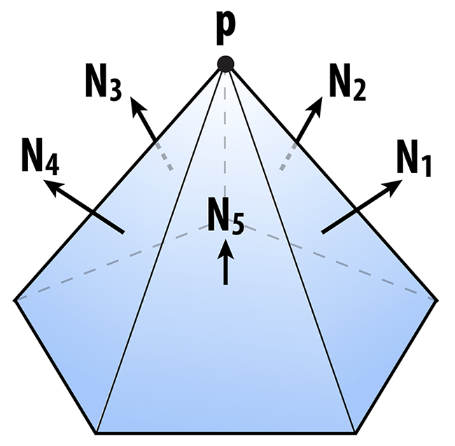

# `A2Go3` Simplification

For an in-practice example, see the [User Guide](https://cmu-graphics.github.io/Scotty3D-docs/guide/model_mode/).

<p align="center"></p>

Just as with images, meshes often have far more samples than we really need. The simplification method in Scotty3D simplifies a given triangle mesh by applying *quadric error simplification* (note that this method is for **triangle meshes only**!). This method was originally developed at CMU by Michael Garland and Paul Heckbert, in their paper [Surface Simplification Using Quadric Error Metrics](http://www.cs.cmu.edu/~./garland/quadrics/quadrics.html). (Looking at this paper -- or the many slides and presentations online that reference it -- may be very helpful in understanding and implementing this part of the assignment!)

The basic idea is to iteratively collapse edges until we reach the desired number of triangles. The more edges we collapse, the simpler the mesh becomes. The only question is: which edges should we collapse? And where should we put the new vertex when we collapse an edge? Finding the sequence of edge collapses (and vertex positions) that give an *optimal* approximation of the surface would be very difficult -- likely impossible! Garland and Heckbert instead proposed a simple, greedy scheme that works quite well in practice, and is the basis of many mesh simplification tools today. Roughly speaking, we're going to write down a function that measures the distance to a given triangle, and then "accumulate" this function as many triangles get merged together.

More precisely, we can write the distance $d$ of a point $x$ to a plane with normal $N$ passing through a point $p$ as $\text{dist}(x) = \text{dot}(N, x - p)$

<p align="center"></p>

In other words, we measure the extent of the vector from $p$ to $x$ along the normal direction. This quantity gives us a value that is either *positive* (above the plane), or *negative* (below the plane). Suppose that $x$ has coordinates $(x, y, z)$, $N$ has coordinates $(a, b, c)$, and let $d(x) = -\text{dot}(N, p)$, then in *homogeneous* coordinates, the distance to the plane is just

$$
\text{dot}(u,v)
$$

where $u = (x, y, z, 1)$ and $v = (a, b, c, d)$. When we're measuring the quality of an approximation, we don't care whether we're above or below the surface; just how *far away* we are from the original surface. Therefore, we're going to consider the *square* of the distance, which we can write in homogeneous coordinates as

$$
(u \cdot v)^2 = u^Tvv^Tu
$$

where $^T$ denotes the transpose of a vector. The term $vv^T$ is an [outer product](https://en.wikipedia.org/wiki/Outer_product) of the vector $v$ with itself, which gives us a symmetric matrix $K = vv^T$. In components, this matrix would look like

<!-- $$
\begin{bmatrix}a^2 & ab  & ac  & ad   \\ ab  & b^2 & bc  & bd   \\ ac  & bc  & c^2 & cd   \\ ad  & bd  & cd  & d^2  \end{bmatrix}
$$ -->

```math
\begin{bmatrix}a^2 & ab  & ac  & ad   \\ ab  & b^2 & bc  & bd   \\ ac  & bc  & c^2 & cd   \\ ad  & bd  & cd  & d^2  \end{bmatrix}
```

but in Scotty3D it can be constructed by simply calling the method `outer( Vec4, Vec4 )` in `lib/mat4.h` that takes a pair of vectors in homogeneous coordinates and returns the outer product as a $4\times4$ matrix. We will refer to this matrix as a "quadric," because it also describes a [quadric surface](https://en.wikipedia.org/wiki/Quadric).

The matrix $K$ tells us something about the distance to a plane. We can also get some idea of how far we are from a *vertex* by considering the sum of the squared distances to the planes passing through all triangles that touch that vertex. In other words, we will say that the distance to a small neighborhood around the vertex $i$ can be approximated by the sum of the quadrics on the incident faces $ijk$:

$$
\Large{K_i = \sum_{\text{all faces } ijk \text{ touching vertex } i} K_{ijk}}
$$

<p align="center"></p>

Likewise, the distance to an *edge* $ij$ will be approximated by the sum of the quadrics at its two endpoints:

$$
\Large{K_{ij} = K_i + K_j}
$$

The sums above should then be easy to compute -- you can just add up the `Mat4` objects around a vertex or along an edge using the usual "$+$" operator. You do not need to write an explicit loop over the 16 entries of the matrix.

Once you have a quadric $K$ associated with an edge $ij$, you can ask the following question: if we collapse the edge to a point $x$, where should we put the new point so that it minimizes the (approximate) distance to the original surface? In other words, where should it go so that it minimizes the quantity $\normalsize{x^TKx}$?

Just like any other function, we can look for the minimum by taking the derivative with respect to $x$ and setting it equal to zero. (By the way, in this case we're always going to get a *minimum* and not a *maximum* because the matrices $K$ are all [positive-definite](https://en.wikipedia.org/wiki/Positive-definite_matrix).) In other words, we want to solve the small $4\times4$ linear system

$$
Ku=0
$$

for the optimal position $u$, expressed in homogeneous coordinates. We can simplify this situation a bit by remembering that the homogeneous coordinate for a point in $3$-space is just $1$. After a few simple manipulations, then, we can rewrite this same system as an even smaller $3\times3$ linear system

$$
Ax=b
$$

where $A$ is the upper-left $3\times3$ block of $K$, and $b$ is *minus* the upper-right $3\times 1$ column. In other words, the entries of $A$ are just

<!-- $$
\begin{bmatrix}a^2 & ab  & ac   \\ ab  & b^2 & bc   \\ ac  & bc  & c^2   \end{bmatrix}
$$ -->

```math
\begin{bmatrix}a^2 & ab  & ac   \\ ab  & b^2 & bc   \\ ac  & bc  & c^2   \end{bmatrix}
```

and the entries of $b$ are

<!-- $$
\begin{bmatrix}-ad \\ -bd \\ -cd \end{bmatrix}
$$ -->

```math
\begin{bmatrix}-ad \\ -bd \\ -cd \end{bmatrix}
```

The cost associated with this solution can be found by plugging $x$ back into our original expression, i.e., the cost is just

$$
x^T K x
$$

where $K$ is the quadric associated with the edge. Fortunately, *you do not need to write any code to solve this linear system*. It can be solved using the method `Mat4::inverse()` which computes the inverse of a $4\times4$ matrix. Note that while we really want to work with a $3\times3$ matrix here, using the upper left $3\times3$ block of a $4\times4$ matrix is equivalent, given that the $4$th row/column remain as in the identity matrix. In particular, you can write something like this:

```cpp
Mat4 A; // computed by accumulating quadrics and then extacting the upper-left 3x3 block
Vec3 b;  // computed by extracting minus the upper-right 3x1 column from the same matrix
Vec3 x = A.inverse() * b; // solve Ax = b for x by hitting both sides with the inverse of A
```

However, $A$ might not always be invertible: consider the case where the mesh is composed of points all on the same plane. In this case, you need to select an optimal point along the original edge. Please read [Garland's paper](http://reports-archive.adm.cs.cmu.edu/anon/1999/CMU-CS-99-105.pdf) section 3.5, Vertex Placement Policie, for more details.

If you're a bit lost at this point, don't worry! There are a lot of details to go through, and we'll summarize everything again in the implementation section. The main idea to keep in mind right now is:

- We're storing a matrix at every vertex that encodes (roughly) the distance to the surface, and
- For each edge, we want to find the point that is (roughly) as close as possible to the surface, according to the matrices at its endpoints.

As we collapse edges, the matrices at endpoints will be combined by just adding them together. So, as we perform more and more edge collapses, these matrices will try to capture the distance to a larger and larger region of the original surface.

The one final thing we want to think about is performance. At each iteration, we want to collapse the edge that results in the *least* deviation from our original surface. But testing every edge, every single iteration sounds pretty expensive! (Something like $O(n^2)$.) Instead, we're going to put all our edges into a [priority queue](https://en.wikipedia.org/wiki/Priority_queue) that efficiently keeps track of the "best" edge for us, even as we add and remove edges from our mesh. In the code framework, we actually introduce a new class called an `Edge_Record` that encodes all the essential information about our edge:

```cpp
// An edge record keeps track of all the information about edges
// that we need while applying our mesh simplification algorithm.
class Edge_Record {
    public:
        Edge_Record() {}
        Edge_Record(std::unordered_map<Halfedge_Mesh::VertexRef, Mat4>& vertex_quadrics,
                    Halfedge_Mesh::EdgeRef e) : edge(e) {

            // The second constructor takes a dictionary mapping vertices
            // to quadric error matrices and an edge reference. It then
            // computes the sum of the quadrics at the two endpoints
            // and solves for the optimal midpoint position as measured
            // by this quadric. It also stores the value of this quadric
            // as the "score" used by the priority queue.
        }

        EdgeRef edge; // the edge referred to by this record

        Vec3 optimal; // the optimal point, if we were
                      // to collapse this edge next

        float cost; // the cost associated with collapsing this edge,
                    // which is very (very!) roughly something like
                    // the distance we'll deviate from the original
                    // surface if this edge is collapsed
    };
```

Within `Halfedge_Mesh::simplify`, you will create a dictionary `vertex_quadrics` mapping vertices to quadric error matrices. We will use a `std::unordered_map` for this purpose, which is the hash map provided by the STL. Its usage is detailed in the [C++ documentation](https://en.cppreference.com/w/cpp/container/unordered_map). To initialize the record for a given edge `e`, you can use this dictionary to write

```cpp
Edge_Record record(vertex_quadrics, e);
```

Similarly to how we created a dictionary mapping vertices to quadric matrices, we will also want to associate this record with its edge using the `edge_records` dictionary:

```cpp
edge_records[e] = record;
```

 
Further, we will want to add the record to a priority queue, which is always sorted according to the cost of collapsing each edge. The starter code also provides the helper class `MutablePriorityQueue` for this purpose. For example:

```cpp
MutablePriorityQueue<Edge_Record> queue;
queue.insert(record);
```

If we ever want to know what the best edge is to collapse, we can just look at the top of the priority queue:

```cpp
Edge_Record bestEdge = queue.top();
```

More documentation is provided inline in `geometry/halfedge-global.cpp`.

Though conceptually sophisticated, quadric error simplification is actually not too hard to implement. It basically boils down to two methods:

```cpp
Edge_Record::Edge_Record(std::unordered_map<Halfedge_Mesh::VertexRef, Mat4>& vertex_quadrics, EdgeIter e);
Halfedge_Mesh::simplify();
```

As discussed above, the edge record initializer should:

1. Compute a quadric for the edge as the sum of the quadrics at endpoints.
2. Build a $3\times3$ linear system for the optimal collapsed point, as described above.
3. Solve this system and store the optimal point in `Edge_Record::optimal`.
4. Compute the corresponding error value and store it in `Edge_Record::cost`.
5. Store the edge in `Edge_Record::edge`.

The downsampling routine can then be implemented by following this basic recipe:

1. Compute quadrics for each face by simply writing the plane equation for that face in homogeneous coordinates, and building the corresponding quadric matrix using `outer()`. This matrix should be stored in the yet-unmentioned dictionary `face_quadrics`.
2. Compute an initial quadric for each vertex by adding up the quadrics at all the faces touching that vertex. This matrix should be stored in `vertex_quadrics`. (Note that these quadrics must be updated as edges are collapsed.)
3. For each edge, create an `Edge_Record`, insert it into the `edge_records` dictionary, and add it to one global `MutablePriorityQueue<Edge_Record>` queue.
4. Until a target number of triangles is reached, collapse the best/cheapest edge (as determined by the priority queue) and set the quadric at the new vertex to the sum of the quadrics at the endpoints of the original edge. You will also have to update the cost of any edge connected to this vertex.

The algorithm should terminate when a target number of triangles is reached -- for the purpose of this assignment, you should set this number to $\frac{1}{4}$th the number of triangles in the input (since subdivision will give you a factor of $4$ in the opposite direction). Note that to *get* the best element from the queue you call `MutablePriorityQueue::top()`, whereas to *remove* the best element from the top you must call `MutablePriorityQueue::pop()` (the separation of these two tasks is fairly standard in STL-like data structures).

As with subdivision, it is critical that you carefully reason about which mesh elements get added/deleted in what order -- particularly in Step $4$. A good way to implement Step $4$ would be:

1. Get the cheapest edge from the queue.
2. **Remove the cheapest edge from the queue by calling `pop()`.**
3. Compute the new quadric by summing the quadrics at its two endpoints.
4. **Remove any edge touching either of its endpoints from the queue.**
5. Collapse the edge.
6. Set the quadric of the new vertex to the quadric computed in Step $3$.
7. **Insert any edge touching the new vertex into the queue, creating new edge records for each of them.**

Steps $4$ and $7$ are highlighted because it is easy to get these steps wrong. For instance, if you collapse the edge first, you may no longer be able to access the edges that need to be removed from the queue.

A working implementation should look something like the examples below. You may find it easiest to implement this algorithm in stages. For instance, *first* get the edge collapses working, using just the edge midpoint rather than the optimal point, *then* worry about solving for the point that minimizes quadric error.

<p align="center"></p>

