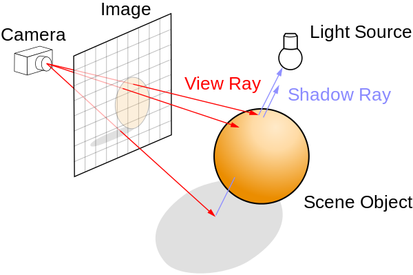
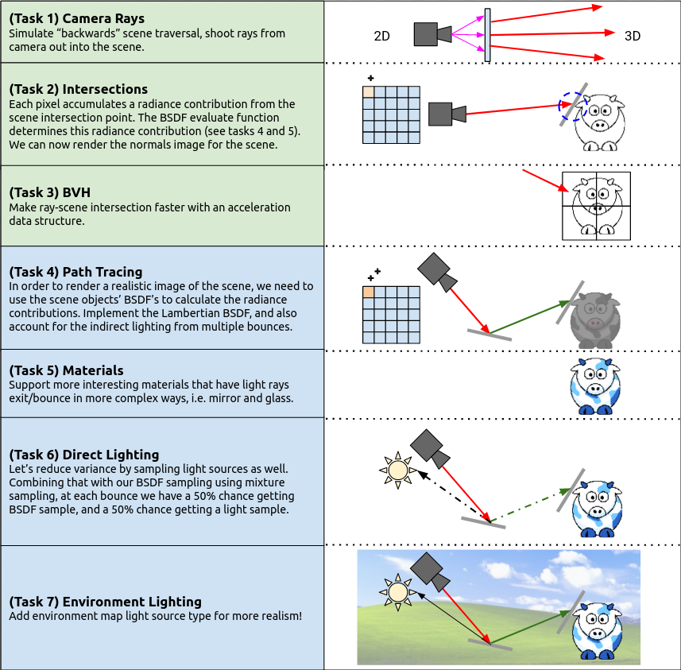

The authoritative version of this file is the one [in the Scotty3D repository](https://github.com/CMU-Graphics/Scotty3D/blob/main/assignments/A3.md).

# A3: Path Tracing

In Assignment 3 you will write code to complete Scotty3D's high-quality path-tracing-based renderer. The first part of the assignment will focus on providing an efficient implementation of **ray-scene geometry queries**. In the second half of the assignment you will **add the ability to simulate how light bounces around the scene**, which will allow your renderer to synthesize much higher-quality images.

<p align="center"></p>

The assignment is split into seven tasks:

<p align="center"></p>

## Scoring

Total [100pts]: (capped at [110pts], even with extra credit)
- Checkpoint A3.0: [40pts]
	- `A3T1` Camera Rays [5pts]
	- `A3T2` Intersection Tests [15pts]
		- Ray vs Sphere [7.5pts]
		- Ray vs Triangle [7.5pts]
	- `A3T3` BVH [18pts]
	- writeup-A3.html [2pts]
- Checkpoint A3.5: [60pts]
	- `A3T4` Path Tracing [15pts]
	- `A3T5` Materials [15pts]
	- `A3T6` Direct Lighting [8pts]
	- `A3T7` Environment Lighting [14pts]
	- writeup-A3.html [3pts]
	- render.js3d + render.png [5pts]

## Hand-in Instructions

To turn in your work, make sure you have all the files in the proper place and then run the following command in your root directory (for the checkpoint, you can exclude the `render.js3d` and `render.png` files):
```
$ tar cvzf handin.tar src tests/a3 assignments/writeup-A3.html assignments/A3-writeup assignments/resources
```

Details:
- We encourage you to develop your own test cases. Please include these in the `tests/` folder.
- If you do any extra credit that requires substantial refactoring (of the sort that might break tests), submit your code and write-up for the extra credit in a separate `extra/` folder. Please explain where to replace this code in the `src/` directory to allow us to test it.
- `render.png` and `render.js3d` are a cool scene you've assembled and rendered with Scotty3D. These should be placed in `assignments/A3-writeup`.
- `writeup-A3.html` is described below.
- Please make sure you do not have any print statements enabled or anything that may make it impossible to render images headless. You will lose points if there are an excessive amount of prints when we run your code.

### Write-up
You will submit a short document explaining how you believe your implementation performs on each of the tasks. The project directory contains a template in `assignments/writeup-A3.html`.

For each task, do either of the following:
* If you believe that you have correctly implemented the required functions, then simply replace any reference images with images from your implentation and answer any questions listed in the writeup. 
* If your implementation does not fully function, write an additional short explanation of what your code can and cannot do, and (optionally) briefly explain your strategy and how you got stuck. If your explanation indicates significant understanding of the problem, we may award partial credit even though the code does not work.

If there are any reference images attached, make sure to replace them with a closely related image that demonstrates the task before turning in your assignment.

### Render Something With Your Code!
It's very satisfying to see the images your code can make -- and the process of making something beautiful will encourage you to improve your code and fix bugs. So build some cool scenes and render them with your pathtracer!

If you don't want to model things in Scotty3D, the "Import obj" button can help you import meshes from other programs (but please make sure you hold a license for the meshes you use). Do note that our importer is imperfect, so it may not be able to perfectly import (or crash on) more complicated objects.

If you decide to use basic scenes and models we provide for you, we expect to see *significant* modifications to our scenes (you now have the ability to model objects via A2!). For example, simply changing the color of the models is insufficient. You will need explicit permission from a course staff to be able to submit a provided scene's render as your final submission.

Once you have rendered your scene, name this file `render.png` and add it to `assignments/A3-writeup` and make sure it is properly displayed in your writeup. You will also need to write a brief artists' statement about your scene, similar to A1.

## How to Test What You've Made

### via Test Cases

Writing automated test cases can help you isolate and test individual functions in your code.

For the tasks below we provide a basic set of functionality tests in the corresponding `tests/a3/test.a3.*.cpp` file(s). You can run these tests with `./Scotty3D --run-tests a3.`.

**Be Warned**, however, that we provide *only* basic functionality tests; when we grade your assignment, we will also (a) read your code and (b) use an expanded set of test cases.

You may add test cases by creating new `.cpp` files in the `tests/a3/` folder. You may refer to the existing tests for examples of how to create test cases, but in general you should include `test.h` header and throw errors if the actual output of the function is inconsistent with the expected value. We encourage you to develop and share test cases on Piazza. (Reminder: Test cases are the *only* source code you should *ever* post on our class Piazza.)

### via GUI
Building and rendering scenes is a great way to catch subtle bugs in your code (and it can, sometimes, be fun!).

You can run the code interactively from the GUI:
- Load a scene.
- Click the "Render" tab at the top of the screen.
- Click the "Open Render Window" button in the left pane.
- Select "Path Trace" from the "Method" drop-down in the "Render Image" window.
- Select a "Camera Instance" in the "Render Image" window.
- Adjust settings such as Film Width, Film Height, Film Samples, Ray Depth, and Using BVH
- Click the "Start Render" button in the "Render Image" window and see the resulting image!

Some useful scenes include `A3-cbox-lambertian-spheres.js3d`, `A3-cbox-spheres.js3d` and `cow.js3d`.

### via CLI

If you find yourself re-rendering scenes repeatedly, you can use the command line interface to Scotty3D instead of the GUI:
```
./Scotty3D --trace 												\
--scene 				<insert path to scene> 					\
--camera 				<insert camera name> 					\
--film-width 			<insert width> 							\
--film-height 			<insert height> 						\
--film-samples			<insert number of samples> 				\
--film-max-ray-depth 	<insert depth> 							\
--no_bvh				<add this if you don't want to use BVH>	\
--output 				<insert name of output image>
```

An example call would be: 

`./Scotty3D --trace --scene media/js3d/A3-cbox-spheres.js3d --camera "Camera_instance" --film-width 1280 --film-height 720 --film-samples 16 --film-max-ray-depth 8 --output render.png`

(For more information about CLI parameters, run `./Scotty3D --help`.)

## What To Do

Each task name is prefixed by a tag which you can use to locate and test the code. See [Overview](A3/overview.md) for a brief overview of relevant files.
E.g., for "`A3T1` Camera Rays" you can:
 - find where to fill in the code, by searching in `src/` for `A3T1`.
   Helpful one-liner: ```find src -type f | xargs grep A3T1``` (UNIX/Linux command)
 - find the test cases in `tests/a3/test.a3.task1.*.cpp` where * represents a more specific part about the task.
 - run the test cases with `./Scotty3d --run-tests a3.t1.`

## Basic Visibility (Checkpoint A3.0)

### `A3T1` Camera Rays
See [Camera Rays](A3/T1-camera-rays.md).

### `A3T2` Intersections
See [Intersections](A3/T2-intersecting-objects.md).

### `A3T3` BVH
See [BVH](A3/T3-bounding-volume-hierarchy.md).

## Indirect Lighting (Checkpoint A3.5)

### `A3T4` Path Tracing
See [Path Tracing](A3/T4-path-tracing.md).

### `A3T5` Materials
See [Materials](A3/T5-materials.md).

### `A3T6` Direct Lighting
See [Direct Lighting](A3/T6-direct-lighting.md).

### `A3T7` Environment Lighting
See [Environment Lighting](A3/T7-environment-lighting.md).

### Dealing with Randomness

Path tracers are full of randomization. Debugging algorithms that depend on pseudo-random numbers can be difficult because every run is different. Although you can try forcing a specific seed for the RNG being used to ensure determinism, we do not recommend this method of debugging.
