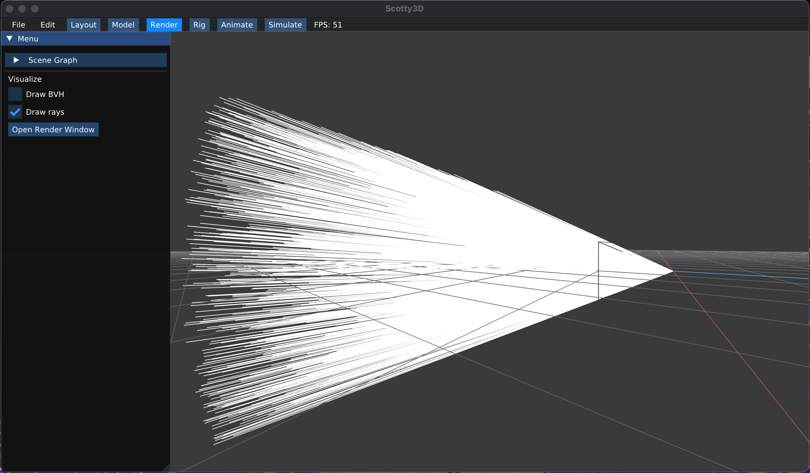

# `A3T1` Generating Camera Rays

**Camera rays** emanate from the camera and measure the amount of scene radiance that reaches a point on the camera's sensor plane. Conversely, given a point on the virtual sensor plane, there is a corresponding camera ray that is traced into the scene. Your job is to generate these rays, which is the first step in the raytracing procedure.

---

## Step 0: Read `Pathtracer::do_trace`
Take a look at `Pathtracer::do_trace` in `src/pathtracer/pathtracer.cpp`. The job of this function is to estimate the amount of energy arriving at every pixel of a tile of the image. Conveniently, there is a function `Pathtracer::trace(rng, ray)` that provides a measurement of incoming scene radiance along the direction given by `ray`, split into emissive (direct) and reflected (indirect) components. See `src/lib/ray.h` for the interface of `Ray`.

Thus, `do_trace` loops over all pixels in the image (and some number of samples in the pixel), selects a ray arriving at the pixel, calls `trace()`, and accumulates the results.

This part has already been implemented for you, but make sure you understand what the code is doing.

## Step 1: `Camera::sample_ray`
For `do_trace` to work, its camera rays must actually correspond to sensor pixels. Implement `Camera::sample_ray(rng,px,py)` (in `src/scene/camera.cpp`), which returns a random ray that starts at the origin and passes through a given pixel (with a random offset). The `Camera` has a couple important fields:
- `vertical_fov` indicates the vertical field of view of the camera (in **degrees**, not radians).
- `aspect_ratio` indicates the aspect ratio of the camera's sensor plane i.e. the ratio of the width of the sensor to its height.
- `film.width` and `film.height` are parameters giving the camera's sensor size in pixels. You can think of this as the sizes of the images you want to render. 

Together, these fields will allow your code to transform from a pixel location (**2D coordinate**) into a location on the camera's sensor plane (**3D coordinate**).

This image gives a visualization of the description provided inside the code:

We've provided test cases in `tests/test.a3.task1.sample_ray.cpp` to construct a camera and plane, and see whether the rays coming from the camera will hit the plane.

## Step 2: Basic Super-sampling
Notice that `Pathtracer::do_trace` calls `trace()` multiple times for each pixel of the image, trusting `Camera::sample_ray` to pick a new random location within the pixel. This, in turn, relies on `Rect::sample`.

Implement `Rect::sample` (in `src/pathtracer/samplers.cpp`), such that it provides a random uniformly distributed 2D point within the rectangular region specified by the origin and the member `Rect::size`. You may want to take a look at `src/util/rand.h` to see how you can use Scotty3D's random number generator.

Once you have implemented `Camera::sample_ray` and `Rect::sample`, you will have a working camera (see the **Raytracing Visualization** section below to confirm that your camera is indeed working).

### Raytracing Visualization

Your code can also log the results of ray computations for visualization and debugging. To do so, simply call the function `Pathtracer::log_ray` in your `Pathtracer::trace` function. Function `Pathtracer::log_ray` takes in 3 arguments: the ray that you want to log, a float that specifies the distance to log that ray up to, and a color for the ray. If you don't pass a color, it will default to white. We encourage you to make use of this feature for debugging both camera rays and those used for sampling direct & indirect lighting.

One thing to note is that you should only log only a small fraction of the generated rays. Otherwise, your result will contain too many generated rays, making the result hard to interpret. To do so, you can add `if(log_rng.coin_flip(0.0005f)) log_ray(out, 10.0f);` to only log $0.05$% of the camera rays.

Finally, you can visualize the logged rays by checking the box for Logged rays under Visualize and then **starting the render** (Open Render Window -> Start Render). After running the path tracer, rays will be shown as lines in visualizer. Be sure to wait for rendering to complete so you see all rays while visualizing. Do note that this is independent from the scene, so you don't need to open a scene to visualize this.

We've already supplied some camera ray logging code, enabled by setting `LOG_CAMERA_RAYS=true` at the top of `pathtracer.cpp`.

---

## Extra Credit

### Low-discrepancy Sampling
Write your own pixel sampler (replacing `Rect`) that generates samples with a more advanced distribution. Refer to [Physically Based Rendering](http://www.pbr-book.org/3ed-2018/) chapter 7. Some examples include:
  - Jittered Sampling (1 point)
  - Multi-jittered sampling (1 point)
  - N-Rooks (Latin Hypercube) sampling (1 points)
  - Sobol sequence sampling (1 points)
  - Halton sequence sampling (2 points)
  - Hammersley sequence sampling (2 points)
