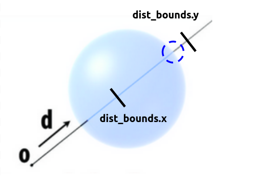
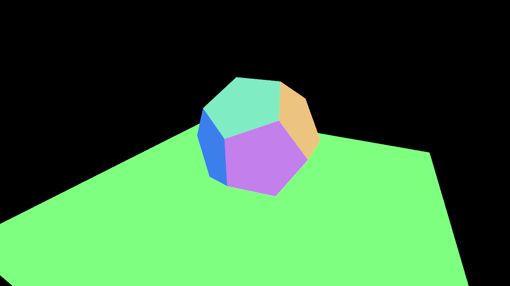
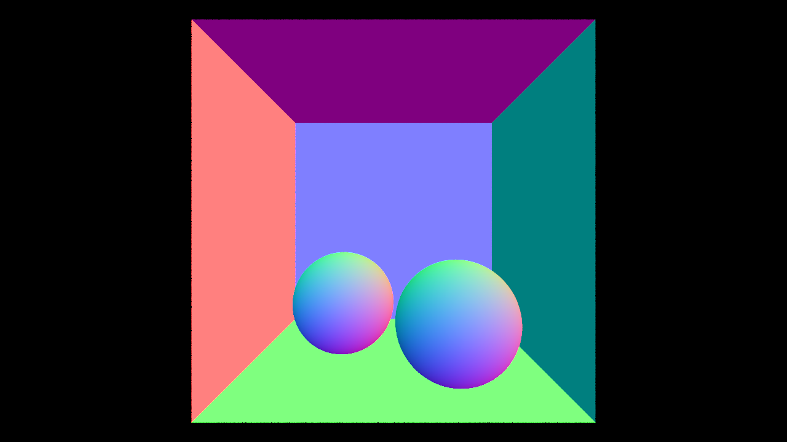
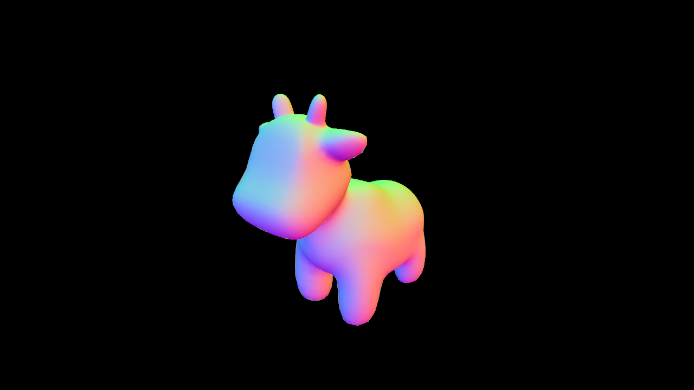

# `A3T2` Intersecting Objects

Now that your ray tracer generates camera rays, we need to be able to answer the core query in ray tracing: "does this ray hit this object?" Here, you will start by implementing ray-object intersection routines against the two types of objects in the starter code: **triangles** and **spheres**.

First, take a look at `src/pathtracer/instance.h` for the interface of the `Instance` class. An `Instance` can be **either** a `Tri_Mesh` or a `Shape`. The interfaces for `Tri_Mesh` and `Shape` are in `src/pathtracer/tri_mesh.h` and `src/scene/shape.h`, respectively. `Tri_Mesh` contains a BVH (or list) of `Triangle`, and in this task you will be working with the `Triangle` class. For `Shape`, you are going to work with a `Sphere`, which is the only type of `Shape` in Scotty3D.

Now, you need to implement the `hit` routine for both `Triangle` and `Sphere`. `hit` takes in a ray, and returns a `Trace` structure (see: `src/pathtracer/trace.h`), which contains the following information:

* `hit`: a boolean representing if there is a hit or not.
* `distance`: the distance from the origin of the ray to the hit point. This will often times be denoted as `t` since the ray's direction is normalized (think back to distance = rate $\times$ time).
* `position`: the position of the hit point. This can be computed from `ray.at(distance)` since the ray's direction is normalized.
* `normal`: the shading normal of the surface at the hit point. The shading normal for a triangle is computed by linear interpolation from per-vertex normals using the barycentric coordinates of the hit point as their weights. The shading normal for a sphere is the same as its geometric normal.
* `uv`: The uv coordinates of the hit point on the surface. The uv coordinates for a triangle is computed by the linear interpolation from per-vertex uvs using the barycentric coordinates of the hit point as their weights. The uv coordinates for a sphere can be computed with spherical coordinates.
* `origin`: the origin of the query ray.
* `material`: the material ID of the hit object (ignore).

In order to correctly implement `hit`, you will also need to understand some of the fields in the Ray structure defined in `src/lib/ray.h`.

* `point`: the 3D point of origin of the ray.
* `dir`: the 3D direction of the ray (always normalized).
* `dist_bounds`: the minimum and maximum distance along the ray. Primitive intersections that lie outside the [`ray.dist_bounds.x`, `ray.dist_bounds.y`] range should be disregarded.
* `depth`: the recursive depth of the ray (Used in task $4$).

One important detail of the ray structure is the `dist_bounds` field. When finding intersections with aggregates of many primitives, you will want to update the ray's `dist_bounds` value after finding each hit with scene geometry (possibly by using a local copy of the ray given they are `const &` parameters). By bounding the ray as tightly as possible, your ray tracer will be able to avoid unnecessary tests with scene geometry that is known to not be able to result in a closest hit, resulting in higher performance. You may ignore this for now, but this will be important in later tasks.

---

# Ray Triangle Intersection

## Step 1: `Triangle::hit`

The first intersect routine you will implement is the `hit` routine for triangle meshes in `src/pathtracer/tri_mesh.cpp`.

We recommend that you implement the [*Moller-Trumbore algorithm*](https://www.scratchapixel.com/lessons/3d-basic-rendering/ray-tracing-rendering-a-triangle/moller-trumbore-ray-triangle-intersection), a fast algorithm that takes advantage of a barycentric coordinates parameterization of the intersection point, for ray-triangle intersection. We will provide motivation for the algorithm down below, but feel free to look at other resources for ray-triangle intersections.

Down below will be our main diagram that will illustrate this algorithm:

    

We define the following variables in terms of this diagram:
- $s = o - p_0$
- $e_1 = p_1 - p_0$
- $e_2 = p_2 - p_0$

First, we can parameterize any point $\textbf{P}$ in terms of the vertices $\textbf{p}_0$, $\textbf{p}_1$ andd $\textbf{p}_2$ with barycentric coordinates $u$, $v$ and $w$:

$$\textbf{P} = w \cdot \textbf{p}_0 + u \cdot \textbf{p}_1 + v \cdot \textbf{p}_2.$$

We can simplify this by using the fact that if an intersection point lies within the triangle (which is what we aim to find), then the sum of the barycentric coordinates is equal to $1$ and each of the coordinates are non-negative. If any of the coordinates fail to satisfy this property, then we can simply return that there was no intersection. This allows us to simplify the equation from above:

$$
\begin{align*}
\textbf{P} &= w \cdot \textbf{p}_0 + u \cdot \textbf{p}_1 + v \cdot \textbf{p}_2 \\
 & = (1 - u - v) \cdot \textbf{p}_0 + u \cdot \textbf{p}_1 + v \cdot \textbf{p}_2 \\ 
 & = \textbf{p}_0 + u \cdot (\textbf{p}_1 - \textbf{p}_0) + v \cdot (\textbf{p}_2 - \textbf{p}_0) 
\end{align*}
$$

On the other hand, we can express any point on the ray with origin $\textbf{o}$ and **normalized** direction $\textbf{d}$ as a function of time $t$. Thus, if our ray does intersect the triangle, then we can set these two equations equal:

$$ \textbf{o} + t \cdot \textbf{d} = \textbf{p}_0 + u \cdot (\textbf{p}_1 - \textbf{p}_0) + v \cdot (\textbf{p}_2 - \textbf{p}_0) $$

$$ \textbf{o} + t \cdot \textbf{d} = \textbf{p}_0 + u \cdot \textbf{e}_1 + v \cdot \textbf{e}_2 $$

$$ \implies \textbf{o} - \textbf{p}_0 = u \cdot \textbf{e}_1 + v \cdot \textbf{e}_2 + t \cdot (-\textbf{d}) $$

$$
\implies 
\begin{bmatrix} \textbf{e}_1 & \textbf{e}_2 & -\textbf{d} \end{bmatrix}
\cdot \begin{bmatrix}u \cr v \cr t \end{bmatrix}
= \textbf{o} - \textbf{p}_0 
= \textbf{s}
$$

Where $\textbf{s}$, $\textbf{e}_1$ and $\textbf{e}_2$ are defined in the initial diagram (please read through the math if you're confused about anything).

We can now use Cramer's rule where we solve for each variable as the fraction of determinants to solve the above equation:

$$
\begin{bmatrix} u \cr v \cr t \end{bmatrix}
= \frac{1}{(\textbf{e}_1 \times \textbf{d}) 
\cdot \textbf{e}_2} 
\cdot \begin{bmatrix} -(\textbf{s} \times \textbf{e}_2) 
\cdot \textbf{d} \cr (\textbf{e}_1 \times \textbf{d}) 
\cdot \textbf{s} \cr -(\textbf{s} \times \textbf{e}_2) 
\cdot \textbf{e}_1 \end{bmatrix}
$$

Once you've successfully implemented triangle intersection, you will be able to render many of the scenes in the media directory. However, your ray tracer will be very slow until you implement BVH in Task 3.

A few final notes and thoughts:
- While you are working with `src/parhtracer/tri_mesh.cpp`, you can choose to implement `Triangle::bbox` as well (pretty straightforward to do), which is needed for task 3.
- If the denominator ( $(\textbf{e}_1 \times \textbf{d}) \cdot \textbf{e}_2$ ) is zero, what does that mean about the relationship of the ray and the triangle? Can a triangle with this area be hit by a ray? Given $u$ and $v$, how do you know if the ray hits the triangle? Don't forget that the intersection point on the ray should be within the ray's `dist_bounds`.
- Please use the $t$ value that is computed via the algorithm. Recomputing the point of intersection and the distance may lead to small floating point errors that could accumulate to significant errors when performing global illumination.
- We've provided test cases in `tests/test.a3.task2.triangle.hit.cpp` to construct a triangle and a ray. You can see whether the ray intersects the triangle by comparing the resulting trace information.

---

# Ray Sphere Intersection

## Step 2: `Sphere::hit`

The second intersect routine you will implement is the `hit` routine for spheres in `src/scene/shape.cpp`. 

Down below will be our main diagram that will illustrate this algorithm:

    

We will use an algebraic approach to solve for any potential intersection points.

First, similar to `Triangle::hit`, we can express any points that lie on our ray with origin $\textbf{o}$ and **normalized** direction $\textbf{d}$ as a function of time $t$:

$$\textbf{r}(t) = \textbf{o} + t\textbf{d}$$

Next, we need to consider the equation of a sphere. We can think of this as all the points that have a distance of $r$ from the center of the sphere:

$$||\textbf{x} - \textbf{c}||^2 - r^2 = 0.$$

Thus, if our ray intersects the sphere, then we know that for some time $t$, $\textbf{x} = \textbf{o} + t\textbf{d}$ will satisfy the equation of a sphere. To simplify the problem, we will consider doing the intersection in local spherical space, where the center is at $(0, 0, 0)$. Thus, we have the following equations:

$$
\begin{aligned}
||x - c||^2 - r^2 &= 0 \\
||\textbf{o} + t\textbf{d}||^2 - r^2 &= 0 \\ 
\underbrace{||\textbf{d}||^2}\_{a} \cdot t^2 + \underbrace{2 \cdot (\textbf{o} \cdot \textbf{d})}\_{b} \cdot t + \underbrace{||\textbf{o}||^2 - r^2}\_{c} &= 0 \\
\hline \\
t = \frac{-2 \cdot (\textbf{o} \cdot \textbf{d}) \pm \sqrt{4 \cdot (\textbf{o} \cdot \textbf{d})^2 - 4 \cdot ||\textbf{d}||^2 \cdot (||\textbf{o}||^2 - r^2)}}{2 \cdot ||\textbf{d}||^2}
\end{aligned}
$$

Notice how there are potentially two solutions to the quadratic – this makes sense as if we go into the sphere in some direction, then we will go out of the sphere on the other side. Consider what happens when the discriminant is negative or zero, and how to take care of those cases.

Once you've implemented both this and ray-triangle intersections, you should be able to render the normals of `A3-cbox-lambertian-spheres.js3d` and any other scene that involves spheres. You'll need to make sure that the setting `RENDER_NORMALS` is set to `true` at the top of `pathtracer.cpp`.

A few final notes and thoughts:
- Take care **NOT** to use the `Vec3::normalize()` method when computing your
normal vector. You should instead use `Vec3::unit()`, since `Vec3::normalize()`
will actually change the `Vec3` calling object rather than returning a
normalized version.
- Remember that your intersection tests should respect the ray's `dist_bounds`, and that normals should be out-facing.
- A common mistake is to forget to check the case where the first
intersection time $t_1$ is out of bounds but the second intersection time $t_2$ is in bounds
(in which case you should return $t_2$). Please refer to the figure below.

    

- Please use the $t$ value(s) that is computed via the algorithm. Recomputing the point of intersection and the distance may lead to small floating point errors that could accumulate to significant errors when performing global illumination.
- We've provided test cases in `tests/test.a3.task2.sphere.hit.cpp` to construct a sphere and a ray. You can see whether the ray intersects the sphere by comparing the resulting trace information.

---

## Reference Results

You should now be able to render all of the example scenes colored based on surface normals. You'll need to make sure that the setting `RENDER_NORMALS` is set to `true` at the top of `pathtracer.cpp`. Note that scenes with high geometric complexity will be extremely slow until you implement BVH in Task 3. 

Here are the reference renders of `dodecahedron-lit.js3d`, `A3-cbox-lambertian-spheres.js3d`, and `cow.js3d`:

    

    

    

