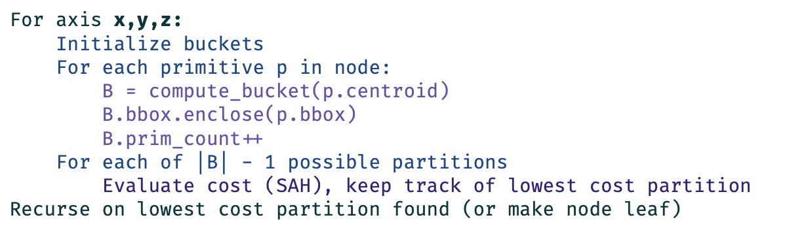
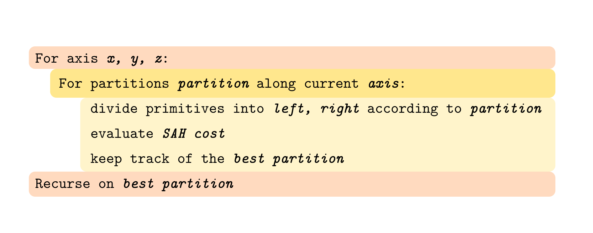
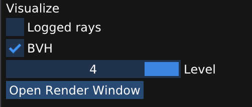
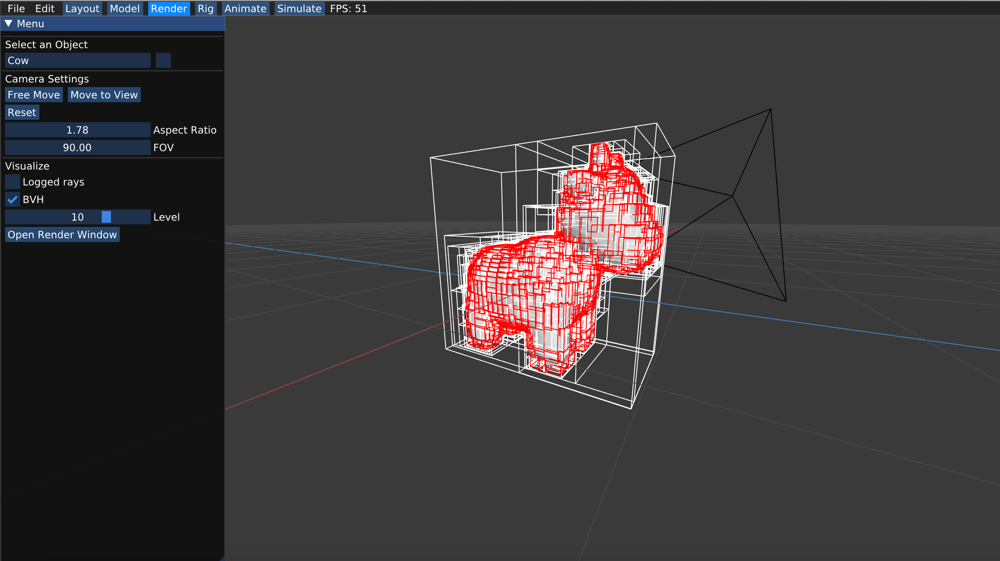
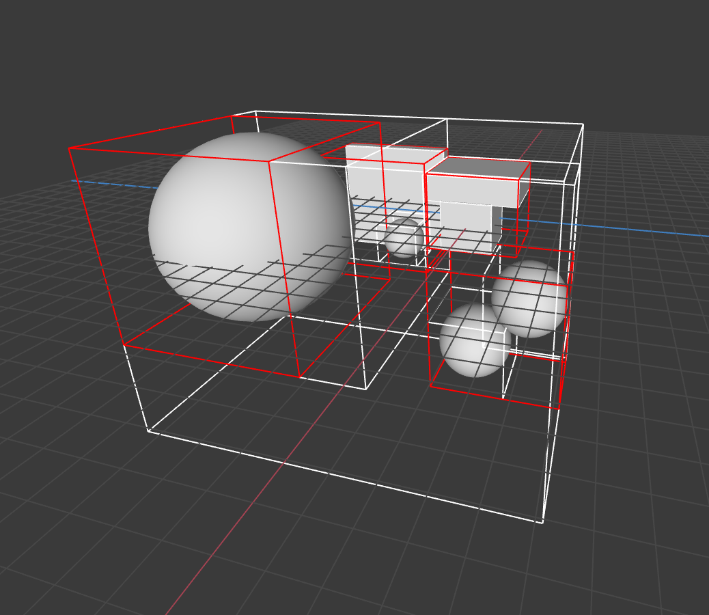
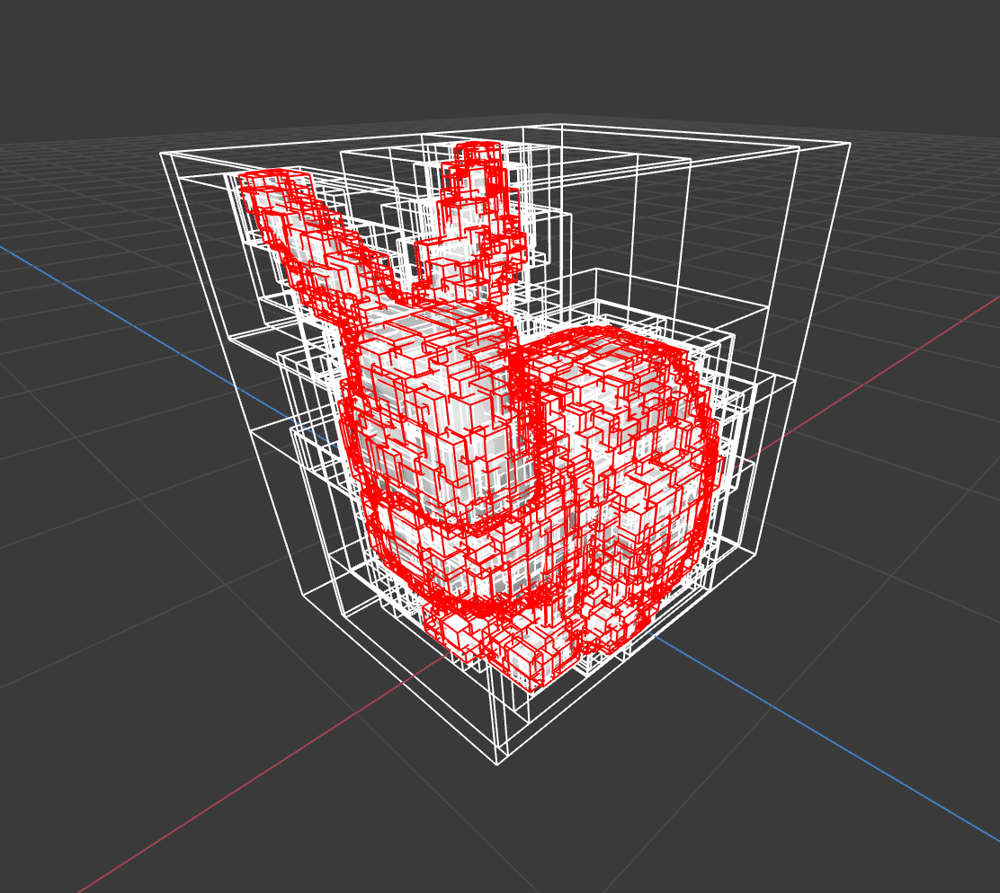

# `A3T3` Bounding Volume Hierarchy

In this task you will implement a bounding volume hierarchy that accelerates ray-scene intersection. Most of the work will be in `src/pathtracer/bvh.cpp`. Note that this code is defining a template, which usually are defined in header files because they must be visible to the compiler when instantiated. However, the line `template class BVH<Triangle>;` and similar lines at the bottom of the file take care of instantiating the template at all the relevant types.

First, take a look at the definition for our `BVH` in `src/pathtracer/bvh.h`. We represent our BVH as `nodes` (a vector of `Node`s) as an implicit tree data structure in the same fashion as heaps that you probably have seen in some other courses. A `Node` has the following fields:

* `BBox bbox`: the bounding box of the node (bounds all primitives in the subtree rooted by this node)
* `size_t start`: start index of primitives in the `BVH`'s primitive array
* `size_t size`: range of index in the primitive list (# of primitives in the subtree rooted by the node)
* `size_t l`: the index of the left child node
* `size_t r`: the index of the right child node

The BVH class also maintains a vector of all primitives in the BVH. The fields start and size in the BVH `Node` refer to the range of contained primitives in this array. The primitives in this array are not initially in any particular order, and you will need to _rearrange the order_ as you build the BVH so that your BVH can accurately represent the spatial hierarchy.

The starter code constructs a valid BVH, but it is a trivial BVH with a single node containing all scene primitives. Once you are done with this task, you can check the box for BVH in the left bar under "Visualize" when you start render to visualize your BVH and see each level.

<!-- TODO: We've also provided an example of how to make a helper function within bvh.cpp - it is up to you if you want to modify it or instead try to use a data structure to implement the recursion. -->

Finally, note that the BVH visualizer will start drawing from `BVH::root_idx`, so be sure to set this to the proper index (probably `0` or `nodes.size() - 1`, depending on your implementation) when you build the BVH.

**NOTE (Please read)**: Implementing BVH will make your renderer much faster, but it is not required to finish the assignment. When you go to Render mode and click Open Render Window, there is a checkbox to not use BVH (or pass `--no_bvh` if rendering from the command line). Uncheck that and you will be able to test the rest of the tasks in A3.5.

---

## Step 0: Bounding Box Calculation & Intersection

Implement `BBox::hit` in `src/lib/bbox.h` and `Triangle::bbox` in `src/pathtracer/tri_mesh.cpp` (if you haven't already from Task 2).

We recommend checking out this [Scratchapixel article](https://www.scratchapixel.com/lessons/3d-basic-rendering/minimal-ray-tracer-rendering-simple-shapes/ray-box-intersection) for implementing bounding box intersections. Please read the whole article to understand each part of the code snippet at the bottom - do note the difference between our implementation with `times` versus the provided code. 

We've provided test cases in `tests/test.a3.task3.bbox.hit.cpp` to construct a bounding box and ray. You may see whether the ray intersects the bounding box by comparing the resulting trace information. 

We've also provided test cases in `tests/test.a3.task3.bbox.triangle.cpp` to construct the bbox from a triangle and test whether it's valid. If you choose to make your bbox have non-zero volume as the hint suggests, you may need to choose a small enough epsilon to be ignored by the `Test::differs` function.
## Step 1: BVH Construction

Your job is to construct a `BVH` in `void BVH<Primitive>::build` in `src/pathtracer/bvh.cpp` using the [Surface Area Heuristic](http://15462.courses.cs.cmu.edu/fall2017/lecture/acceleratingqueries/slide_025) discussed in class. For the sake of this task, you won't need to worry about optimizing this heuristic – as long as you use reasonable values for each of the variables, your BVH should perform pretty well. Tree construction will occur when the BVH object is constructed. Below is the pseudocode from class by which your BVH construction procedure should generally follow:

If you find it easier to think of looping over partitions rather than buckets, here is another outline of pseudocode that you may use:

**Notes:**
- The $B$ referenced in the first pseudocode is the bucket that the primitive's centroid would lie in along the axis we are currently on. 
- For the centroid referenced in the pseudocode, we can take the center of the primitive's bbox as a good approximation.
- A helpful C++ function to use for partitioning primitives is [std::partition](https://en.cppreference.com/w/cpp/algorithm/partition). This function divides the original group of elements into two sub-groups, where the first group contains elements that return true for the execution policy and the second group contains the elements that return false.
- You may find that this task is one of the most time consuming parts of A3, especially since this part of the documentation is intentionally sparse.
- There is no "correct" BVH construction - as long as your BVH levels seem to look approximately correct, it is likely that you have a good implementation. If it looks biased on one of the axes or if it seems that there are levels missing, then you likely have a buggy implementation.
- We've provided test cases in `tests/test.a3.task3.bvh.build.cpp` to construct a BVH from a series of triangle objects and then check if some of the invariants of the BVH holds.

## Step 2: Ray-BVH Intersection

Implement the ray-BVH intersection routine `Trace BVH<Primitive>::hit(const Ray& ray)` in `src/pathtracer/bvh.cpp`. You may wish to consider the node visit order optimizations we discussed in class. Once complete, your renderer should be able to render all of the test scenes in a reasonable amount of time (as in you can see progress and it will eventually finish). Below is the pseudocode that we went over [in class](http://15462.courses.cs.cmu.edu/spring2022/lecture/spatial/slide_021):

**Note:** We've provided test cases in `tests/test.a3.task3.bvh.hit.cpp` to construct a mesh that uses `bvh::hit` and see whether the ray intersects the mesh by comparing the resulting trace information.

---

## Reference Results

In Render mode, check the box for "BVH" and then render your image. You should be able to see the BVH you generated in task 3 once it **starts rendering**. You can click on the horizontal bar to see each level of your BVH. We've also provided test cases in `tests/test.a3.task3.bvh.fuzz.cpp` to construct a random scene of large objects and see if we can shoot random rays into the scene in a reasonable amount of time.

The BVH constructed for Spot the Cow on the 11th level.

The BVH constructed for a scene composed of several cubes and spheres on the 0th and 2nd levels.

The BVH constructed for the Stanford Bunny on the 10th level.

