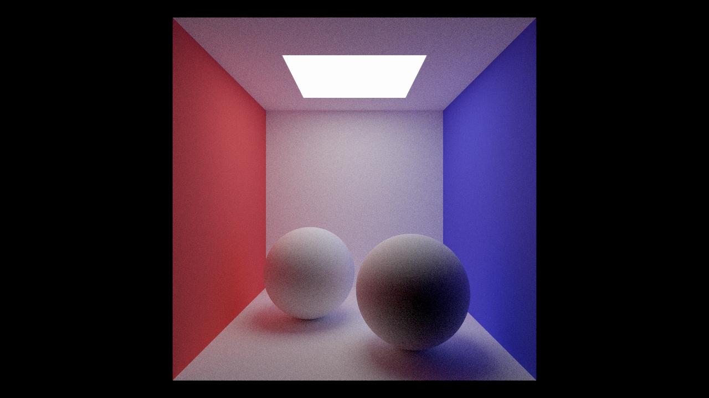
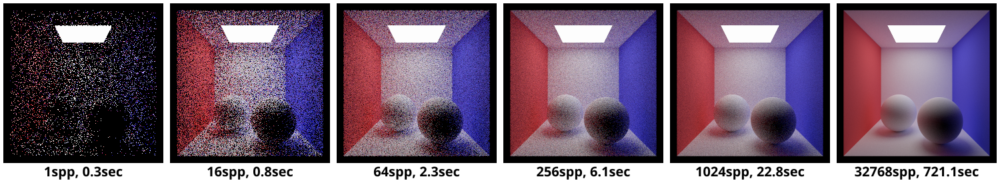

# `A3T4` Path Tracing

Up to this point, your renderer has only computed object visibility using ray tracing. Now, we will simulate the complicated paths that light can take throughout the scene, bouncing off many surfaces before eventually reaching the camera. Simulating this multi-bounce light is referred to as _global illumination_, and it is critical for producing realistic images, especially when specular surfaces are present. Note that all functions in `src/scene/material.cpp` are in **local space** to the surface with respect to the ray intersection point, while functions in `src/pathtracer/pathtracer.cpp` are generally in **world space**. Keep in mind that in Scotty3D's coordinate system, $x$ is horizontal, $y$ is vertical (the 'up' direction), and $z$ is depth.

---

## Step 0: `Pathtracer::trace`

`Pathtracer::trace` is the function responsible for coordinating the path tracing procedure. We've given you code to intersect a ray with the scene and collect information about the surface intersection necessary for computing the lighting at that point. You should read this function and understand where/why functions of the `bsdf` are called and how the parameters are set up. **You do not need to modify anything here, just understand the procedure.**

## Step 1: `Lambertian` Material

Implement `Lambertian::scatter`, `Lambertian::evaluate`, and `Lambertian::pdf`. Note that their interfaces are defined in `src/scene/material.h`. Task 5 will further discuss sampling BSDFs, so reading ahead may help your understanding.

- `Lambertian::albedo` is a texture giving the ratio of incoming light to reflected light, also known as the base color of the Lambertian material (*albedo* is the Latin word for *whiteness*). Call `albedo.lock()->evaluate(uv)` to get the albedo at the current point. Note that an albedo of $1$ should correspond to perfect energy conservation. (I.e., this value has _not_ been pre-divided by $\pi$.)
- `Lambertian::scatter` returns a `Scatter` object, with `direction` and `attenuation` components. You can use a `Samplers::Hemisphere::Cosine` sampler to randomly sample a direction from a cosine-weighted hemisphere distribution, and you can compute the attenuation component via `Lambertian::evaluate`.
- `Lambertian::evaluate` computes the ratio of outgoing to incoming radiance given a pair of directions. Traditionally, BSDFs are specified as the ratio of outgoing radiance to incoming _irradiance_, which necessitates the extra `cos(theta)` factor in the rendering equation. In Scotty3D, however, we expect the BSDF to operate only on radiance, so you must scale the evaluation accordingly. See [the wikipedia page](https://en.wikipedia.org/wiki/Bidirectional_reflectance_distribution_function) for a visualization of the formula.
- `Lambertian::pdf` computes the PDF for sampling some incoming direction given some outgoing direction. However, the Lambertian BSDF in particular does not depend on the outgoing direction. Since we sampled the incoming direction from a cosine-weighted hemisphere distribution, what is its PDF?

Notes: 
- A variety of sampling functions are provided in `src/pathtracer/samplers.h`.
- For testing, notice that `sample_direct_lighting_task4` already samples "delta lights" (i.e., non-area lights). So a scene with point or directional lights should show your material working without requiring Step 3 to be completed. However, you need to set `RENDER_NORMAL = false` to make Scotty3D render the actual lighting instead of normals.
- Understanding what `out_dir` and `in_dir` represent is key to understanding pathtracing as a whole - make sure you also read the beginning of Task 5's documentation if you're still confused.
- We've provided test cases in `tests/test.a3.task4.bsdf.lambertian.cpp` to check whether the direction, PDF and attenuation of a sample are valid from a randomly generated scatter on a Lambertian material.

## Step 2: `Pathtracer::sample_indirect_lighting`

In this function, you will estimate light that bounced off at least one other surface before reaching our shading point. This is called _indirect_ lighting.

- (1) Randomly sample a new ray direction from the BSDF distribution using `Material::scatter()`.
- (2) Create a new world-space ray and call `Pathtracer::trace()` to get incoming light. You should modify `Ray::dist_bounds` so that the ray does not intersect at time = 0. Remember to set the new depth value to avoid infinite recursion.
- (3) Compute a Monte Carlo estimate of incoming _indirect_ light scaled by BSDF attenuation.

NOTE: you may wish to add some ray logging to help debug. See, for example, the code in `sample_direct_lighting_task6` and the corresponding usage. Guarding it with a constant (in the example: `LOG_AREA_LIGHT_RAYS`) is useful so it is easy to turn off for increased performance.

## Step 3: `Pathtracer::sample_direct_lighting_task4`

Finally, you will estimate light that hit our shading point after being emitted from a light source without any bounces in between. For now, you should use the same sampling procedure as `Pathtracer::sample_indirect_lighting`, except for using the _direct_ component of incoming light. Note that since we are only interested in light emitted from the first intersection, we can trace a ray with `depth = 0`.

Once you have finished making modifications to these three steps, you'll need to change the `RENDER_NORMAL` global variable to `false` in order to test your changes.

Note: separately sampling direct lighting might seem silly, as we could have just gotten both direct and indirect lighting from tracing a single BSDF sample. However, separating the components will allow us to improve our direct light sampling algorithm in Task 6.

We won't be releasing any test cases for lighting - instead, we encourage you to run the pathtracer in the GUI or headless to test your code.

---

## Reference Results

After correctly implementing Task 4, your renderer should be able to make a beautifully lit picture of the Cornell Box with Lambertian spheres (`A3-cbox-lambertian-spheres.js3d`). Below is a render using 1024 samples per pixel (spp):

Note the time-quality tradeoff here. This image was rendered with a sample rate of 1024 camera rays per pixel and a max ray depth of 8. This will produce a relatively high quality result, but will take quite some time to render. Rendering a fully converged clean image may take even longer, so start testing your pathtracer early!

Thankfully, runtime will scale (roughly) linearly with the number of samples. Below are the results and runtime of rendering the Lambertian Cornell Box at 240x240 on an Intel Core i7-8086K (max ray depth 8):

---

## Extra Credit

- Instead of setting a maximum ray depth, implement un-biased Russian roulette for path termination. Though Russian roulette will increase variance, use of a good heuristic (such as overall path throughput) should improve performance enough to show better convergence in an equal-time comparison. Refer to [Physically Based Rendering](http://www.pbr-book.org/3ed-2018/) Chapter 13.7. (You may need to add a `throughput` member to `Ray` to support this change.)
- (Advanced) Implement homogeneous volumetric scattering. Refer to [Physically Based Rendering](http://www.pbr-book.org/3ed-2018/) chapters 11 and 15.
