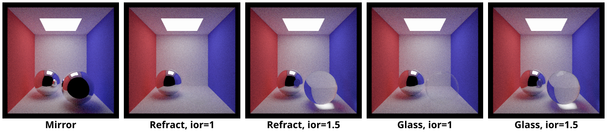
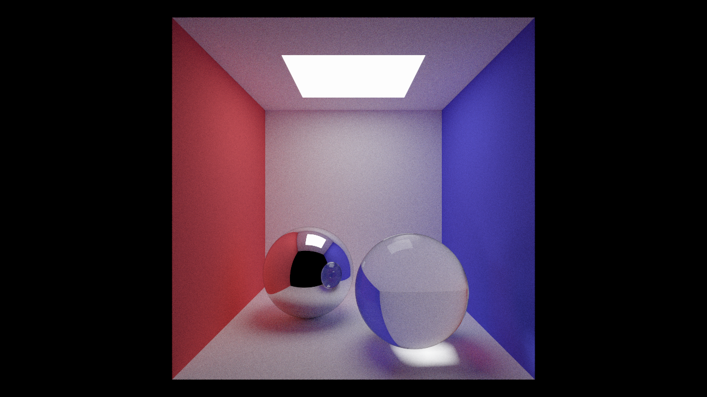

# `A3T5` Materials

Now that you have implemented the ability to sample more complex light paths, it's time to add support for more types of materials. In this task you will add support for two types of specular materials: mirrors and glass. These materials are implemented in `src/scene/material.cpp`.

- In the diagrams below, $\omega_t$ is the direction of the outgoing ray. At its intersection with the surface, there are two possibilities: the outgoing ray can be either reflected or refracted from an incoming ray. Here, $\omega_r$ is the direction of the _reflected_ incoming ray, and $\omega_i$ is the direction of the _refracted_ incoming ray. 
- Note that all three of them are pointing _away_ from the intersection point so that we can more consistently consider their angles with respect to the surface normal $\hat n$.
- Remember that we are tracing rays _backwards_, from the camera into the scene. This is why the computed scattering direction $\omega_i$ or $\omega_r$ correspond with the _incoming_ light.

First, take another look at the BSDF interface in `src/scene/material.h`. There are a number of key methods you should understand in `Material`:

- `Scatter scatter(RNG &rng, Vec3 out, Vec2 uv)`: given outgoing direction `out`, generates a random sample for incoming direction (using `RNG` as the random number source and looking up material properties at location `uv`). It returns a `Scatter`, which contains both the sampled `direction` and the `attenuation` for the in/out pair.
- `Spectrum evaluate(Vec3 out, Vec3 in)`: evaluates the BSDF for a given pair of directions. This is only called for continuous BSDFs.
- `float pdf(Vec3 out, Vec3 in)`: computes the PDF for sampling `in` from the BSDF distribution, given `out`. This is only meaningful for continuous BSDFs.
- `Spectrum emission(Vec2 uv)`: returns emitted light. This is zero for all materials except the `Emissive` material.

To complete the mirror and glass materials, you will only need to implement their `scatter` functions, as they are both discrete BSDFs (i.e. they have a finite number of possible incoming ray directions for any outgoing ray direction). Additionally, you will want to complete two helper functions:

- `Vec3 reflect(Vec3 dir)`: returns a direction that is the **perfect specular reflection** of `dir` about the local surface normal `{0, 1, 0}`. More detail about specular reflection can be found [here](http://15462.courses.cs.cmu.edu/fall2015/lecture/reflection/slide_028). In other words, it should return $\omega_r$ given $\omega_t$.

- `Vec3 refract(Vec3 out_dir, float index_of_refraction, bool& was_internal)`: returns the ray that results from refracting `out_dir` through the surface according to Snell's Law. Given $\omega_t$, it should return $\omega_i$. If a total internal reflection occurs and refraction was not possible, it should set `was_internal` to `true`.

---

## Step 1: `Materials::Mirror`

Implement `reflect` and `Mirror::scatter()`.

Because discrete BSDFs do not require Monte Carlo integration (we can simply analytically evaluate each possible direction), we do not need to implement `BSDF::pdf`. Perhaps more interestingly, we also do not require `Material::evaluate`. This is because evaluating the BSDF is only necessary when sampling directions from distributions other than the BSDF itself. When the BSDF is discrete, like a perfect mirror, we can assume other distributions never sample the single (infinitesimal) direction at which the BSDF is non-zero. 

Therefore, we must update our path tracing procedure in `Pathtracer::sample_(in)direct_lighting`: when the BSDF is discrete (`Material::is_specular`), we are not doing a Monte Carlo estimate, hence should not use `Material::pdf`. Instead, simply multiply the scattering attenuation and the incoming light. Note that failing to make this check will cause the invalid BSDF calls to abort or may result in black rendered objects.

## Step 2: `Materials::Refract`

Implement `refract` and `Refract::scatter()`.

Refract is a non-physical BSDF that only refracts light (...or perfectly reflects, if `refract` returns `internal`). It is a stepping stone toward the `Glass` material, which has a more nuanced notion of Fresnel reflectance.

### Using Snell's Law

For a given $\omega_t$, we can find the $\omega_i$ by using [Snell's Law](http://15462.courses.cs.cmu.edu/fall2015/lecture/reflection/slide_032). This corresponds to finding the unknown $\theta_i$, the angle of refraction for the incoming ray, given $\theta_t$, $\eta_t$ and $\eta_i$. By Snell's Law, we have

$$\begin{align*}
\eta_i \sin(\theta_i) &= \eta_t\sin(\theta_t) \\
\sin(\theta_i) &= \frac{\eta_t\sin(\theta_t)}{\eta_i} \\
\theta_i &= \mathord{?}
\end{align*}$$

Your implementation should assume that rays always travel from or to a _vacuum_ (i.e. index of refraction = 1.0), that is,

- If the outgoing ray is **entering** the surface, then it was previously travelling in a vacuum i.e. the incoming ray was travelling in a vacuum.
- If the outgoing ray is **leaving** the surface, then it is entering a vacuum.

These two cases are illustrated by the figure below, where the white region is the vacuum and the gray region is the material. Observe that whether the outgoing ray enters the surface depends on the sign of $\omega_t \cdot \hat{n}$. Feel free to use this quantity directly, or further simplify it using the fact that $\hat{n}=(0, 1, 0)$ in our case. Also, note that the surface normal $\hat n$ always points into the vacuum.

Note that there is a special case to account for: total internal reflection. This occurs when a ray hits a refractive boundary at an angle greater than the _critical angle_. The critical angle is the $\theta_t$ that causes $\theta_i$ to be $> 90$ degrees, hence can produce no real solution to Snell's Law. In this case, you should set `was_internal` to `true`.

$$\sin(\theta_i) = \frac{\eta_t\sin(\theta_t)}{\eta_i}\overset{?}{>} 1$$

### Distribution Function for Transmitted Light

Although we described the BRDF for perfect specular reflection in class, we did not discuss the distribution function for transmitted light. Unlike reflection, refraction "spreads" or "condenses" a differential beam of light. Hence, a refraction event should change the radiance along a ray.

After using Snell's Law to find the direction of refracted rays, compute the BSDF attenuation using the distribution function found in Pharr, Jakob, and and Humphries's book [Physically Based Rendering](http://www.pbr-book.org/3ed-2018/Reflection_Models/Specular_Reflection_and_Transmission.html). Since this material is pure refraction, we won't need to weight the attenuation on the Fresnel coefficient. However, do note that the derivations in the book attempts to find $\theta_t$ given $\theta_i$, which is the contrary of our derivations. When applying the equations and figures from the book, you should swap the subscripts $i$ and $t$ accordingly.

## Step 3: `Materials::Glass`

Implement `Glass::scatter()`.

Glass is a material that can both reflect and transmit light. As discussed in class, the fraction of light that is reflected vs. transmitted is governed by the dielectric (non-conductive) Fresnel equations. To simulate this, we may sample the direction of the incoming ray from either reflection or refraction with probability proportional to the Fresnel reflectance. For example, if the Fresnel reflectance is $0.9$, then you should generate a reflected ray 90% of the time. 

Note that instead of computing the full Fresnel equations, you have the option to use [Schlick's approximation](https://en.wikipedia.org/wiki/Schlick's_approximation) instead.
(Either way, fill in the `schlick()` function, even though it will be somewhat misnamed if you use the full Fresnel equations.)

In the description below, $\eta_i$ and $\theta_i$ refer to the index of refraction of the medium containing the incoming ray and the angle of that ray with respect to the boundary surface normal. $\eta_t$ and $\theta_t$ refer to the index of refraction of the new medium and the angle to the boundary normal of the transmitted ray.

The Fresnel equations state that reflection from a surface is a function of the surface's index of refraction and the polarity of the incoming light. Since our renderer doesn't account for polarity, we'll apply a common approximation of averaging the reflectance of light polarized in perpendicular and parallel directions:

$$F_r = \frac{1}{2}(r^2_{\parallel}+r^2_{\perp})$$

The parallel and perpendicular terms are given by:

$$\begin{align*}
r_{\parallel} &= \frac{\eta_t\cos(\theta_i) - \eta_i\cos(\theta_t)}{\eta_t\cos(\theta_i)+\eta_i\cos(\theta_t)} \\
r_{\perp} &= \frac{\eta_i\cos(\theta_i) - \eta_t\cos(\theta_t)}{\eta_i\cos(\theta_i)+\eta_t\cos(\theta_t)}
\end{align*}$$

Therefore, for a dielectric material, the fraction of reflected light will be given by $F_r$, and the amount of transmitted (refracted) light will be given by $1-F_r$.

---

## Tips

- Check your sphere intersection code, as you may have bugs there that were not exposed by rendering Lambertian spheres in Task 4.
- When calculating the direction of the incoming ray, keep in mind that the normal always points into the vacuum.
- Check the behavior of your refract function when `index_of_refraction = 1.f`. This should not change the transmitted direction, hence make the glass sphere transparent.
- Test reflection and refraction separately, i.e. ignore the Fresnel coefficient and only refract or reflect. Once you've verified that those are correct, then go ahead and reintroduce the Fresnel coefficient and split rays between reflection  and refraction.
- We've provided some **very** basic test cases in `test.a3.task5.bsdf.*.cpp`. Similar to Task 4, we highly recommend testing via the GUI as you're able to get visual feedback on what is happening with these different materials.

---

## Reference Results

When you are done, you will be able to render images with specular materials, like the Cornell Box with a metal and glass sphere (`A3-cbox-spheres.js3d`, 1024 samples, max depth 8):

---

## Extra Credit
- Add a more advanced parameterized BSDF, such as Blinn-Phong, GGX, or Disney. More information about evaluating and sampling each of these distributions can be found in [Physically Based Rendering](http://www.pbr-book.org/3ed-2018/) chapters 8 & 9.
