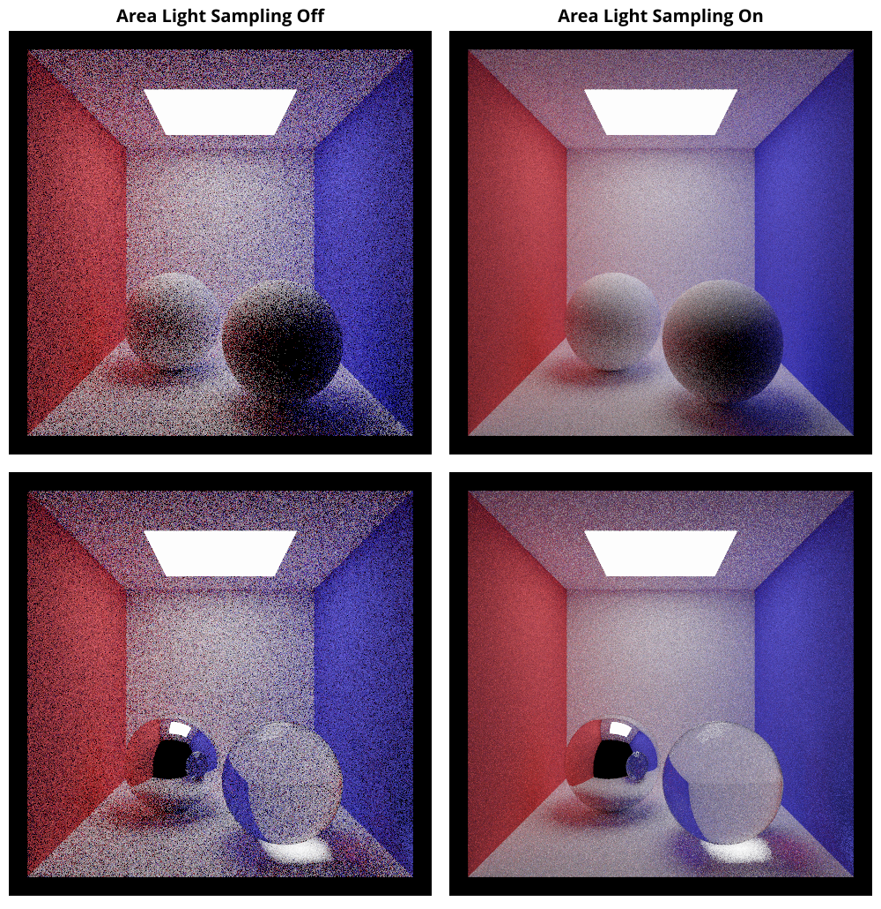

# `A3T6` Direct Lighting 

After tasks 4 and 5, `Pathtracer::sample_direct_lighting_task4` is no different than the indirect case: it samples a ray from the BSDF scattering function and traces it into the scene to gather direct lighting. In this task, you will modify the sampling algorithm by splitting samples between BSDF scatters and the surface of area lights, a procedure commonly known as _next event estimation_.

First consider why sampling lights is useful. Currently, we are only importance sampling the BSDF term of the rendering equation (in which we have included the cosine term). However, each sample we take will also be multiplied by incoming radiance. If we could somehow sample the full product, our monte carlo estimator would exhibit far lower variance. Sampling lights is one way to importance sample incoming radiance, but there are some caveats.

- Importance sampling indirect lighting is hard. Doing so in an un-biased fashion requires more advanced integration schemes like bidirectional path tracing or metropolis light transport. In Scotty3D, we will only be adding sampling for direct lighting, because we know a priori what directions it can come from: those that point at emissive objects. Although doing so will not importance sample the full distribution of incoming radiance, it will be a better approximation.

- Specular BSDFs, such as mirror and glass, will not be improved by directly sampling lights. This is because any ray that is not a perfect reflection or refraction has zero contribution. However, scenes using continuous distributions like the Lambertian, Blinn-Phong, or GGX BSDFs, can benefit tremendously, especially in the presence of small and/or intense area lights.

### How do we do it? 

It's tempting to simply compute an estimate of direct lighting from BSDF samples, another from sampling the surface of lights, and average the results. However, variance is additive: averaging two high-variance estimators does not give back a low-variance one. Instead, we can create a single new distribution that has the average PDF of the two inputs. 

To do so, simply uniformly randomly choose which strategy to use before sampling from it as usual. Any given sample could then have been generated from either distribution, so the PDF at the sample is the average over each individual strategy's PDF. This is called _mixture sampling_, or more properly _single-sample multiple importance sampling_. 

### Why is this helpful? 

Intuitively, consider that the average of multiple PDFs is itself a PDF: it is non-negative and integrates to one. The average PDF will assign higher weight to any region that one of its components did, producing a distribution following the strengths of each. We can then use the improved distribution to sample and accumulate monte carlo estimates as usual. 

Previously, if we chose a low-weight BSDF sample that just happened to hit a bright light, we would get a huge (high-variance) result after dividing (large) incoming light by the (small) PDF. Now, regardless of whether that sample came from `Material::scatter` or `Pathtracer::sample_area_lights`, the PDF of the sample cannot be small, because its `Pathtracer::area_lights_pdf` component is not small.

For a more rigorous explanation of multiple importance sampling, refer to [Physically Based Rendering](https://www.pbr-book.org/3ed-2018/) chapters 13.10 and 14.3.

- Note: because the mixture PDF now depends on both strategies, we need to separate the concepts of sampling a distribution and evaluating its PDF. This is why we separate `Material::scatter`/`Material::pdf` and `Pathtracer::sample_area_lights`/`Pathtracer::area_lights_pdf`.

Lastly, note that when the true light distribution heavily favors only one strategy (e.g. a highly specular but still continuous BSDF, or an intense but small area light), our code will end up wasting time on samples it got from the wrong strategy. Ideally, our code could adaptively choose how much contribution to take from each option, which is known as _multi-sample multiple importance sampling_ (see Extra Credit).

---

Finally, let's upgrade `Pathtracer::sample_direct_lighting_task4` with `Pathtracer::sample_direct_lighting_task6`. Start by reading the following functions:
- `Pathtracer::sample_area_lights` takes a world-space position, returning a world-space direction pointing towards an area light.
- `Pathtracer::area_lights_pdf` takes a world-space position and direction, returning the PDF for generating the direction at the point from the area lights in the scene.
Note that these area light functions operate in **world space**, while BSDF functions operate in **local space**, relative to the surface at the ray intersection point. Pay close attention to the inputs and outputs of each of these functions, and make sure to look at what attributes you have available to you as part of the `Pathtracer::Shading_Info` struct.
The direct lighting procedure should now follow these steps:

- If the BSDF is discrete (`hit.bsdf.is_specular()`), we don't need to bother sampling lights: the behavior should be the same as Task 4.

- Otherwise, we should randomly choose whether we get our sample from `Material::scatter` or `Pathtracer::sample_area_lights`. Choose between the strategies with equal probability.

- Create a new world-space ray (the "shadow ray") and call `Pathtracer::trace` to get incoming light. You should modify `Ray::dist_bounds` so that the ray does not intersect at time = 0. We are still only interested in the emissive component, so the ray depth can be zero.

- Add estimate of incoming light scaled by BSDF attenuation. Given a sample, we don't know whether it came from the BSDF or the light, so you should use `Material::evaluate`, `Material::pdf`, and `Pathtracer::area_lights_pdf` to compute the proper weighting. What is the PDF of our sample, given it comes from the combined distribution?

Once you have finished making modifications to `sample_direct_lighting_task6`, you'll need to change the `SAMPLE_AREA_LIGHTS` global variable to be true in order to test your changes.

---

## Tips

- The converged output of all scenes should **not** change with the addition of Task 6. If it does, you've done something wrong.
- When computing the BSDF attenuation, you should take into account that you are using only **one** direction that you randomly chose out of two sampling strategies.
- We do not provide much in the way of reference images: make your own scene demonstrating what situations area light sampling is or isn't well suited for. 
- Use the ray log to visually debug what proportion of your shadow rays are being directed at lights and where they are going.
- Similar to Task 4, we won't be releasing any test cases for lighting. Instead, we encourage you to run the pathtracer in the GUI or headless to test your code.

---

## Reference Results

You will now be able to render scenes featuring area lights using far fewer samples and still get good results. The effect will be particularly pronounced when small and/or intense area lights are used with Lambertian materials (e.g. see Task 7, the bright light sources at the top of the cathedral in `grace.exr`). 

Here are `A3-cbox-spheres.js3d` and `A3-cbox-lambertian-spheres.js3d` without (left) and with (right) area light sampling (32 samples, max depth = 8):

---

## Extra Credit

- Upgrade the mixture sampling procedure to use proper multiple importance sampling. This will involve always generating both a light sample and BSDF sample, then weighting their direct light contributions by the balance or power heuristic. You may also want to re-combine the direct and indirect sampling procedures. Refer to [Physically Based Rendering](http://www.pbr-book.org/3ed-2018/) chapter 14.3 for more information.
- Currently, computing the area light PDF involves checking whether the sampled ray intersects each individual emissive triangle. Improve the brute-force approach by building and querying a BVH containing only emissive triangles. You will need a traversal algorithm that returns all triangles intersected by a ray, not just the closest. 
- (Advanced) Implement a more powerful integration scheme such as bidirectional path tracing or photon mapping. Refer to [Physically Based Rendering](http://www.pbr-book.org/3ed-2018/) chapter 16.
- (Advanced) Implement [specular next event estimation](http://rgl.epfl.ch/publications/Zeltner2020Specular) for the mirror and glass materials.
