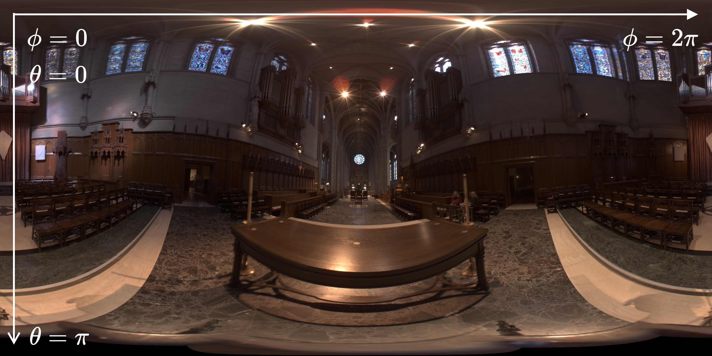

# (Task 7) Environment Lighting

## Walkthrough

The final task of this assignment will be to implement a new type of light source: an infinite environment light. An environment light is a light that supplies incident radiance (really, the light intensity $\frac{d\Phi}{d\Omega}$) from all directions on the sphere. Rather than using a predefined collection of explicit lights, an environment light is a capture of the actual incoming light from some real-world scene; rendering using environment lighting can be quite striking.

The intensity of incoming light from each direction is defined by a texture map parameterized by phi and theta, as shown below.

In this task you will implement `Env_Map::sample`, `Env_Map::pdf`, and `Env_Map::evaluate` in `student/env_light.cpp`. You'll start with uniform sampling to get things working, and then move onto a more advanced implementation that uses **importance sampling** to significantly reduce variance in rendered images.

Note that for the purposes of this task, (0,0) is actually the **bottom left** of the HDR image, not the **top left**. Think about how this will affect your calculation of the $\theta$ value for a pixel.

---

## Step 1: Uniformly sampling the environment map

To get things working, your first implementation of `Env_Map::sample` will be quite simple. First, check out the interface of `Env_Map` in `rays/env_light.h`. For `Env_Map`, the `image` field is a `HDR_Image`, which contains the size and pixels of the environment map. The `HDR_Image` interface may be found in `util/hdr_image.h`.

Second, implement the uniform sphere sampler in `student/samplers.cpp`. Implement `Env_Map::sample` using `uniform_sampler` to generate a direction uniformly at random. Implement `Env_Map::pdf` by returning the PDF of a uniform sphere distribution.

Lastly, in `Env_Map::evaluate`, convert the given direction to image coordinates (phi and theta) and look up the appropriate radiance value in the texture map using **bilinear interpolation**.

Since high dynamic range environment maps can be large files, we have not included them in the Scotty3D repository. You can download a set of sample environment maps [here](http://15462.courses.cs.cmu.edu/fall2015content/misc/asst3_images/asst3_exr_archive.zip).

To use a particular environment map with your scene, select `layout` -> `new light` -> `environment map`-> `add`, and  select your file. For more creative environment maps, check out [Poly Haven](https://polyhaven.com/)

## Step 2: Importance sampling the environment map

Much like light in the real world, most of the energy provided by an environment light source is concentrated in the directions toward bright light sources. Therefore, it makes sense to prefer sampling directions for which incoming radiance is the greatest. For environment lights with large variation in incoming light intensities, good importance sampling will significantly reduce the variance of your renderer.

The basic idea of importance sampling an image is assigning a probability to each pixel based on the total radiance coming from the solid angle it subtends.

A pixel with coordinate $\theta = \theta_0$ subtends an area $\sin\theta d\theta d\phi$ on the unit sphere (where $d\theta$ and $d\phi$ are the angles subtended by each pixel as determined by the resolution of the texture). Thus, the flux through a pixel is proportional to $L\sin\theta$. (Since we are creating a distribution, we only care about the relative flux through each pixel, not the absolute flux.)

**Summing the flux for all pixels, then normalizing each such that they sum to one, yields a discrete probability distribution over the pixels where the probability one is chosen is proportional to its flux.**

The question is now how to efficiently get samples from this discrete distribution. To do so, we recommend treating the distribution as a single vector representing the whole image (row-major). In this form, it is easy to compute its CDF: the CDF for each pixel is the sum of the PDFs of all pixels before it. Once you have a CDF, you can use inversion sampling to pick out a particular index and convert it to a pixel and a 3D direction.

The bulk of the importance sampling algorithm will be found as `Samplers::Sphere::Image` in `student\samplers.cpp`. You will need to implement the constructor, the inversion sampling function, and the PDF function, which returns the value of your PDF at a particular direction. Once these methods are complete, upgrade `Env_Map::sample` and `Env_Map::pdf` to use your new `image_sampler`.

Be sure to update your `image_sampler` to scale the returned PDF according to
the Jacobian that appears when converting from one sampling distribution to the
other. The PDF value that corresponds to a pixel in the HDR map should be
multiplied by the Jacobian below before being returned by
`Samplers::Sphere::Image::pdf`.

The Jacobian for transforming the PDF from the HDR map sampling distribution to
the unit sphere sampling distribution can be thought of as two separate
Jacobians: one to a rectilinear projection of the unit sphere, and then the
second to the unit sphere from the rectilinear projection.

The first Jacobian scales the $w \times h$ rectangle to a $2\pi \times \pi$
rectangle, going from $(dx, dy)$ space to $(d\phi, d\theta)$ space.
Since we have a distribution that integrates to 1 over $(w,h)$, in order to obtain
a distribution that still integrates to 1 over $(2\pi, \pi)$, we must multiply by the
ratio of their areas, i.e. $\frac{wh}{2\pi^2}$. This is the first Jacobian.

Then in order to go from integrating over the rectilinear projection of the unit
sphere to the unit sphere, we need to go from integrating over $(d\phi, d\theta)$ to
solid angle $(d\omega)$. Since we know that $d\omega = \sin(\theta) d\phi d\theta$,
if we want our new distribution to still integrate to 1, we must divide by $\sin(\theta)$, our second Jacobian.

Altogether, the final Jacobian is $\frac{wh}{2\pi^2 \sin(\theta)}$.

---

### Tips

- Remember to use the coordinate system as outlined in Task 1!
- When computing areas corresponding to a pixel, use the value of theta at the pixel centers.
- Compute the PDF and CDF in the constructor of `Sampler::Sphere::Image`, storing them values in fields `_pdf` and `_cdf`. See `rays/sampler.h`.
- `Spectrum::luma()` returns the luminance (brightness) of a Spectrum. The weight assigned to a pixel should be proportional both its luminance and the solid angle it subtends.
- For inversion sampling, use `std::upper_bound`: it's a binary search. Read about it [here](https://en.cppreference.com/w/cpp/algorithm/upper_bound).
- If you didn't use the ray log to debug area light sampling, start using it now to visualize what directions are being sampled from the environment map.

---

## Reference Results

