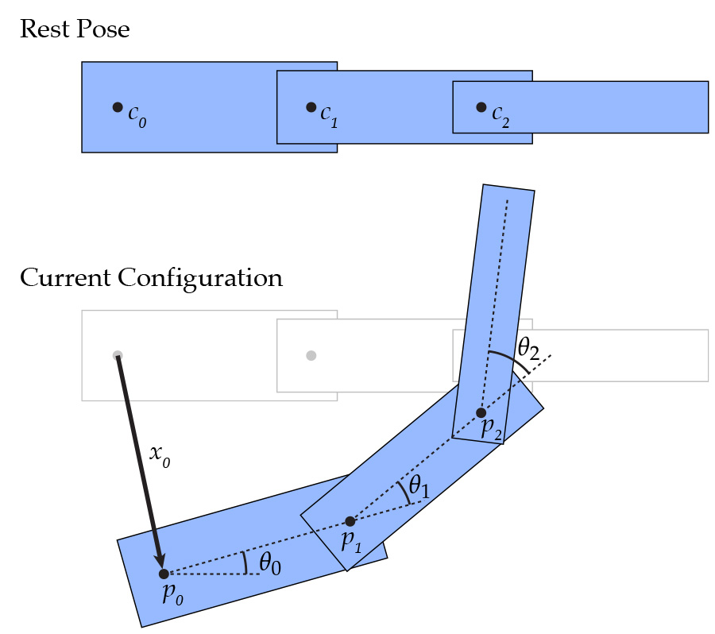
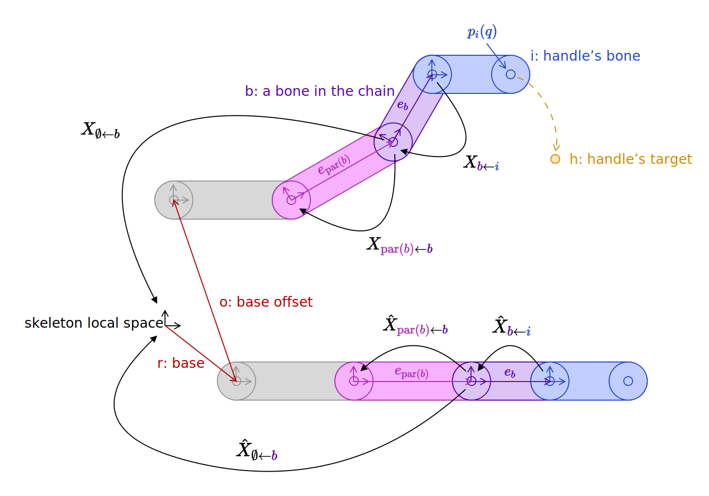

# `A4T2` Skeleton Kinematics

A `Skeleton` (declared in `src/scene/skeleton.h`, defined in `src/scene/skeleton.cpp`) is what we use to drive our animation. You can think of them like the set of bones we have in our own bodies and joints that connect these bones. For convenience, we have merged the bones and joints into the `Bone` class which holds the orientation of the bone relative to its parent as Euler angles (`Bone::pose`), and an `extent` that specifies where its child bones start. Each `Skinned_Mesh` has an associated `Skeleton` class which holds a rooted tree of `Bones`s, where each `Bone` can have an arbitrary number of children.

When discussing skeletal animation we have a whole family of different transformations and spaces to consider:
- **World space** is the space of the scene.
- **Local space** is the coordinate system local to the `Skinned_Mesh`. It is shared by the `Skinned_Mesh::mesh` and the `Skinned_Mesh::skeleton`. The transformation, $L$, between local space and world space is determined by the scene graph and can be retrieved from `Instance::Skinned_Mesh::transform->local_to_world()` (which you wrote way back in A1!).
- Bone space has its origin at the base point of the bone and its axes rotated by the bone (and its parents) rotations. There are two different bone spaces we will talk about:
	- **Bind Space** is the bone space in the bind pose (the pose where all joints are not rotated). The transformations, $B_j$, from bone space to local space for all bones $j$ is computed by `Skeleton::bind_pose()` (which you will implement).
	- **Pose Space** is the bone space in the current pose (the pose where each bone and its children are rotated by `Bone::pose` around `Bone::compute_rotation_axes`). The transformations, $P_j$, from pose space to local space for all bones $j$ are computed by `Skeleton::current_pose()` (which you will also implement).
- We define $\hat{X}_{a \gets b}$ as the transformation that represents moving from bone $b$'s space to bone $a$'s space, with $\emptyset$ representing the skeleton local space (this usually requires a translation from the root to skeleton).

**NOTE:** I mention world space above because it is one of the coordinate systems in Scotty3D. But for all of the implementation details of this assignment, you'll be working in local space and/or the bone spaces. Indeed, it is not possible from within `Skeleton` to determine $L$, since `Skeleton`s don't know what instance they are being accessed through.

**Note:** The [most recent slides](http://15462.courses.cs.cmu.edu/fall2023/lecture/lecture-15) have very good visuals to help understand each of the different spaces.

## `A4T2a` Forward Kinematics

**Implement:**
- `Skeleton::bind_pose`, which returns a vector whose $i\textrm{th}$ entry is $B_i \equiv \hat{X}_{\emptyset \gets i}$.
- `Skeleton::current_pose`, which returns a vector whose $i\textrm{th}$ entry is $P_i \equiv X_{\emptyset \gets i}$.

In the first half of this task, you will implement `Skeleton::bind_pose` and `Skeleton::current_pose`, which compute all the bind-to-local and pose-to-local transformations $B_j$ and $P_j$, respectively. It makes sense to compute these transformations in bulk because they are defined recursively in terms of a bone-to-parent transformation.

The transform between every bone's local space to its parent is a rotation around a local $x$, $y$, and $z$ rotation axis (in that order) followed by a translation by the parent's `extent`.

In other words, given bone $b$ with rotation axis directions $x_b$, $y_b$, and $z_b$; local rotation amounts $rx_b$, $ry_b$, and $rz_b$; and parent bone $\text{par}(b)$ with extent $e_{\text{par}(b)}$, the transform that takes points in the local space of $b$ to the local space of $\text{par}(b)$ is the matrix:

$$X_{\text{par}(b) \gets b} \equiv T_{e_{\text{par}(b)}} \times R_{rz_b @ z_b} \times R_{ry_b @ y_b} \times R_{rx_b @ x_b}$$

Where $T_{e_{\text{par}(b)}}$ is a translation by $e_{\text{par}(b)}$ and $R_{ra @ a}$ rotates by angle $ra$ around axis $a$.

Bones without a parent are translated by the skeleton's base point, $r$, and current base offset, $o$:
$$X_{\emptyset \gets b} \equiv T_{r+o} \times R_{rz_b @ z_b} \times R_{ry_b @ y_b} \times R_{rx_b @ x_b}$$

The overall transform from each bone to local space can be computed recursively:
$$X_{\emptyset \gets b} \equiv X_{\emptyset \gets \text{par}(b)} \times X_{\text{par}(b) \gets b}$$

The previous part detailed what would happen if we were in **current pose** as that would mean we would have a rotation for each axis. Alternatively, in **bind pose**, the bones are not posed or offset, so we have the following:

- For bone $b$ with parent $\text{par}(b)$: 

$$\hat{X}_ {\text{par}(b) \gets b} \equiv T_ {e_ {\text{par}(b)}}$$

- For bone $b$ without parent: 

$$\hat{X}_ {\emptyset \gets b} \equiv T_ {r}$$

- And, recursively: 

$$\hat{X}_ {\emptyset \gets b} \equiv \hat{X}_ {\emptyset \gets \text{par}(b)} \times \hat{X}_ {\text{par}(b) \gets b}$$

Implementation notes:
 - The list of bones in the skeleton is guaranteed to be sorted such that bones' parents appear first, so your code should be able to work in a single pass through the bones array.
 - The functions `Mat4::angle_axis` and `Mat4::translate` will be helpful.

### Aside: Local Axes

Why do we bother specifying $x_b$, $y_b$, $z_b$? \
Having a good choice of local axis is important when rigging characters for effective posing. If a joint has one primary axis of rotation, you'd prefer to have that axis aligned with (say) $rx_b$ so you need only adjust one variable when animating. This is especially important with mechanical assemblies, where you may well want a joint to represent a 1-DOF hinge, which is hard if the hinge is not parallel to some local axis of rotation!

The local rotation axes for a bone in Scotty3D are defined as follows (already implemented for you in the `Bone::compute_rotation_axes` function).

The $y_b$ axis is aligned with the bone's extent:
$$y_b \equiv \mathrm{normalize}(e_b)$$
(In case the bone's extent is zero, $y_b$ is set to $(0,1,0)$.)

To define $x_b$ we start with $\hat{x}$, the axis perpendicular to $y_b$ and aligned with the skeleton's $x$ axis:
$$\hat{x} \equiv \mathrm{normalize}((1,0,0) - ((1,0,0) \cdot y_b) y_b)$$
(In case $y_b$ is parallel to the $x$ axis, $\hat{x}$ is set to $(0,0,1)$.)

The $x_b$ axis is $\hat{x}$ rotated by $\theta_b \equiv$ `bone.roll` around $y_b$:
$$x_b \equiv \cos(\theta_b) \hat{x} - \sin(\theta_b) (\hat{x} \times y_b)$$

And, finally, the $z_b$ axis is set perpendicular to $x_b$ and $y_b$ to form a right-handed coordinate system:
$$z_b \equiv x_b \times y_b$$

### A picture of what's going on

_Note: These diagrams are in 2D for visual clarity, but we will work with a 3D kinematic skeleton._

Just like a `Scene::Transform`, the `pose` (and `extent`) of a `Bone` transform all of its children.
In the diagram below, $c_0$ is the parent of $c_1$ and $c_1$ is the parent of $c_2$.
When a translation of $x_0$ and rotation of $\theta_0$ is applied to $c_0$, all of the descendants are affected by this transformation as well.
Then, $c_1$ is rotated by $\theta_1$ which affects itself and $c_2$. Finally, when rotation of $\theta_2$ is applied to $c_2$, it only affects itself because it has no children.

  

Once you have implemented these basic kinematics, you should be able to define skeletons, set their positions at a collection of keyframes, and watch the skeleton smoothly interpolate the motion (see the [user guide](https://cmu-graphics.github.io/Scotty3D-docs/guide/animate_mode/) for an explanation of the interface and some demo videos). 

We have provided an example skeleton in `media/js3d/A4-human.js3d` that should behave similar to how a normal human's skeleton and joints should behave. To test if you have correctly implemented forward kinematics, you should be able to see a skeleton rig and rotate any bone around their local $x$, $y$ and $z$ axes (using the `pose` slider on the left side). The rings are slightly buggy in that increasing the pose for $x$ will rotate the bone CCW while increasing $y$ or $z$ will rotate the bone CW (and also jump at varying times), so it's better to test using the slider. 

An incorrect implementation of `bind_pose` will mean you won't have a skeleton rig, while an incorrect implementation of `current_pose` will mean you won't be able to properly rotate any of the bones.

We have also provided some test cases for computing the bind_pose and current_pose - feel free to write more if you wish to extensively test through the test cases.

Note that the skeleton does not yet influence the geometry of meshes in the scene -- that will come in Task 3!

## `A4T2b` Inverse Kinematics

**Implement:**
- `Skeleton::gradient_in_current_pose`, which returns $\nabla f$.
- `Skeleton::solve_ik`, takes downhill steps in bone pose space to minimize $f$.

Now that we have a logical way to move joints around, we can implement Inverse Kinematics (IK), which will move the joints around in order to reach a target point. There are a few different ways we can do this, but for this assignment we'll implement an iterative method called **gradient descent** in order to find the minimum of a function. For a function $f : \mathbb{R}^n \to \mathbb{R}$, we'll have the update scheme:

$$q \gets q - \tau \nabla f$$

Where $\tau$ is a small timestep and $q$ holds all the `Bone::pose` coordinates.
Specifically, we'll be using gradient descent to find the minimum of a cost function which measures the total squared distance between a set of IK handles positions $h$ and their associated bones $i$:

$$f(q) = \sum_{(h,i)} \frac{1}{2}|p_i(q) - h|^2 $$

Where $p_i(q) = I_{3\times 4} \times X_{\emptyset \gets i } \times [ e_i ~ 1 ]^T$  is the end position of bone $i$. (Here $I_{3\times 4}$ is a 3-row, 4-column matrix with ones on the diagonal to strip the homogenous coordinate, leaving just the position component. This is okay to do as long as $X$ is made up of well-behaved translations and rotations that don't (say) scale the homogenous coordinate. You don't necessarily need to use this exact equation when implementing this task as long as you get the position component correctly.)

*Implementation Notes:*
- If your updates become unstable, use a smaller $\tau$ (timestep).
- For even faster and better results, you can also implement a variable timestep instead of a fixed one. (One strategy: do a binary search to find a step which produces the large decrease in $f$ along $-\nabla f$.)
- Gradient descent should never affect `Skeleton::base_offset`.
- Remember what coordinate frame you're in. If you calculate the gradients in the wrong coordinate frame or use the axis of rotation in the wrong coordinate frame your answers will come out very wrong!
- Gradient descent is hard to get perfectly right because (especially with adaptive stepping!) it is a method that _really wants_ to work. Sometimes it's hard to distinguish an inefficient implementation from an incorrect one.

### Computing $\nabla f$

The gradient of $f$ (i.e., $\nabla f$) is the vector consisting of the partial derivatives of $f$ with respect to every element of $q$ (remember, $q$ is a vector containing all the `Bone::pose` coordinates, so $\nabla f$ should be a vector of length number of bones).
So let's look at one example: let's take the partial derivative with respect to $ry_b$ -- the rotation around the local $y_b$ axis of bone $b$.

First, we expand the definition of $f$:
$$\frac{\partial}{\partial ry_b} f = \sum_{(h,i)} \frac{\partial}{\partial ry_b} \frac{1}{2}|p_i(q) - h|^2 $$

In other words, we can compute the partial derivatives for each IK handle individually and sum them.
Any IK handle where $b$ isn't in the kinematic chain will contribute nothing to the partial derivative (can you explain why?), so let's look at a handle whose bone $i$ is a descendant of $b$, and apply the chain rule (do make a note of the dimensions of each of these parts):

$$\frac{\partial}{\partial ry_b} \frac{1}{2}|p_i(q) - h|^2
 = (p_i(q) - h) \cdot \frac{\partial}{\partial ry_b} p_i(q) $$

Then expand the definition of $p_i(q)$ (we omit the $I_{3\times 4}$ as it's purpose is to transform a Vec4 to a Vec3, but to make the final equation work out, there should be a $I_{3\times 4}$ to get a dot product between two Vec3s):

$$= (p_i(q) - h) \cdot 
\frac{\partial}{\partial ry_b} 
(X_{\emptyset \gets i} \times 
[ e_i ~ 1 ]^T) $$

$$= (p_i(q) - h) \cdot 
\frac{\partial}{\partial ry_b} 
(X_{\emptyset \gets \text{par}(b)} \times 
X_{\text{par}(b) \gets b} \times X_{b \gets i} \times 
[ e_i ~ 1 ]^T) $$

$$= (p_i(q) - h) \cdot 
(X_{\emptyset \gets \text{par}(b)} \times 
\frac{\partial}{\partial ry_b} X_{\text{par}(b) \gets b} 
\times X_{b \gets i} \times [ e_i ~ 1 ]^T) $$

$$= (p_i(q) - h) \cdot 
(X_{\emptyset \gets \text{par}(b)} \times 
\frac{\partial}{\partial ry_b} (T_{e_{\text{par}(b)}} \times R_{rz_b @ z_b} \times R_{ry_b @ y_b} \times R_{rx_b @ x_b}) \times 
X_{b \gets i} \times 
[ e_i ~ 1 ]^T) $$

$$= (p_ i(q) - h) \cdot (
\underbrace{X_ {\emptyset \gets \text{par}(b)} \times 
T_ {e_ {\text{par}(b)}} \times 
R_ {rz_ b @ z_ b}}_ {\textrm{linear xform}}
\times
\underbrace{\frac{\partial}{\partial ry_ b} R_ {ry_ b @ y_ b}}_ {\textrm{rotation}}
\times
\underbrace{R_ {rx_ b @ x_ b} \times X_ {b \gets i} \times [ e_ i ~ 1 ]^T}_ {\textrm{some point}}
)$$

In other words, your code needs only to find partial derivative of a rotation relative to its angle, and project this partial derivative to skeleton-local space.

  

Here's a useful bit of geometric reasoning (since it's a little difficult to compute the partial derivative in bone-local space): if you transform the axis of rotation and the base point of the bone into **skeleton-local** space, then you can use the fact that the derivative (w.r.t. $\theta$) of the rotation by $\theta$ around axis $x$ and center $r$ of point $p$ is a vector perpendicular $x$ with length $|r-p|$ (this is applicable to any axes):

$$\frac{\partial}{\partial \theta} R_{\theta @ x} (p - r) + r = x \times (p - r)$$

If we look at how to use this tidbit, we see that first, we'll need to transform our axis $x$ to skeleton-local space via the linear xform. Next, we'll need a point to act as our center of rotation for $r$ - this will be the base point of the current bone we are on, and we'll need to also transform this to skeleton-local space via the linear xform. Finally, we need some point $p$ to do this derivative on - since we are doing this in skeleton-local space, we simply want to use the point $p_i(q)$ that we initially wanted to take the derivative of.

Do note that you'll need to do this for each axis for every bone chain on every enabled handle.

For a more in-depth derivation of the process of computing this derivative (and a look into other inverse kinematics algorithms), please check out [these slides](http://15462.courses.cs.cmu.edu/fall2023/lecture/lecture-15/slide_046). 

### Using your IK!
Once you have IK implemented, you should be able to create a series of joints, and get a particular joint to move to the desired final position you have selected.

To help make it easier to test, we have provided a skeleton in `media/js3d/A4-human.js3d`. To test your IK, you should do the following steps:
- Open up `media/js3d/A4-human.js3d`
- Go to the `Rig` tab on the top
- Click on your Human_skinned_mesh
- Click on one of the bones
- Click `Add IK` on the left side of the screen
- Move the IK point in the GUI to wherever you want it to go
- Click Enable on the left side of the screen
- Click the `Animate` tab on the top
- Click on the Human
- The bone(s) should now move (if implemented correctly) towards the IK point

We have also provided some test cases for computing the gradient and for solve_ik - do note that these are quite specific to the reference implementation (some factors that should belong in the gradient can be ignored and instead placed in the timestep), so it's possible to have a working implementation and not pass any of these test cases. I tried to make it work in most scenarios (it's not totally rebust though), but don't worry too much about passing all the test cases. As long as using an IK works in the GUI, you should be good to go.

[Slightly outdated]: Please refer to the [User Guide](https://cmu-graphics.github.io/Scotty3D-docs/guide/rigging_mode/) for more examples.
