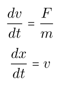
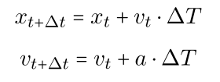
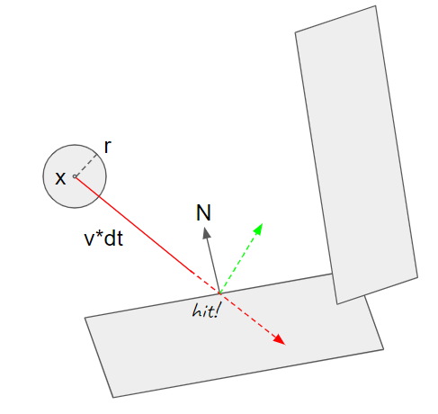

# Particle Systems

A particle system in Scotty3D is simply a collection of non-interacting, physics-simulated, spherical particles that interact with the rest of the scene. Take a look at the [user guide](../guide/simulate.md) for an overview of how to create and manage them. 

In this task, you will implement ``bool Particle::update(const PT::BVH<PT::Object>& scene, float dt, float radius)`` found in `student/particles.cpp`.

## Kinematics 

Each particle is described by a position and a velocity. If we want to know where the particle will be at some future time, we simply have to move it along its velocity vector. If the particle is travelling at constant velocity, this is a very easy expression to compute. 

However, if the particle can have arbitrary forces applied to it, we no longer know exactly how it will move. Since we're interested in physical simulation, we can apply the basic equation governing motion: F = ma. Since acceleration is the time derivative of velocity, we now have a differential equation governing how our particle moves. Unfortunately, it's no longer feasible (in general) to compute this motion analytically, so instead we will use numerical integration to step our particles forward in time. To get realistic behavior from approximate but easy to compute steps, we can simply take many small time steps until we reach the desired destination.

There are many different techniques for integrating our equations of motion, including forward, backward, and symplectic Euler, Verlet, Runge-Kutta, and Leapfrog. Each strategy comes with a slightly different way of computing how much to update our velocity and position across a single time-step. In this task, we will use the simplest - forward Euler - as we aren't too concerned with stability or energy conservation for our particle system. Forward Euler simply steps our position forward by our velocity, and then velocity by our acceleration:

In `Particle::update`, use this integrator to step the current particle forward for `dt` seconds. Note that the only force we will apply to our particles is gravity, so `acceleration` (a static member of `Particle`) is a constant `-9.8` meters per second squared pointing downward (feel free to play around with this!). Once you've added the update rule, you should already see some interesting behavior - create a particle system and see how the particles travel along nice parabolic trajectories. 

## Collisions

The more substantial part of this task is colliding each particle with the rest of our scene geometry. Thankfully, you've already done most of the work required here during A3: we can use Scotty3D's ray-tracing capabilities to find collisions along our particles' paths. 

During each timestep, we know that in the absence of a collision, our particle will travel in the direction of velocity for distance `||velocity|| * dt`. We can create a ray representing this position and velocity to look for collisions during the time-step. If the ray intersects with the scene, we can compute when the particle would experience a collision. Note that since we are representing particles as small spheres, you must take `radius` into account when finding the collision point. If the path intersects a surface, at what distance does the closest point on the sphere start colliding? (Hint - it depends on the angle of intersection.) Also note that if a collision would occur after the end of the current timestep, it may be ignored.

When we find a collision, we could just place the particle at the collision point and be done, but we don't want our particles to simply stick the surface! Instead, we will assume all particles collide elastically (and massless-ly) - that is, the magnitude of their velocity should be the same before and after the collision, and its direction should be reflected about the normal of the collision surface. 

Finally, once we have a reflected velocity, we can compute how much of the time step remains after the collision, and step the particle forward that amount. However, what if the particle collided with the scene _again_ before the end of the time-step? If we are using very small time-steps, it might be OK to ignore this possibility, but we want to be able to resolve all collisions. So, we can repeat the ray-casting procedure in a loop until we have used up the entire time-step (up to some epsilon). Remember to only use the remaining portion of the time-step each iteration, and to step forward both the velocity and position at each sub-step.

Once you have got collisions working, you should be able to open `particles.dae` and see a randomized collision-fueled waterfall. Try rendering the scene!

## Lifetime

Finally, note that `Particle::update` is supposed to return a boolean representing whether or not the particle should be removed from the simulation. Each particle has an `age` member that represents the remaining time it has to live. Each time-step, you should subtract `dt` from `age` and return whether `age` is still greater than zero. 

