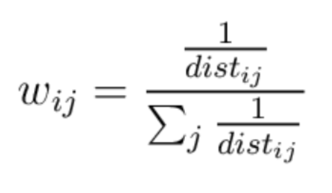
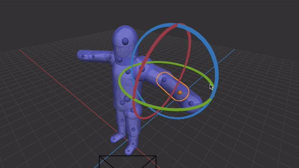

# Linear Blend Skinning

Now that we have a skeleton set up, we need to link the skeleton to the mesh in order to get the mesh to follow the movements of the skeleton. We will implement linear blend skinning using the following functions: `Skeleton::skin()`, `Skeleton::find_joints()`, and `closest_on_line_segment`.

The easiest way to do this is to update each of mesh vertices' positions in relation to the bones (Joints) in the skeleton. There are 3 types of coordinate spaces: bind, joint, and pose. Bind is the initial coordinate frame of the vertices of where they are bound to relative to the mesh. Joint is the position of the vertex relative to a given joint. Pose is the world-space position after the joint transforms have been applied. You'll want to compute transforms that take vertices in bind space and convert them to posed space (Hint: `joint_to_bind`, `joint_to_posed`, and `inverse()` will come in handy.)

Your implementation should have the following basic steps for each vertex:

- Compute the vertex's position with respect to each joint j in the skeleton in j's coordinate frame when no transformations have been applied to the skeleton (bind pose, vertex bind position).
- Find where this vertex would end up (in world coordinates) if it were transformed along with bone j.
- Find the closest point on joint j's bone segment (axis) and compute the distance to this closest point (Hint: `closest_on_line_segment` might come in handy).
    - Diagram of `closest_on_line_segment`:

- Compute the resulting position of the vertex by doing a weighted average of the bind-to-posed transforms from each bone and applying it to the vertex. The weights for the weighted average should be the inverse distance to the joint, so closer bones have a stronger influence.

Below we have an equation representation. The ith vertex v is the new vertex position. The weight w is the weight metric computed as the inverse of distance between the ith vertex and the closest point on joint j. We multiply this term with the position of the ith vertex v with respect to joint j after joint's transformations has been applied.

<!--# TODO: fix this-->
<!---->

In Scotty3D, the `Skeleton::skin()` function gets called on every frame draw iteration, recomputing all skinning related quantities. In this function, you should read vertices from `input.verts()` and indices from `input.indices()`, and write the resulting positions and norms to `v.pos` and `v.norm` for every vertex in the input vertices list.

You will be implementing a Capsule-Radius Linear Blend Skin method, which only moves vertices with a joint if they lie in the joint's radius. The `Skeleton::skin()` function also takes in a `map` of vertex index to relevant joints that you must compute the above distance/transformation metrics on. You are also responsible for creating this `map`, which is done so in `Skeleton::find_joints()`. Don't worry about calling this function, it is called automatically before skin is called, populating the `map` field and sending it over to the `skin()` function. Your `Skeleton::find_joints()` implementation should iterate over all the vertices and add joint j to vertex index i in the map if the distance between the vertex and joint is less than `j->radius` (remember make sure they're both in the same coordinate frame.)

