# Spline Interpolation

As we discussed in class, data points in time can be interpolated by constructing an approximating piecewise polynomial or spline. In this assignment you will implement a particular kind of spline, called a Catmull-Rom spline. A Catmull-Rom spline is a piecewise cubic spline defined purely in terms of the points it interpolates. It is a popular choice in real animation systems, because the animator does not need to define additional data like tangents, etc. (However, your code may still need to numerically evaluate these tangents after the fact; more on this point later.) All of the methods relevant to spline interpolation can be found in `spline.h` with implementations in `spline.inl`.

### Task 1a - Hermite Curve over the Unit Interval

Recall that a cubic polynomial is a function of the form:

where 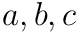, and  are fixed coefficients. However, there are many different ways of specifying a cubic polynomial. In particular, rather than specifying the coefficients directly, we can specify the endpoints and tangents we wish to interpolate. This construction is called the "Hermite form" of the polynomial. In particular, the Hermite form is given by

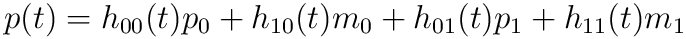

where 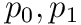 are endpoint positions,  are endpoint tangents, and  are the Hermite bases

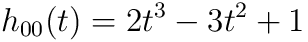  

  

  

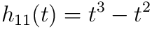  

Your first task is to implement the method `Spline::cubic_unit_spline()`, which evaluates a spline defined over the time interval  given a pair of endpoints and tangents at endpoints.

Your basic strategy for implementing this routine should be:

*   Evaluate the time, its square, and its cube (for readability, you may want to make a local copy).
*   Using these values, as well as the position and tangent values, compute the four basis functions 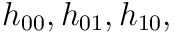 of a cubic polynomial in Hermite form.
*   Finally, combine the endpoint and tangent data using the evaluated bases, and return the result.

Notice that this function is templated on a type T. In C++, a templated class can operate on data of a variable type. In the case of a spline, for instance, we want to be able to interpolate all sorts of data: angles, vectors, colors, etc. So it wouldn't make sense to rewrite our spline class once for each of these types; instead, we use templates. In terms of implementation, your code will look no different than if you were operating on a basic type (e.g., doubles). However, the compiler will complain if you try to interpolate a type for which interpolation doesn't make sense! For instance, if you tried to interpolate `Skeleton` objects, the compiler would likely complain that there is no definition for the sum of two skeletons (via a + operator). In general, our spline interpolation will only make sense for data that comes from a vector space, since we need to add T values and take scalar multiples.

### Task 1B: Evaluation of a Catmull-Rom spline

The routine from part 1A just defines the interpolated spline between two points, but in general we will want smooth splines between a long sequence of points. You will now use your solution from part 1A to implement the method `Spline::at()` which evaluates a general Catmull-Romspline at the specified time in a sequence of points (called "knots"). Since we now know how to interpolate a pair of endpoints and tangents, the only task remaining is to find the interval closest to the query time, and evaluate its endpoints and tangents.

The basic idea behind Catmull-Rom is that for a given time t, we first find the four closest knots at times

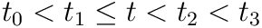

We then use t1 and t2 as the endpoints of our cubic "piece," and for tangents we use the values

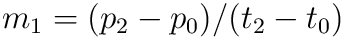  

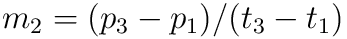  

In other words, a reasonable guess for the tangent is given by the difference between neighboring points. (See the Wikipedia and our course slides for more details.)

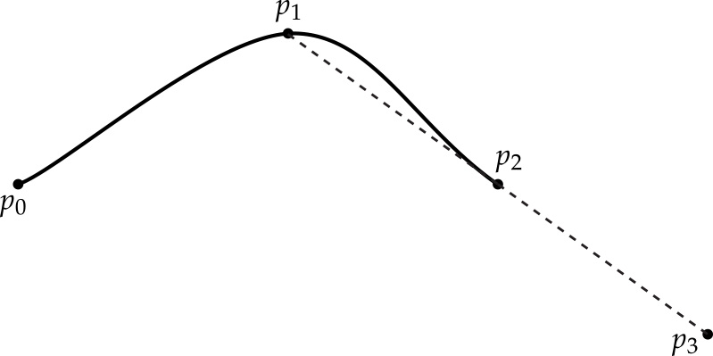  

This scheme works great if we have two well-defined knots on either side of the query time t. But what happens if we get a query time near the beginning or end of the spline? Or what if the spline contains fewer than four knots? We still have to somehow come up with a reasonable definition for the positions and tangents of the curve at these times. For this assignment, your Catmull-Rom spline interpolation should satisfy the following properties:

*   If there are no knots at all in the spline, interpolation should return the default value for the interpolated type. This value can be computed by simply calling the constructor for the type: T(). For instance, if the spline is interpolating Vector3D objects, then the default value will be 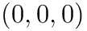.
*   If there is only one knot in the spline, interpolation should always return the value of that knot (independent of the time). In other words, we simply have a constant interpolant.
*   If the query time is less than or equal to the initial knot, return the initial knot's value.
*   If the query time is greater than or equal to the final knot, return the final knot's value.

Once we have two or more knots, interpolation can be handled using general-purpose code. In particular, we can adopt the following "mirroring" strategy to obtain the four knots used in our computation:

*   Any query time between the first and last knot will have at least one knot "to the left"  and one "to the right" 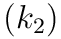.
*   Suppose we don't have a knot "two to the left" . Then we will define a "virtual" knot 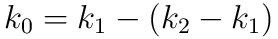. In other words, we will "mirror" the difference be observe between 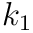 and 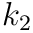 to the other side of .
*   Likewise, if we don't have a knot "two to the right" 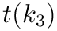), then we will "mirror" the difference to get a "virtual" knot 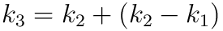.
*   At this point, we have four valid knot values (whether "real" or "virtual"), and can compute our tangents and positions as usual.
*   These values are then handed off to our subroutine that computes cubic interpolation over the unit interval.

  

An important thing to keep in mind is that `Spline::cubic_unit_spline()` assumes that the time value t is between 0 and 1, whereas the distance between two knots on our Catmull-Rom spline can be arbitrary. Therefore, when calling this subroutine you will have to normalize t such that it is between 0 and 1, i.e., you will have to divide by the length of the current interval over which you are interpolating. You should think very carefully about how this normalization affects the value computed by the subroutine, in comparison to the values we want to return. A transformation is necessary for both the tangents that you feed in to specify the unit spline.

Internally, a Spline object stores its data in an STL map that maps knot times to knot values. A nice thing about an STL map is that it automatically keeps knots in sorted order. Therefore, we can quickly access the knot closest to a given time using the method `map::upper_bound()`, which returns an iterator to knot with the smallest time greater than the given query time (you can find out more about this method via online documentation for the Standard Template Library).

### Using the splines

Once you have implemented the functions in `spline.cpp`, you should be able to make simple animations by translating, rotating or scaling the mesh in the scene. The main idea is to:
* create an initial keyframe by clicking at a point on the white timeline at the bottom of the screen
* specify the initial location/orientation/scale of your mesh using the controls provided
* create more keyframes with different mesh locations/orientations/scales and watch the splines smoothly interpolate the movement of your mesh!

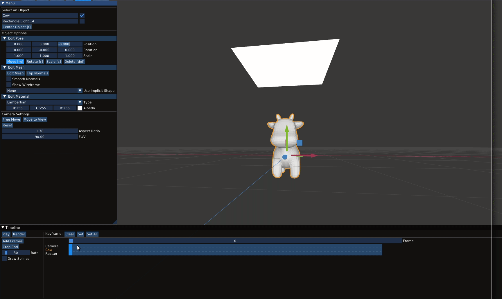

