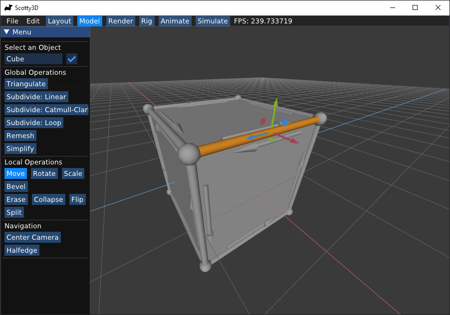

# Model

When in `Model` mode, Scotty3D provides a polygon-based 3D modeler with basic
subdivision capabilities. The central modeling paradigm is "box modeling", i.e.,
starting with a simple cube, you can add progressively more detail to produce
interesting 3D shapes. You can also use _subdivision_ to get smooth
approximations of these shapes.

MeshEdit supports four basic actions on mesh elements (move, rotate, scale, and bevel),
plus a collection of local and global mesh editing commands.

Note that MeshEdit (and more broadly, Scotty3D) will only operate on meshes that
are _manifold_ (i.e., the union of faces containing any given vertex _v_ is a
topological disk). Likewise, all mesh operations in Scotty3D will preserve the
manifold property, i.e., manifold input will always get mapped to manifold
output. This property is key for ensuring that many algorithms in Scotty3D are
"well-behaved", and that it always produces nice output for other programs to
use. If you load a mesh that is non-manifold, you can still use it in your scene
and render with it, but editing will not be supported.

### Editing Mesh Elements

In `Model` mode you can inspect mesh elements by
left-clicking on vertices, edges, faces, and halfedges. Information about these
elements will be shown in the left sidebar.

In this mode you can change the geometry (i.e., the shape) of the mesh by transforming mesh elements in the same way you can transform scene objects. Note
that the transformation widget again has three modes of operation, which you can
toggle through by pressing the `r` key.
- `Move`: click and drag on the red (X), green (Y), or blue (Z) arrow to move the object along the X/Y/Z axis. Click and drag on the red (YZ), green (XZ), or blue (XY) squares to move the object in the YZ/XZ/XY plane.
- `Rotate`: click and drag on the red (X), green (Y), or blue (Z) loop to rotate the object about the X/Y/Z axis. Note that these rotations are applied relative to the current pose, so they do not necessarily correspond to smooth transformations of the X/Y/Z Euler angles.
- `Scale`: click and drag on the red (X), green (Y), or blue(Z) block to scale the object about the X/Y/Z axis. Again note that this scale is applied relative to the current pose.

### Beveling

The bevel action creates a new copy of the selected element that is inset and
offset from the original element. Clicking and dragging on an element will
perform a bevel; the horizontal motion of the cursor controls the amount by
which the new element shrinks or expands relative to the original element, and
the vertical motion of the cursor controls the amount by which the new element
is offset (in the normal direction) from the original element. It is important
to note that a new element will be created upon click _even if no inset or
offset is applied_. Therefore, if you're not careful you may end up with
duplicate elements that are not immediately visible. (To check, you can drag one
of the vertices mode.)

There are three possible types of bevels:

- Vertex Bevel: The selected vertex _v_ is replaced by a face _f_ whose
vertices are connected to the edges originally incident on _v_. The new face is
inset (i.e., shunken or expanded) by a user-controllable amount.

<video src="{{ site.baseurl }}/guide/model_mode/vertex_bevel.mp4" controls preload muted loop style="max-width: 100%; margin: 0 auto;"></video>

- Edge Bevel: The selected edge _e_ is replaced by a face _f_ whose
vertices are connected to the edges originally incident on the endpoints of _e_.
The new face is inset and offset by some user-controllable amount, as with the
vertex bevel.

<video src="{{ site.baseurl }}/guide/model_mode/edge_bevel.mp4" controls preload muted loop style="max-width: 100%; margin: 0 auto;"></video>

- Face Bevel: The selected face _f_ is replaced by a new face _g_, as well
as a ring of faces around _g_, such that the vertices of _g_ connect to the
original vertices of _f_. The new face is inset and offset by some
user-controllable amount.

<video src="{{ site.baseurl }}/guide/model_mode/face_bevel.mp4" controls preload muted loop style="max-width: 100%; margin: 0 auto;"></video>

### Local Connectivity Editing

In addition to beveling, a variety of commands can be used to alter the
connectivity of the mesh (for instance, splitting or collapsing edges). These
commands are applied by selecting a mesh element (in any mode) and pressing the
appropriate key, as listed below. Local mesh editing operations include:

- Erase Vertex: The selected vertex _v_ together with all incident edges
and faces will be replaced with a single face _f_, that is the union of all
faces originally incident on _v_.

<video src="{{ site.baseurl }}/guide/model_mode/erase_vertex.mp4" controls preload muted loop style="max-width: 100%; margin: 0 auto;"></video>

- Erase Edge: The selected edge _e_ will be replaced with the union of the
faces containing it, producing a new face _e_ (if _e_ is a boundary edge,
nothing happens).

<video src="{{ site.baseurl }}/guide/model_mode/erase_edge.mp4" controls preload muted loop style="max-width: 100%; margin: 0 auto;"></video>

- Edge Collapse: The selected edge _e_ is replaced by a single vertex _v_.
This vertex is connected by edges to all vertices previously connected to either
endpoint of _e_. Moreover, if either of the polygons containing _e_ was a
triangle, it will be replaced by an edge (rather than a degenerate polygon with
only two edges).

<video src="{{ site.baseurl }}/guide/model_mode/collapse_edge.mp4" controls preload muted loop style="max-width: 100%; margin: 0 auto;"></video>

- Face Collapse: The selected face _f_ is replaced by a single vertex _v_.
All edges previously connected to vertices of _f_ are now connected directly to
_v_.

<video src="{{ site.baseurl }}/guide/model_mode/collapse_face.mp4" controls preload muted loop style="max-width: 100%; margin: 0 auto;"></video>

- Edge Flip: The selected edge _e_ is "rotated" around the face, in the
sense that each endpoint moves to the next vertex (in counter-clockwise order)
along the boundary of the two polygons containing _e_.

<video src="{{ site.baseurl }}/guide/model_mode/edge_flip.mp4" controls preload muted loop style="max-width: 100%; margin: 0 auto;"></video>

- Edge Split: [Note: this method is for triangle meshes only!] The
selected edge _e_ is split at its midpoint, and the new vertex _v_ is connected
to the two opposite vertices (or one in the case of a surface with boundary).

<video src="{{ site.baseurl }}/guide/model_mode/edge_split.mp4" controls preload muted loop style="max-width: 100%; margin: 0 auto;"></video>

### Global Mesh Processing

A number of commands can be used to create a more global change in the mesh
(e.g., subdivision or simplification). These commands can be applied by
pressing the appropriate sidebar button with a mesh selected. Note that in scenes with multiple meshes (e.g., those used by
the path tracer), this command will be applied only to the selected mesh.

- Triangulate: Each polygon is split into triangles.

<video src="{{ site.baseurl }}/guide/model_mode/triangulate.mp4" controls preload muted loop style="max-width: 100%; margin: 0 auto;"></video>

- Linear Subdivision: Each polygon in the selected mesh is split into
quadrilaterals by inserting a vertex at the midpoint and connecting it to the
midpoint of all edges. New vertices are placed at the average of old vertices so
that, e.g., flat faces stay flat, and old vertices remain where they were.

<video src="{{ site.baseurl }}/guide/model_mode/linear_subd.mp4" controls preload muted loop style="max-width: 100%; margin: 0 auto;"></video>

- Catmull-Clark Subdivision: _[Note: this method is for meshes without boundary only!]_
Just as with linear subdivision, each
polygon is split into quadrilaterals, but this time the vertex positions are
updated according to the [Catmull-Clark subdivision
rules](https://en.wikipedia.org/wiki/Catmull_Clark_subdivision_surface),
ultimately generating a nice rounded surface.

<video src="{{ site.baseurl }}/guide/model_mode/catmull_subd.mp4" controls preload muted loop style="max-width: 100%; margin: 0 auto;"></video>

- Loop Subdivision:  _[Note: this method is for triangle meshes without boundary only!]_
Each triangle is split into four by connecting the edge midpoints. Vertex
positions are updated according to the [Loop subdivision
rules](https://en.wikipedia.org/wiki/Loop_subdivision_surface).

<video src="{{ site.baseurl }}/guide/model_mode/loop_subd.mp4" controls preload muted loop style="max-width: 100%; margin: 0 auto;"></video>

- Isotropic Remeshing: _[Note: this method is for triangle meshes only!]_
The mesh is resampled so that triangles all have roughly the same size and
shape, and vertex valence is close to regular (i.e., about six edges incident on
every vertex).

<video src="{{ site.baseurl }}/guide/model_mode/remesh.mp4" controls preload muted loop style="max-width: 100%; margin: 0 auto;"></video>

- Simplification _[Note: this method is for triangle meshes only!]_ The
number of triangles in the mesh is reduced by a factor of about four, aiming to
preserve the appearance of the original mesh as closely as possible.

<video src="{{ site.baseurl }}/guide/model_mode/simplify.mp4" controls preload muted loop style="max-width: 100%; margin: 0 auto;"></video>

### Key Bindings

| Key                   | Command                                            |
| :-------------------: | :--------------------------------------------:     |
| `c` | Center the camera on the current element. |
| `m` | Use the `Move` tool. |
| `r` | Use the `Rotate` tool. |
| `s` | Use the `Scale` tool. |
| `b` | Use the `Bevel` tool. |
| `v`                 | Select the current halfedge's vertex                |
| `e`                 | Select the current halfedge's edge                |
| `f`                 | Select the current halfedge's face                |
| `t`                 | Select the current halfedge's twin                |
| `n`                 | Select the current halfedge's next                |
| `h`                 | Select the current element's halfedge                |
| `delete` | Erase the currently selected vertex or edge. |
