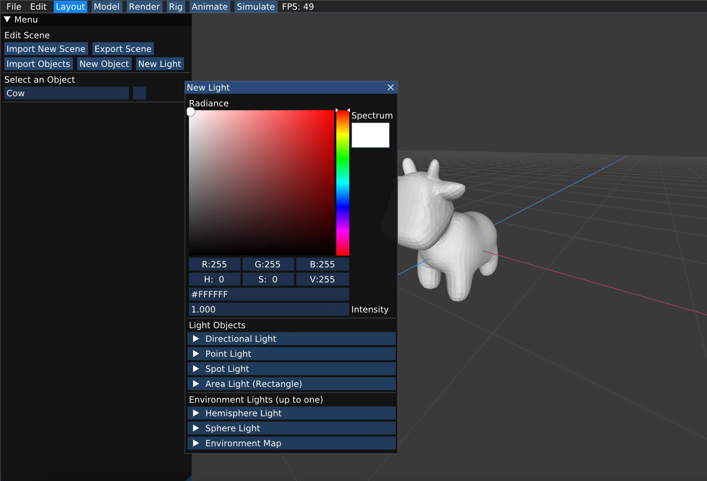
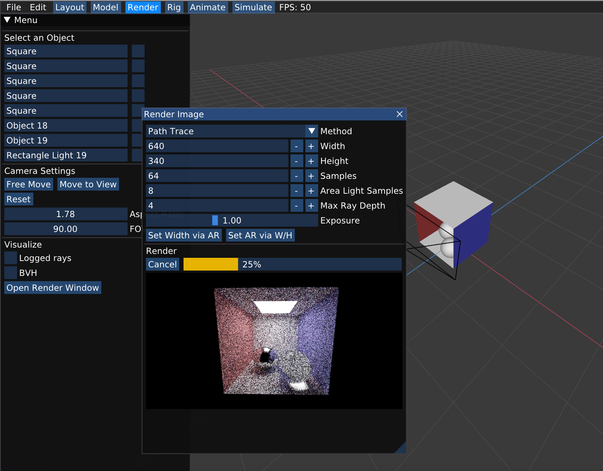

# Render

Welcome! This is Scotty3D's realistic, globally illuminated pathtracing renderer, capable of creating images of complex scenes using path tracing.

## Moving Camera

## Create light

To create a lighting for your scene, simply go to the menu on the left side, click "New Light", and you will be able to choose from a variaty of light objects and environmental lights. (you will implement the support for environmental light in Task 7. See the corresponding documentation for more guide.)

## Render Window

Click on "Open Render Window", and you will be able to set the parameters to render your model. Enjoy the excitement of seeing the images becoming clearer and clearer ;-)

## Enable Logged Ray for Debugging

In Render mode, simply check the box for "Logged Rays", and you would be able to see the camera rays that you generated in task 1.

## Visualize BVH

In Render mode, simply check the box for "Logged Rays", and you would be able to see the camera rays that you generated in task 3 when you start rendering. You can click on the horizontal bar to see each level of your BVH.

