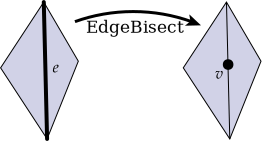
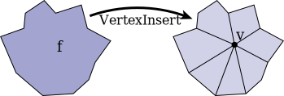
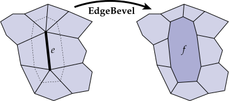
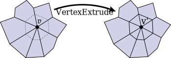

# Local Mesh Operations

Many of the actions that need to be implemented in the MeshEdit mode are local mesh operations (like edge collapse, face bevel, etc.).

A good recipe for ensuring that all pointers are still valid after a local remeshing operation is:

1.  Draw a picture of all the elements (vertices, edges, faces, halfedges) that will be needed from the original mesh, and all the elements that should appear in the modified mesh.
2.  Allocate any new elements that are needed in the modified mesh, but do not appear in the original mesh.
3.  For every element in the "modified" picture, set **all** of its pointers -- even if they didn't change. For instance, for each halfedge, make sure to set `next`, `twin`, `vertex`, `edge`, and `face` to the correct values in the new (modified) picture. For each vertex, make sure to set its `halfedge` pointer. Etc. A convenience method `Halfedge::set_neighbors()` has been created for this purpose.
4.  Deallocate any elements that are no longer used in the modified mesh, which can be done by calling `Halfedge_Mesh::erase()`.

The reason for setting all the pointers (and not just the ones that changed) is that it is very easy to miss a pointer, causing your code to crash.

### Interface with global mesh operations

To facilitate user interaction, as well as global mesh processing operations (described below), local mesh operations should return the following values when possible. However, should it happen that the specified values are not available, or that the operation should not work on the given input, we need a way to signify the failure case. To do so, each local operation actually returns a ``std::optional`` value parameterized on the type of element it returns. For example, ``Halfedge_Mesh::erase_vertex`` returns a ``std::optional<Halfedge_Mesh::Face>``.  An ``optional`` can hold a value of the specified type, or, similarly to a pointer, a null value (``std::nullopt``). See ``student/meshedit.cpp`` for specific examples.

Also, remember that in any case, _the program should not crash!_ So for instance, you should never return a pointer to an element that was deleted.

See the [User Guide](/Scotty3D/guide/model_mode) for demonstrations of each local operation.

*   `Halfedge_Mesh::flip_edge` - should return the edge that was flipped

*   `Halfedge_Mesh::split_edge` - should return the inserted vertex

*   `Halfedge_Mesh::bisect_edge` - should bisect the edge and return the inserted vertex

*   `Halfedge_Mesh::collapse_edge` - should return the new vertex, corresponding to the collapsed edge

*   `Halfedge_Mesh::collapse_face` - should return the new vertex, corresponding to the collapsed face

*   `Halfedge_Mesh::insert_vertex` - should return the newly inserted vertex

*   `Halfedge_Mesh::erase_vertex` - should return the new face, corresponding to the faces originally containing the vertex

*   `Halfedge_Mesh::erase_edge` - should return the new face, corresponding to the faces originally containing the edge

*   `Halfedge_Mesh::bevel_vertex` - should return the new face, corresponding to the beveled vertex

*   `Halfedge_Mesh::bevel_edge` - should return the new face, corresponding to the beveled edge

*   `Halfedge_Mesh::bevel_face` / `Halfedge_Mesh::extrude_face` / `Halfedge_Mesh::inset_face` - should return the new, inset face. 

*   `Halfedge_Mesh::extrude_vertex` - should return the new vertex

