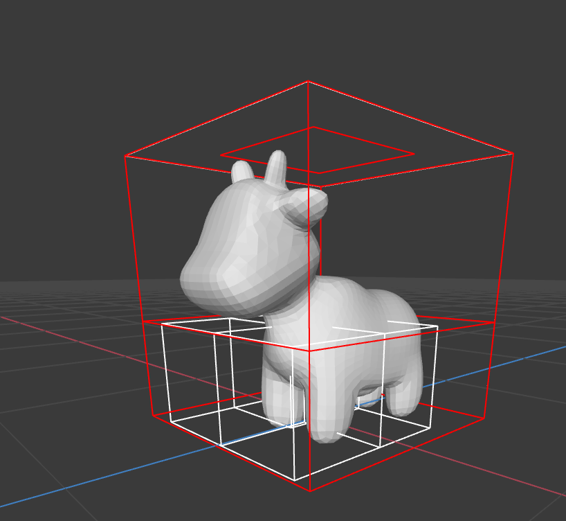

# (Task 3) Bounding Volume Hierarchy

In this task you will implement a bounding volume hierarchy that accelerates ray-scene intersection. Most of this work will be in `student/bvh.inl`. Note that this file has an unusual extension (`.inl` = inline) because it is an implementation file for a template class. This means `bvh.h` must `#include` it, so all code that sees `bvh.h` will also see `bvh.inl`.

First, take a look at the definition for our `BVH` in `rays/bvh.h`. We represent our BVH using a vector of `Node`s, `nodes`, as an implicit tree data structure in the same fashion as heaps that you probably have seen in some other courses. A `Node` has the following fields:

* `BBox bbox`: the bounding box of the node (bounds all primitives in the subtree rooted by this node)
* `size_t start`: start index of primitives in the `BVH`'s primitive array
* `size_t size`: range of index in the primitive list (number of primitives in the subtree rooted by the node)
* `size_t l`: the index of the left child node
* `size_t r`: the index of the right child node

The BVH class also maintains a vector of all primitives in the BVH. The fields start and size in the BVH `Node` refer the range of contained primitives in this array. The primitives in this array are not initially in any particular order, and you will need to _rearrange the order_ as you build the BVH so that your BVH can accurately represent the spacial hierarchy.

The starter code constructs a valid BVH, but it is a trivial BVH with a single node containing all scene primitives. Once you are done with this task, you can check the box for BVH in the left bar under "Visualize" when you start render to visualize your BVH and see each levels.

Finally, note that the BVH visualizer will start drawing from `BVH::root_idx`, so be sure to set this to the proper index (probably 0 or `nodes.size() - 1`, depending on your implementation) when you build the BVH.

## Step 0: Bounding Box Calculation

Implement `BBox::hit` in `student/bbox.cpp`.
Also if you haven't already, implement `Triangle::bbox` in `student/tri_mesh.cpp`.

## Step 1: BVH Construction

Your job is to construct a `BVH` using the [Surface Area Heuristic](http://15462.courses.cs.cmu.edu/fall2017/lecture/acceleratingqueries/slide_025) discussed in class. Tree construction would occur when the BVH object is constructed.

## Step 2: Ray-BVH Intersection

Implement the ray-BVH intersection routine `Trace BVH<Primitive>::hit(const Ray& ray)`. You may wish to consider the node visit order optimizations we discussed in class. Once complete, your renderer should be able to render all of the test scenes in a reasonable amount of time. [Visualization of normals](visualization_of_normals.md) may help with debugging.

## Visualization

In Render mode, simply check the box for "BVH", and you would be able to see the BVH you generated in task 3 when you **start rendering**. You can click on the horizontal bar to see each level of your BVH.

The bvh constructed for spot on the 10th level.

The bvh constructed for a scene composed of several cubes and spheres on the 0th level.

The bvh constructed for a scene composed of several cubes and spheres on the 1st level.

The bvh constructed for bunny on the 10th level.

