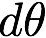
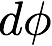
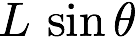
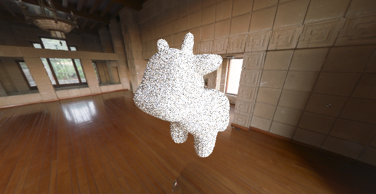
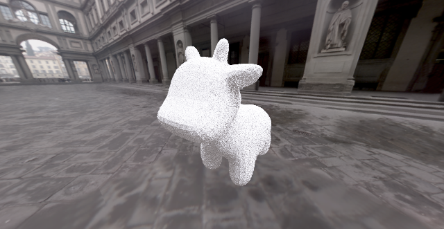
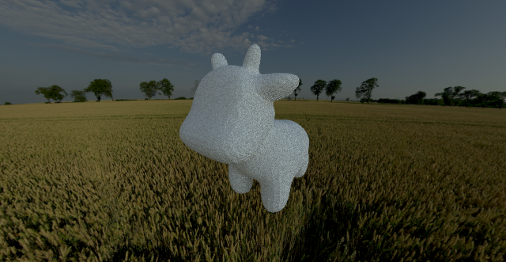
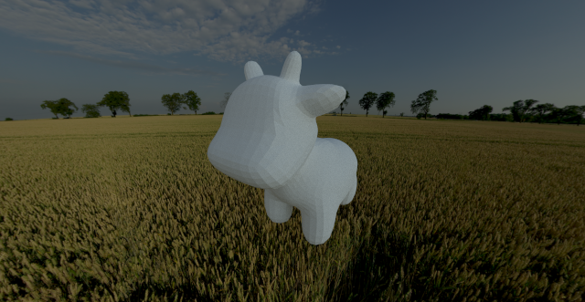

# (Task 7) Environment Lighting

### Walkthrough Video
<iframe width="750" height="500" src="Task7_EnvMap.mp4" frameborder="0" allowfullscreen></iframe>

The final task of this assignment will be to implement a new type of light source: an infinite environment light. An environment light is a light that supplies incident radiance (really, the light intensity dPhi/dOmega) from all directions on the sphere. Rather than using a predefined collection of explicit lights, an environment light is a capture of the actual incoming light from some real-world scene; rendering using environment lighting can be quite striking.

The intensity of incoming light from each direction is defined by a texture map parameterized by phi and theta, as shown below.

In this task you need to implement the `Env_Map::sample` and `Env_Map::sample_direction` method in `student/env_light.cpp`. You'll start with uniform direction sampling to get things working, and then move to a more advanced implementation that uses **importance sampling** to significantly reduce variance in rendered images.

## Step 1: Uniformly sampling the environment map
To get things working, your first implementation of `Env_Map::sample` will be quite simple. You should generate a random direction on the sphere (**with uniform (1/4pi) probability with respect to solid angle**), convert this direction to coordinates (phi, theta) and then look up the appropriate radiance value in the texture map using **bilinear interpolation** (note: we recommend you begin with bilinear interpolation to keep things simple.)

Since high dynamic range environment maps can be large files, we have not included them in the starter code repo. You can download a set of environment maps from this [link](http://15462.courses.cs.cmu.edu/fall2015content/misc/asst3_images/asst3_exr_archive.zip). You can designate rendering to use a particular environment map from the GUI: go to `layout` -> `new light` -> `environment map`-> `add`, and then select one of the environment maps that you have just downloaded.

For more HDRIs for creative environment maps, check out [HDRIHAVEN](https://hdrihaven.com/)

**Tips:**

* You must write your own code to uniformly sample the sphere.
* check out the interface of `Env_Map` in `rays/env_light.h`. For `Env_Map`, the `image` field is the actual map being represented as a `HDR_Image`, which contains the pixels of the environment map and size of the environment texture. The interface for `HDR_Image` is in `util/hdr_image.h`.

## Step 2: Importance sampling the environment map

Much like light in the real world, most of the energy provided by an environment light source is concentrated in the directions toward bright light sources. **Therefore, it makes sense to bias selection of sampled directions towards the directions for which incoming radiance is the greatest.** In this final task you will implement an importance sampling scheme for environment lights. For environment lights with large variation in incoming light intensities, good importance sampling will significantly improve the quality of renderings.

The basic idea is that you will assign a probability to each pixel in the environment map based on the total flux passing through the solid angle it represents.

A pixel with coordinate  subtends an area  on the unit sphere (where  and  the angles subtended by each pixel -- as determined by the resolution of the texture). Thus, the flux through a pixel is proportional to . (We only care about the relative flux through each pixel to create a distribution.)

**Summing the fluxes for all pixels, then normalizing the values so that they sum to one, yields a discrete probability distribution for picking a pixel based on flux through its corresponding solid angle on the sphere.**

To sample this 2D discrete probability distribution, we recommend treating the image as a single vector (row-major), where
the CDF of a pixel is the sum of the PDFs of the pixels before it. You can then use inversion sampling with this vector to sample a pixel from this 2D discrete probability distribuion.

**Here are a few tips:**

* When computing areas corresponding to a pixel, use the value of theta at the pixel centers.
* We recommend precomputing the joint distributions p(phi, theta) and marginal distributions p(theta) in the constructor of `Sampler::Sphere::Image` and storing the resulting values in fields `pdf`. See `rays/sampler.h`.
* `Spectrum::luma()` returns the luminance (brightness) of a Spectrum. The probability of a pixel should be proportional to the product of its luminance and the solid angle it subtends.
* `std::lower_bound` is your friend. Documentation is [here](https://en.cppreference.com/w/cpp/algorithm/lower_bound).

## Sample results for importance sampling:

ennis.exr with 32 spp

uffiz.exr with 32 spp

field.exr with 32 spp

field.exr with 1024 spp

