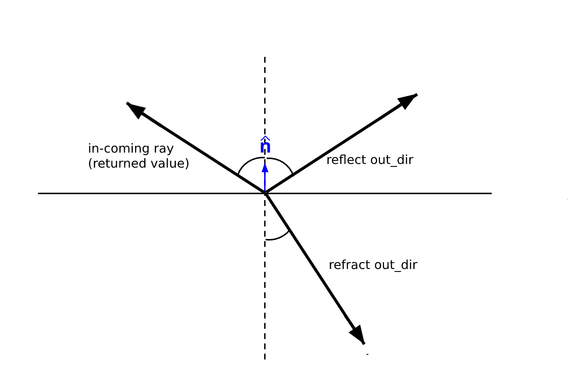
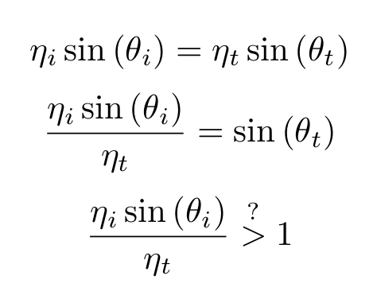
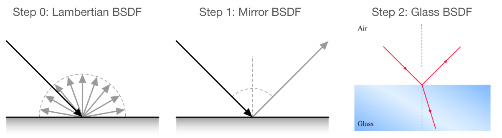
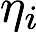
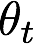
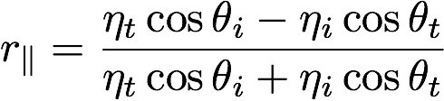
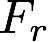
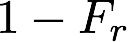
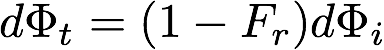
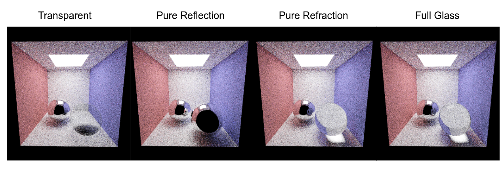

# (Task 6) Materials

### Walkthrough Video
<iframe width="750" height="500" src="Task6_Materials.mp4" frameborder="0" allowfullscreen></iframe>

Now that you have implemented the ability to sample more complex light paths, it's finally time to add support for more types of materials (other than the fully Lambertian material that you have implemented in Task 5). In this task you will add support for two types of materials: a perfect mirror and glass (a material featuring both specular reflection and transmittance) in `student/bsdf.cpp`.

**Note:** In the BSDF diagrams and documentation below, both the `out_dir` and the returned in-direction are pointing away from the intersection point of the ray and the surface, as illustrated in this picture below. This is so that it is easy to define the angles with respect to the surface normal.

Also, remember that in pathtracing, we are tracing _backwards_, from the camera to the scene, which is why the output of these BSDF diagrams (and hence your BSDF functions) correspond with the input rays of the pathtracing procedure.

To get started take a look at the BSDF interface in `rays/bsdf.h`. There are a number of key methods you should understand in `BSDF class`:

* `Spectrum evaluate(Vec3 out_dir, Vec3 in_dir)`: evaluates the distribution function for a given pair of directions.
* `BSDF_Sample sample(Vec3 out_dir)`: given the `out_dir`, generates a random sample of the in-direction (which may be a reflection direction or a refracted transmitted light direction). It returns a `BSDF_Sample`, which contains the in-direction(`direction`), its probability (`pdf`), as well as the `attenuation` for this pair of directions. (You do not need to worry about the `emissive` for the materials that we are asking you to implement, since those materials do not emit light.)

There are also two helper functions in the BSDF class in `student/bsdf.cpp` that you will need to implement:

* `Vec3 reflect(Vec3 dir)` returns a direction that is the **perfect specular reflection** direction corresponding to `dir` (reflection of `dir` about the normal, which in the surface coordinate space is [0,1,0]). More detail about specular reflection is [here](http://15462.courses.cs.cmu.edu/fall2015/lecture/reflection/slide_028).

* `Vec3 refract(Vec3 out_dir, float index_of_refraction, bool& was_internal)` returns the ray that results from refracting the ray in `out_dir` about the surface according to [Snell's Law](http://15462.courses.cs.cmu.edu/fall2015/lecture/reflection/slide_032). The surface's index of refraction is given by the argument `index_of_refraction`. Your implementation should assume that if the ray in `out_dir` **is entering the surface** (that is, if `cos(out_dir, N=[0,1,0]) > 0`) then the ray is currently in vacuum (index of refraction = 1.0). If `cos(out_dir, N=[0,1,0]) < 0` then your code should assume the ray is leaving the surface and entering vacuum. Remember to **flip the sign of the x and z components** of the output ray direction from the refract method.

* There is a special case to account for, specifically known as **total internal
reflection**. This happens for certain angles when the incoming ray is in the material with the
higher refractive index. These certain angles are angles that are greater than the _critical angle_, which is the incident angle \theta_i that causes the
refracted angle \theta_t to be >= 90 degrees, which causes there to be no real solution to Snell's
Law.

**In the case of total internal reflection, you should set `*was_internal` to `true`**.

## Step 1: `BSDF_Mirror`

Implement the class `BSDF_Mirror` which represents a material with perfect specular reflection (a perfect mirror). You should Implement `BSDF_Mirror::sample`, `BSDF_Mirror::evaluate`, and `reflect`.

**Hint:** the mirror BSDF is a Dirac Delta. What does this mean for the pdf and the evaluate function?

## Step 2: `BSDF_Glass`

Implement the class `BSDF_Glass` which is a glass-like material that both reflects light and transmit light. As discussed in class the fraction of light that is reflected and transmitted through glass is given by the dielectric Fresnel equations.

Specifically your implementation should:

* Implement `refract` to add support for refracted ray paths.
* Implement `BSDF_refract::sample` as well as `BSDF_Glass::sample`. Your implementation should use the Fresnel equations to compute the fraction of reflected light and the fraction of transmitted light. The returned ray sample should be either a reflection ray or a refracted ray, with the probability of which type of ray to use for the current path proportional to the Fresnel reflectance. (e.g., If the Fresnel reflectance is 0.9, then you should generate a reflection ray 90% of the time. What should the pdf be in this case?) Note that you can also use [Schlick's approximation](https://en.wikipedia.org/wiki/Schlick's_approximation) instead.
* You should read the notes below on the Fresnel equations as well as on how to compute a transmittance BSDF.

### Dielectrics and Transmission

### Fresnel Equations for Dielectric

The [Fresnel Equations](https://en.wikipedia.org/wiki/Fresnel_equations) (another [link](http://hyperphysics.phy-astr.gsu.edu/hbase/phyopt/freseq.html) here) describe the amount of reflection from a surface. The description below is an approximation for dielectric materials (materials that don't conduct electricity). In this assignment you're asked to implement a glass material, which is a dielectric.

In the description below,  and  refer to the index of refraction of the medium containing an incoming ray, and the zenith angle of the ray to the surface of a new medium.  and  refer to the index of refraction of the new medium and the angle to the surface normal of a transmitted ray.

The Fresnel equations state that reflection from a surface is a function of the surface's index of refraction, as well as the polarity of the incoming light. Since our renderer doesn't account for polarity, we'll apply a common approximation of averaging the reflectance of polarizes light in perpendicular and parallel polarized light:

The parallel and perpendicular terms are given by:

Therefore, for a dielectric material, the fraction of reflected light will be given by , and the amount of transmitted light will be given by .

Alternatively, you may compute   using [Schlick's approximation](https://en.wikipedia.org/wiki/Schlick%27s_approximation).

### Distribution Function for Transmitted Light

We described the BRDF for perfect specular reflection in class, however we did not discuss the distribution function for transmitted light. Since refraction "spreads" or "condenses" a beam, unlike perfect reflection, the radiance along the ray changes due to a refraction event. In your assignment you should use Snell's Law to compute the direction of refraction rays, and use the following distribution function to compute the radiance of transmitted rays. We refer you guys to Pharr, Jakob, and and Humphries's book [Physically Based Rendering](http://www.pbr-book.org/3ed-2018/Reflection_Models/Specular_Reflection_and_Transmission.html) for a derivation based on Snell's Law and the relation . (But you are more than welcome to attempt a derivation on your own!)

When you are done, you will be able to render images like this one, the Cornell Box with a metal and glass sphere (`cbox.dae`):

## Tips for Debugging Glass BSDF

* Check your sphere intersection code, as you may have bugs there that were not
    encountered by the Lambertian spheres from Task 5.
* Check that your refract function is correct by setting `ior = 1.f` in the
    glass BSDF function. This will make the glass sphere transparent
    and check that the refracted ray is indeed obeying Snell's Law.
* Test reflection and refraction separately, i.e. ignore the Fresnel coefficient
    and only refract or reflect. Once you've verified that those are correct,
    then go ahead and reintroduce the Fresnel coefficient for determining the
    portion of rays being reflected vs. refracted.

