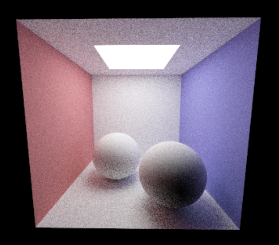
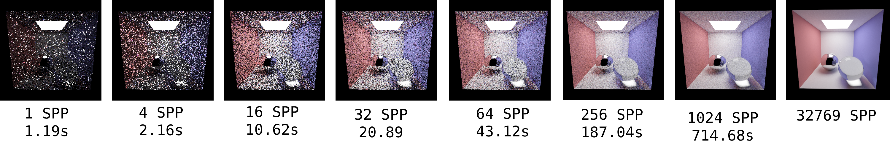

# (Task 5) Path Tracing

### Walkthrough Video
<iframe width="750" height="500" src="Task5_PathTracing.mp4" frameborder="0" allowfullscreen></iframe>

Up to this point, your renderer simulates light which begins at a source, bounces off a surface, and hits a camera. However, light can take much more complicated paths, bouncing off many surfaces before eventually reaching the camera. Simulating this multi-bounce light is referred to as _indirect illumination_, and it is critical to producing realistic images, especially when specular surfaces are present.

In this task you will modify your renderer to simulate multi-bounce light, adding support for indirect illumination in addition to the direct illumination implemented for you in the starter code.

## Step 1: `Pathtracer::trace_ray`

You must modify `Pathtracer::trace_ray` to simulate multiple bounces using the [Russian Roulette](http://15462.courses.cs.cmu.edu/spring2020/lecture/montecarloraytracing/slide_044) algorithm discussed in class.

The basic structure will be as follows:

* (1) Randomly select a new ray direction using `bsdf.sample` (which you will implement in Step 2)
* (2) Potentially terminate the path (using Russian Roulette)
* (3) Recursively trace the ray to evaluate weighted reflectance contribution due to light from this direction. Remember to respect the maximum number of bounces from `max_depth` (which is a member of class `Pathtracer`). Don't forget to add in the BSDF emissive component to account for light materials!

## Step 2: `BSDF_Lambertian::sample`

Implement `BSDF_Lambertian::sample` for diffuse reflections, which randomly samples a direction from a uniform hemisphere distribution and returns a `BSDF_Sample`.  Note that the interface is in `rays/bsdf.h`. Task 6 contains further discussion of sampling BSDFs, reading ahead may help your understanding. The implementation of `BSDF_Lambertian::evaluate` is already provided to you.

Note:

* When adding the recursive term to the total radiance, you will need to account
    for emissive materials, like the ceiling light in the Cornell Box
    (cbox.dae). To do this, simply add the BSDF sample's emissive term to your
    total radiance, i.e. `L += sample.emisssive`.

* Functions in `student/sampler.cpp` from class `Sampler` contains helper functions for random sampling, which you will use for sampling. Our starter code uses uniform hemisphere sampling `Samplers::Hemisphere::Uniform  sampler`(see `rays/bsdf.h` and `student/sampler.cpp`) which is already implemented for you.

* If you want to implement Cosine-Weighted Hemisphere sampling for extra credit, fill in `Hemisphere::Cosine::sample` in `student/samplers.cpp` and then in `rays/bsdf.h`change `Samplers::Hemisphere::Uniform sampler` to `Samplers::Hemisphere::Cosine sampler`.

---

After correctly implementing path tracing, your renderer should be able to make a beautifully lit picture of the Cornell Box with Lambertian spheres (`cbox_lambertian.dae`). Below is a render using 1024 samples per pixel (spp):

Note the time-quality tradeoff here. With these arguments, your path tracer will be running at a sample rate of 1024 camera rays per pixel, with a max ray depth of 4. This will produce an image with relatively high quality but will take quite some time to render. Rendering a high quality image will take a very long time as indicated by the image sequence below, so start testing your path tracer early! Below are the result and runtime of rendering cornell box with different sample per pixel at 640 by 430 on Macbook Pro(3.1 GHz Dual-Core Intel Core i5).

Also note that if you have enabled Russian Roulette, your result may seem noisier, but should complete faster. The point of Russian roulette is not to increase sample quality, but to allow the computation of more samples in the same amount of time, resulting in a higher quality result.

## Tips

* The path termination probability should be computed based on the [overall throughput](http://15462.courses.cs.cmu.edu/fall2015/lecture/globalillum/slide_044) of the path. The throughput of the ray is recorded in its `throughput` member, which represents the multiplicative factor the current radiance will be affected by before contributing to the final pixel color. Hence, you should both use and update this field. To update it, simply multiply in the rendering equation factors: BSDF attenuation and `cos(theta)`. Remember to apply the coefficients from the current step before deriving the termination probability. Finally, note that the updated throughput should be copied to the recursive ray for later steps.

* Keep in mind that delta function BSDFs can take on values greater than one, so clamping termination probabilities derived from BSDF values to 1 is wise.

* To convert a Spectrum to a termination probability, we recommend you use the luminance (overall brightness) of the Spectrum, which is available via `Spectrum::luma`

* We've given you some [pretty good notes](http://15462.courses.cs.cmu.edu/fall2015/lecture/globalillum/slide_047) on how to do this part of the assignment, but it can still be tricky to get correct.
