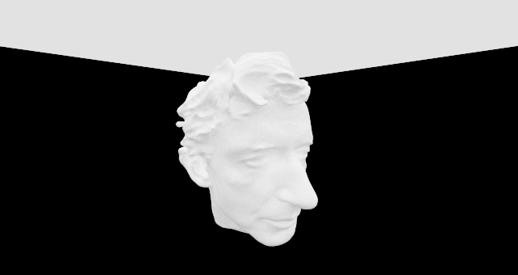
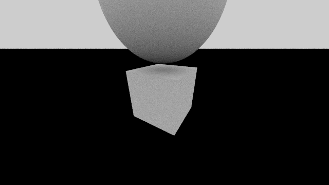
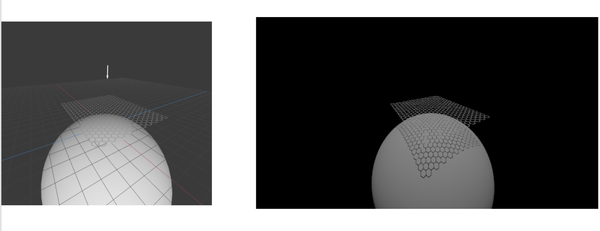
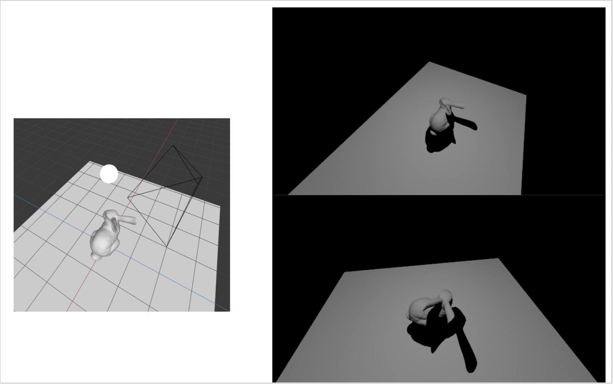
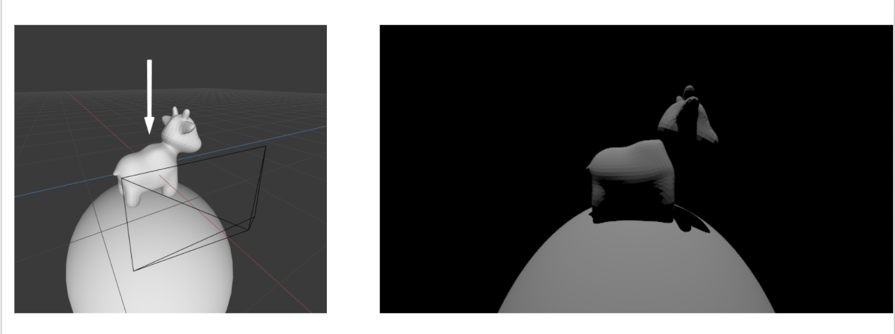
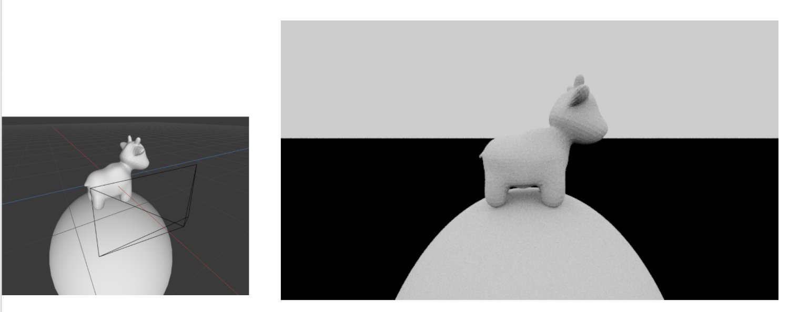

# (Task 4) Shadow Rays

In this task you will modify `Pathtracer::trace_ray` to implement accurate shadows.

Currently `Pathtracer::trace_ray` computes the following:

* It computes the intersection of ray `r` with the scene.
* It computes the amount of light arriving at the hit point `hit.position` (the irradiance at the hit point) by integrating radiance from all scene light sources.
* It computes the radiance reflected from the hit point in the direction of -`r`. (The amount of reflected light is based on the BSDF of the surface at the hit point.)

Shadows occur when another scene object blocks light emitted from scene light sources towards the hit point. Fortunately, determining whether or not a ray of light from a light source to the hit point is occluded by another object is easy given a working ray tracer (which you have at this point!). **You simply want to know whether a ray originating from the hit point (`hit.position`), and traveling towards the light source (direction to light) hits any scene geometry before reaching the light.** (Note that you need to consider light's distance from the hit point is given, more on this in the notes below.)

Your job is to implement the logic needed to compute whether hit point is in shadow with respect to the current light source sample. Below are a few notes:

* In the starter code, when we call `light.sample(hit.position)`, it returns us a `Light_Sample` at the hit point . (You might want to take a look at `rays/light.h` for the definition of `struct Light_Sample` and `class light`.) A `Light_Sample` contains fields `radiance`, `pdf`, `direction`, and `distance`. In particular, `sample.direction` is the direction from the hit point to the light source, and `sample.distance` is the distance from the hit point to the light source.

* A common ray tracing pitfall is for the "shadow ray" shot into the scene to accidentally hit the same object as the original ray. That is, the surface is erroneously determined to be occluded because the shadow ray hits itself (this is also known as _shadow acne_)! To fix this, you can set the minimum valid intersection distance (`dist_bound.x`) to a small positive value, for example `EPS_F`. `EPS_F` is defined in for this purpose(see `lib/mathlib.h`).

* Another common pitfall is forgetting that it doesn't matter if the shadow ray hits any scene geometry after reaching the light. Note that the light's distance from the hit point is given by `sample.distance`, and you can again limit the distance we check for intersections with `dist_bound`. Also consider the fact that using the _exact_ distance bound can have the same issues as shadow self-intersections.

* You will find it useful to debug your shadow code using the `DirectionalLight` since it produces hard shadows that are easy to reason about.

* You must comment out the line `Spectrum radiance_out = Spectrum(0.5f);` and initialize the `radiance_out` to a more reasonable value. Hint: is there supposed to have any amount of light before we even start considering each light sample?

At this point you should be able to render very striking images.

If you've got shadow rays working and want a moderate performance boost, you can modify your BVH traversal for shadow rays (and only shadow rays) to return immediately upon any valid hit. This is sufficient because we don't actually need the closest hit to see if the shadow ray is occluded - just whether there was any valid hit at all.

## Sample results:

At this point, you can add all kinds of lights among the options you have when you create "New Light" in Layout mode, except for Sphere Light and Environment Map which you will implement in task 7 (Note that you can still fill in `Sphere::Uniform::sample` in `Samplers.cpp` now to view the result of a mesh under Sphere Light).

The head of Peter Schröder rendered with hemishphere lighting.

A sphere and a cube with hemishphere lighting

Hex and cube under directional lighting

Bunny on a plane under point light

Spot on a sphere under diretional lighting

Spot on a sphere under hemisphere lighting

