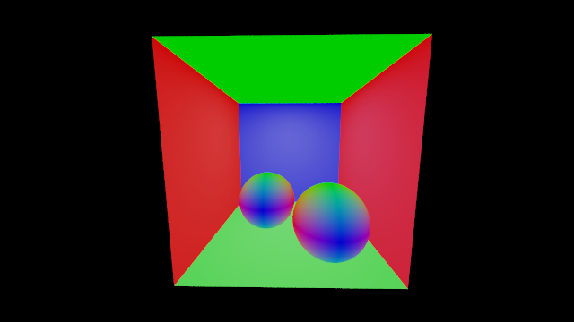

# Visualization of normals

For debugging purposes:

You can set the `bool normal_colors` to true in `student/debug.h` to check if the normals that you have computed at the hit point are correct or not for debugging purposes.

Here are some reference results:

