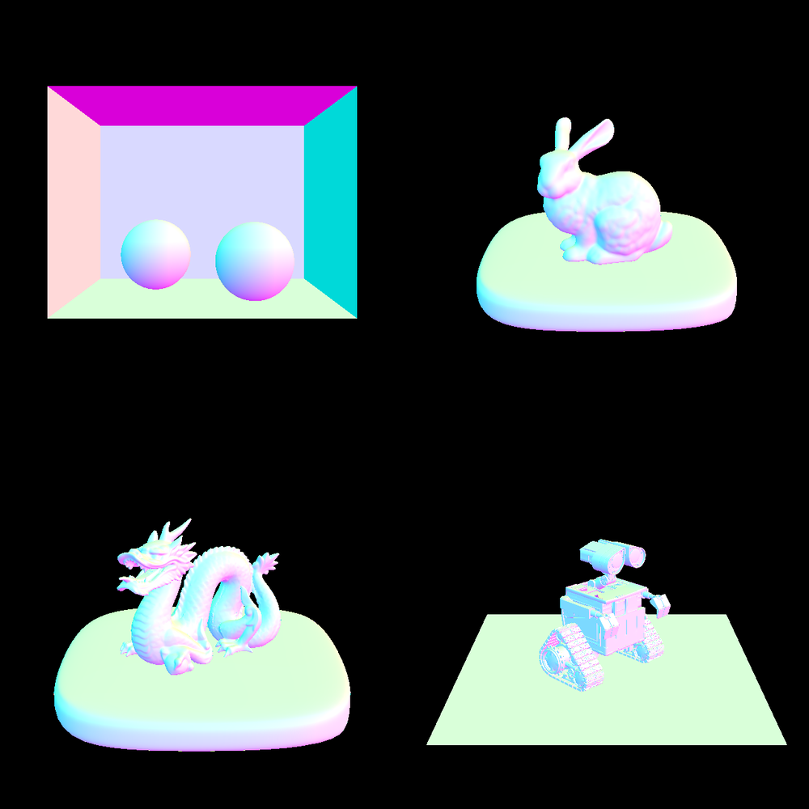

# Visualization of normals

For debugging purposes:

You can replace the `radiance_out = Spectrum(5.f)` in `student/pathtracer.cpp` that the starter code gives you with:

```
(result.n).normalize();
return Spectrum(result.normal.n.x/2.0 + 0.5, result.normal.y/2.0 + 0.5, result.normal.z/2.0 + 0.5);
```

Reference results for CBspheres, bunny, dragon, and wall-e:

